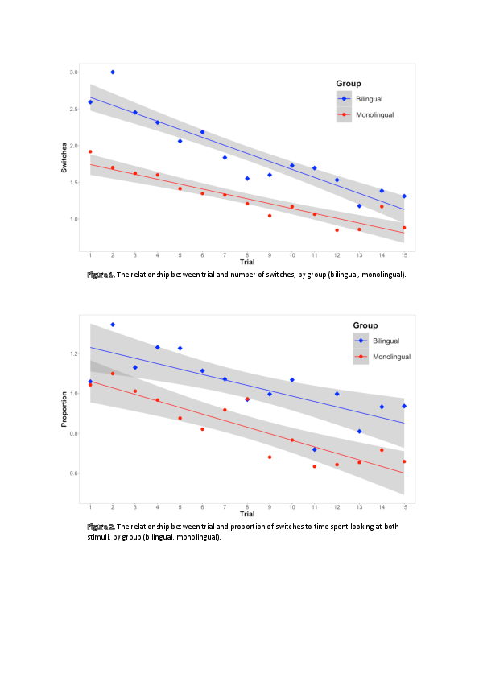

# For review only---DO NOT CITE

## Abstract 18

### How does language experience support language development? Short-term priming and long-term learning.

Children’s language closely reflects their recent and long-term experiences of language. Within conversations, children often repeat the words and sentence structures that they have just heard [1]; their vocabulary and grammatical development tends to reflect the diversity and complexity of their caregivers’ language [3]. But little is known about how children’s short-term language experiences contribute to their longer-term language learning. Syntactic priming effects may offer a promising explanation: growing evidence suggests such effects persist and accumulate to affect language use within the same interaction and even a week later [1]. Accounts of syntactic priming as learning predict age-related differences in the magnitude of immediate priming and cumulative learning over multiple immediate experiences of syntactic structures which should lead to long-term changes in speakers’ representations of syntactic structures [2]. This study investigates whether children’s behaviour at different stages of development supports these predictions. 

We are running two experiments examining the timecourse of experience-based effects in children at early and later stages of acquisition and a comparison adult group. Both experiments involve two testing sessions, consisting of a relatively large number of items (N=48), separated by one week. Experiment 1 assesses priming of noun phrase structures where participants take turns in describing target pictures with an experimenter who alternates between adjective-noun (AN: a blue cat) and noun-relative clause (RC: a cat that’s blue) primes. We have tested 7/44 2.5-year-olds, 39/44 4.5-year-olds and 36/44 adults so far. Experiment 2 tests verb phrase structures (specifically actives (a cat chased the dog) vs passives (the dog was chased by a cat)). To date, 17/44 3.5-year-olds, 33/44 5.5-year-olds and 41/44 adults have been tested. We predicted that all groups will show immediate priming effects within sessions such that participants will produce more target structures after the same prime than after the alternative prime. We also predicted long-term effects of experience, such that participants will be more likely to produce target structures in Session 2 than Session 1. Moreover, we expected younger children to show larger immediate priming effects than older children or adults, leading to greater long-term learning effects for children at earlier stages of acquisition.

At present, Experiment 1 data show larger priming effects for relative clauses in children than in adults in session 1: 31.5%  for 2.5-year-olds, 43% for 4.5-year-olds and 12% for adults but no clear increases to priming in Session 2: 36% for 2.5-year-olds, 25% for 4.5-year-olds and 10% for adults. Experiment 2 data show slightly larger priming effects for passives in children and adults in session 1:  20% for 3.5-year-olds; 22%  for 5.5-year-olds and 14% for adults but smaller priming effects in session 2: 12% for 3.5-year-olds; 11% for 5.5-year-olds and 4% for adults. See Figures 1 and 2. Both experiments show patterns that are consistent with immediate priming effects at all ages, but though children are showing the largest effects, it is not necessarily only in the youngest age group. Contrary to expectations, the data suggest that there could be either no difference, or a decrease in priming across sessions. Possible explanations for these trends in the data will be explored.

1. Branigan, H. P., & Messenger, K. (2016). Consistent and cumulative effects of syntactic experience in children’s sentence production. Cognition, 157, 250–256. 

2. Branigan, H. P., & McLean, J, F. (2016). What children learn from adults’ utterances. Journal of Memory and Language, 91, 141–157. 

3. Huttenlocher, J., Waterfall, H., Vasilyeva, M., Vevea, J., & Hedges, L. V. (2010). Sources of variability in children’s language growth. Cognitive Psychology, 61, 343–365.

