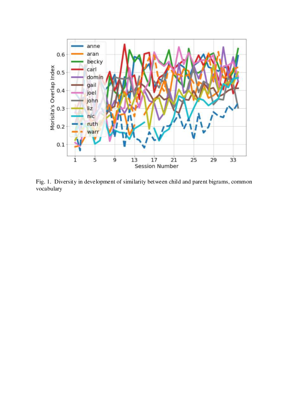

# For review only---DO NOT CITE

## Abstract 3

### When do children most resemble their parents?

We examine the trajectory of children's language development, concentrating on their two-word sequences, or bigrams, and the similarity of those bigrams to the input bigrams they hear.  In a sentence like "Where's my pajamas?", we count 3 bigrams:  where's, 's my, my pajamas.  (Clitics are counted as a separate word.)  Using the Manchester corpus of 12 child-parent pairs, we track the similarity over time between children's and parents' bigram types (where "my pajamas?" is a type).  

If children are especially highly dependent on their parents' input at the beginning of acquisition, very frequent bigram types in the input should also be very frequent in the child's output.  Vocabulary similarity (shared unigrams), as expected, increases over time; the shared top bigrams also increase over time.  Children share more bigram types, not fewer, with their parents as they develop.  To measure similarity more finely, we use the Morisita index of similarity, since it is not affected by differences in sample size.

When we filter the child's and parent's vocabulary so that only words that they share are included, we see in Fig. 1 enormous variability by child in the development of the Morisita index.  But as Fig. 2 shows, there is an underlying uniformity:  the similarity between child and parent increases over age – the blue line is the average with standard deviations; the green line tracks the child with the highest similarity at each file and the orange line tracks the child with the lowest similarity in each file.  Children start and end at different places, and their development is jagged, but they all increase over time and are least like their parents at the outset of acquisition.  We discuss the implications of joint variability and uniformity in development.

