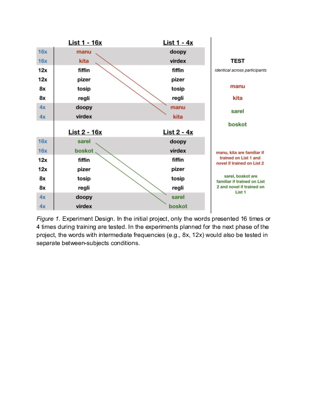
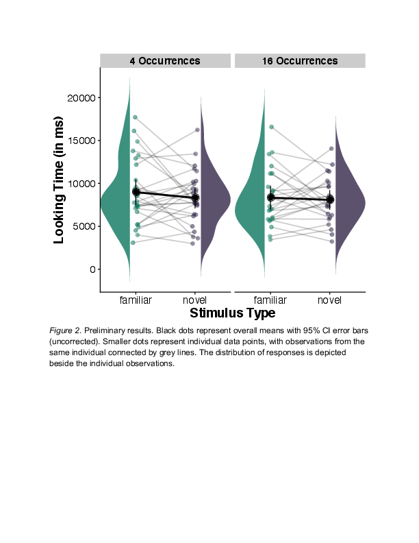

# For review only---DO NOT CITE

## Abstract 23

### Investigating the relationship between infant learning and measured effect size in preferential looking paradigms

In looking time studies, individual infants show a wide range of preferential responses. How should we interpret individual differences in looking times? Does the size of a looking time difference index the individual’s strength of discrimination or amount of learning? Most methodological and analytic approaches are based on the premise that the size of individual infants’ looking time differences are meaningful (e.g., Hoareau et al., 2019). Some analytic approaches, however, treat direction of preference as a binary outcome and ignore variability in preference size (e.g., Newman et al., 2006). An underlying difficulty in interpreting the magnitude of looking time differences is that our understanding of the relationship between learning processes and looking behavior is limited (Bergmann et al., 2013). 

The aim of the project is to ask whether the magnitude of the effect size in looking time studies is a meaningful index of the degree to which infants have learned. To address this question, we test infants’ recognition of novel auditory stimuli following a training phase - a fundamental task for infant learners (Jusczyk & Aslin, 1995) - while manipulating a factor that is expected to affect learning: frequency of exposure. During the training phase, infants hear a list of nonce words, in citation form. While all infants hear the same total number of nonce words during familiarization, the frequency of target words varies. After the training phase, we test infants’ preference for two (familiarized) target words and two (novel) nonce words they did not hear during the exposure (counterbalanced across infants - see Figure 1). The central question is whether more frequent exposure to target nonce words - and hence, stronger learning of these items - results in larger effect sizes as measured through infants’ looking behavior.

In a preliminary experiment (pre-registration: https://osf.io/j49gr/?view_only=124728c565994d5fa27bfc10ab250078; data repository: https://osf.io/db2t3/?view_only=a1c10a1b601147b7a8f13acbd83ebac4), we are investigating two between-subjects boundary conditions: a condition where the target words are heard relatively infrequently (4 occurrences each in 80 total words; 4x condition), and a condition where the target words are heard relatively frequently (16 occurrences each in 80 total words; 16x condition). These data will inform decisions for a planned large-scale test of the relationship between frequency of exposure and effect size. The full design (planned for subsequent data collection) will include a continuous manipulation of nonce-word frequency across several additional conditions (as depicted in Figure 1). 

Preliminary inspection of the data (data collection ongoing; N=51 of a pre-registered final sample of 64) suggests no clear evidence of learning in infants in the 16x condition (difference in looking to novel vs. familiar words: M = -260 ms, 95% CI = [-1581 ms, 1062 ms], t(23) = -0.41, p = .69; moderate evidence in favor of the null hypothesis: BF01 = 4.32; see Figure 2) and infants in the 4x condition (difference in looking to novel vs. familiar words: M = -665 ms, 95% CI = [-2112 ms, 782 ms], t(26) = -0.95, p = .35; moderate evidence in favor of the null hypothesis: BF01 = 3.27). In our presentation, we will discuss our next steps towards studying how systematic changes to infants’ exposure  - and consequently, to infants’ learning - modulate effect sizes in looking time tests.

