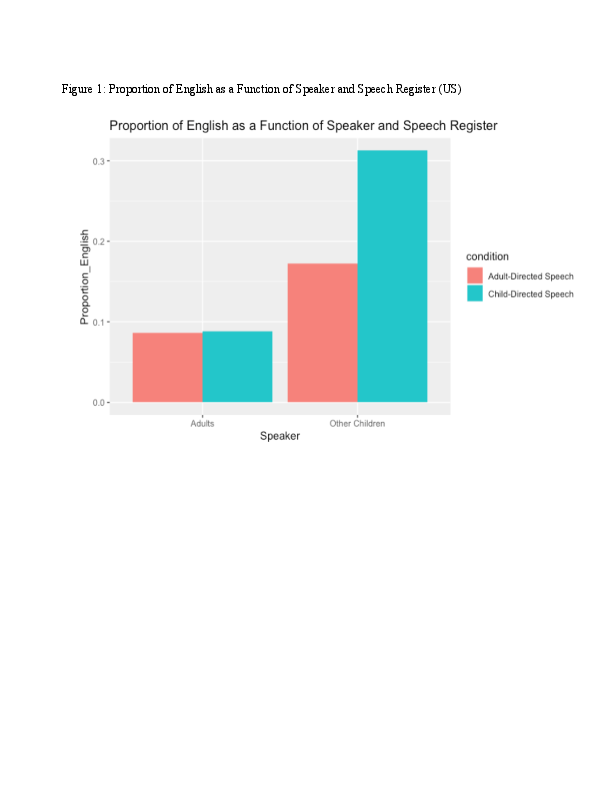
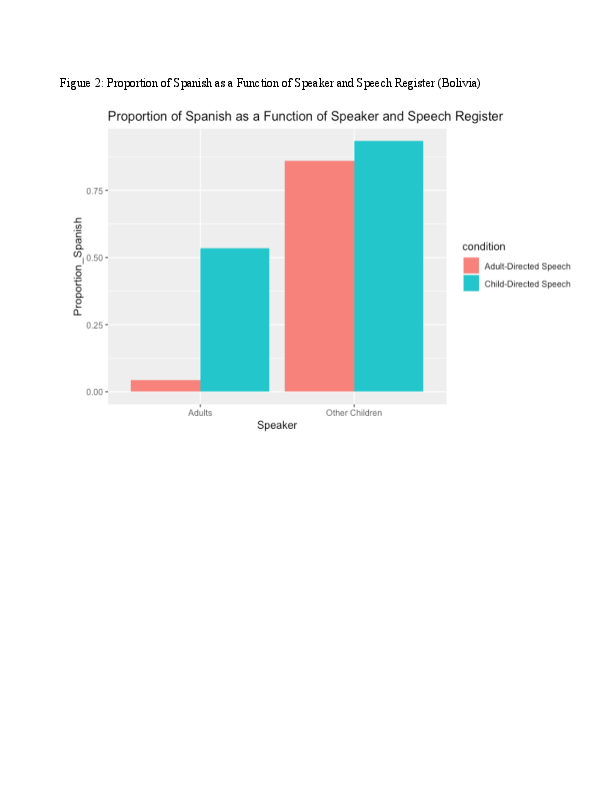

# For review only---DO NOT CITE

## Abstract 47

### Dual Language Input from Adults and Older Children in Two Communities

In monolingual children from industrialized societies, characteristics of the input vary by speech register (e.g., child-directed vs. adult-directed speech) and speaker (e.g., adults vs. children). For example, child-directed speech has been characterized as having a higher pitch and more pronounced pitch contours, being syntactically simpler, and capturing children’s attention more than adult-directed speech (Soderstrom, 2007). Studies also find that speech from adults is  more supportive of  younger infants’ communicative attempts than speech from other children (Hoff-Ginsberg & Krueger, 1991). 

Much less research has examined how speech registers and input from adults and older children are experienced by dual language learners, and how this varies across cultural and linguistic communities. For instance, children in immigrant communities might initially be exposed to the society language in overheard conversations between older siblings while being exposed to their home language in directed speech from adult caregivers. If so, these children might receive different kinds of input in each language. In other communities, bilingual children might have a more uniform pattern of exposure to each language across different social contexts. 

The goal of this study is to better understand the distribution of dual language input across different speakers and speech registers for infants in two sociocultural contexts: a Quechua-Spanish community in Bolivia and a Spanish-speaking immigrant community in the United States (US). We hypothesize that young children’s exposure to each language (Quechua-Spanish and Spanish-English) will differ by: 1) speaker age (adults vs. children); 2) speech register; and 3) the sociocultural/sociolinguistic context (infants in Bolivia vs. infants in the US). Findings from this study will shed light on different patterns of dual language exposure that may influence bilingual children’s language learning. 

Infants and their caregivers were recruited from a mid-size town in southern Bolivia (n=98), and from a hospital serving low-income families in a major US city  (n=23). Families completed daylong audio recordings using the LENATM system. We present preliminary results for 3 infants from the US (ages 0;6-0;7) and 5 infants from Bolivia (ages 0;6-1;0).

Each recording was split into 30-second clips that contained human speech. Then, we annotated audio clips that were randomly selected from the daylong recording (M=174 clips, range: 115-261). Each clip was annotated for language (Quechua/English, Spanish, Mixed), speaker (Adult, Other child), and addressee (Target child, Adult, Other child). From this, we calculated the proportion of clips in each language in speech from adults and children, and in child-directed and adult-directed speech. Figures 1 and 2 show the proportion of English or Spanish in the child- and adult-directed speech of adults and other children in the US and Bolivia samples, respectively.  

Among the US families, preliminary results show other children used a higher proportion of English than adults (M children=0.242, range: 0-0.77, M adults=0.087, range: 0-0.26). In addition, children – but not adults – used a higher proportion of English in child-directed than in adult-directed speech (Fig 1). Among the families in Bolivia, other children used a higher proportion of Spanish than adults (M children=0.897, range: 0.65-1, M adults=0.29, range: 0-0.97). In addition, adults – but not children – used a higher proportion of Spanish in child-directed than in adult-directed speech (Fig 2). Between the two samples, we see different patterns of dual language exposure by speaker and speech register, suggesting possible differences as a function of the sociolinguistic context. Annotation of additional families will be conducted for both samples, and results will be discussed in the context of theories of dual language learning, language shift, and language maintenance.

