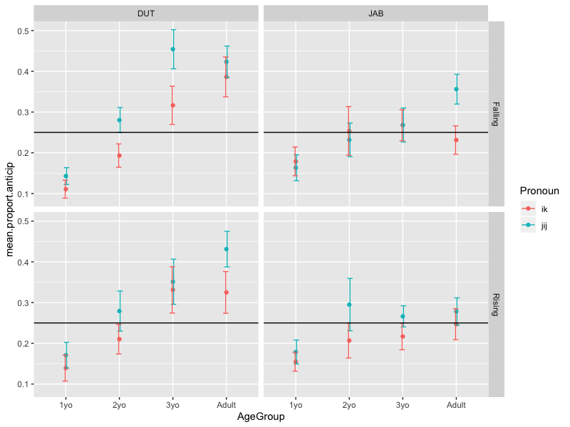

# For review only---DO NOT CITE

## Abstract 97

### You and I: Using epistemic cues to predict who will talk next in conversation

Human conversation is fast: interactants typically have just a few hundred milliseconds to determine if they need to give a response to the current turn and, if so, must start planning early enough to respond as soon as it ends (Casillas et al., 2016; Levinson & Torreira, 2015; Stivers et al., 2009, 2018). Adults manage these speedy transitions via precise predictions on the basis of lexical, syntactic, and prosodic knowledge (de Ruiter et al., 2006) but children, without such sophisticated knowledge, must rely on other strategies.

We hypothesize that children respond on time by using a handful of easily identifiable cues associated with response-seeking utterances (e.g., English wh-words and subject-verb inversion). Here we test whether children use a single, subtle epistemic cue to upcoming response: the subject pronoun person (e.g., “What did you do?” vs. “What did I do?”). Person and questionhood are naturally associated because I tend to know less about you than you yourself do, and so I am more likely to ask a question than make an assertion about you. The use of this epistemic cue is likely consistent, but at best could be used as a heuristic for identifying response-seeking utterances (e.g., “I” questions are possible): this first test presents a formidable challenge to our hypothesis.

We first examined the associative strength between subject pronoun person and interrogative status in Dutch. We controlled for syntactic context by extracting ~8500 child-directed utterances with subject-verb inversion, noting the subject pronoun, main verb, and response status (question/statement) for each. As expected, the majority of subject-verb constructions (79.5%) were questions. The second-person singular pronoun (‘je’/’jij’) appeared more often in questioning compared to non-questioning utterances (62% vs. 46%) while first person subjects occurred more often in non-questioning utterances (singular ‘ik’: 9% vs. 18%; plural ‘we’/’wij’: 8.4% vs. 13.1%). The second person singular pronoun may therefore be a reliable cue in identifying questions as conversational participants.

We then investigated conversational observers’ real-time use of subject pronouns to predict upcoming responses in an experimental setting. We asked 320 participants (80 each at 1;0, 2;0, 3;0 and >18;0) to watch a series of short dyadic conversations in which we controlled the use of first- and second-person subject pronouns (“ik” I vs. “jij” you). In this context, young children and adults spontaneously look at upcoming responders after questions (Casillas & Frank, 2017; Lammertink et al., 2015). We hypothesized that participants would make anticipatory looks more often when hearing a turn with a second- than first-person subject pronoun. We tested this pronoun effect in real Dutch (i.e., with semantic support) and Jabberwocky Dutch (i.e. with nonsense words; no semantic support), with both rising and falling intonation. Logistic mixed effects models of anticipatory gaze likelihood suggest no evidence for children’s use of subject pronoun, intonation, or their interaction, in real or Jabberwocky Dutch. However, anticipatory looks increased with age for real Dutch, suggesting children improve their predictions on the basis of other linguistic cues. Interestingly, the adults showed the predicted pronoun effect, but only in Jabberwocky Dutch, when there was no semantic support to predict what would happen next. There was no effect of intonation in the adults.

Despite the reliable distributional link between subject pronoun person and question status (Study 1), we find only weak evidence that this epistemic cue is used to predict upcoming responses in real time (Study 2); only adults used the cue, and only when we took away all semantic information. We discuss these results with respect to first- vs. third-person measures of prediction, prosodic prominence, and within the broader context of using superficial cues to facilitate interactional exchange.

