# Many Paths to Language

Go to [Main page](../MPaL_handbook.md)

---

## Invited talks

#### 22 October 10.15 - 11.15

Gabriella Vigliocco

Abstract still to come.

---

#### 23 October 10.00 - 11.00

David Barner

Abstract still to come.

---

#### 23 October 14.15 - 15.15

Andrea Ravignani

Abstract still to come.

---

## Talks

### Language development in non-WEIRD contexts

#### 22 October 11.30 - 12.30

#### Universal and language-specific patterns in the acquisition of sign language phonology

[*Hannah Lutzenberger, Connie de Vos, Onno Crasborn, Paula Fikkert*](./authors.md)

h.lutzenberger@let.ru.nl

Children acquiring signed languages from birth parallel their speaking peers in linguistic milestones.[1] The acquisition of sign phonology brings extra hurdles: children learn to coordinate two articulators, i.e. two hands, and autofeedback is visual and/or tactile rather than auditory. This study is the first to investigate the acquisition of sign phonology in a non-WEIRD context: a Balinese village community. 

Kata Kolok (KK) emerged spontaneously in a labour-intensive community with high congenital deafness. KK's phonology is typologically distinct from WEIRD sign languages, with a larger signing space and fewer marked handshapes.[2] KK children receive signed input from birth, from many hearing and deaf signers. Thus, the acquisition setting is comparable to that of hearing children acquiring a spoken language, unlike the experience of most WEIRD deaf children [1]. 

Case studies of WEIRD sign languages show that early signing is characterised by simplification and substitution of handshapes, locations and movements. Children omit, repeat, or proximalise movements, produce signs at bigger and more salient locations, and assimilate and replace marked by unmarked handshapes.[1,3] 

Using longitudinal data, we examine universalities and differences in sign phonology acquisition. We predict cross-linguistic similarities in movement errors due to general motor development and differences in handshape and location errors due to KK's typological profile.  

We collected 1400 off-target signs produced by four deaf children (spanning 1;5-3;0 years) in a total of 75 hours of naturalistic recordings from the KK Child Signing Corpus. For each error, we analysed (i) attempted target signs, (ii) accuracy of handshape, movement, location, orientation, and body contact, and (iii) error types. Results are interpreted in the light of the literature and KK's phonological system. 

The errors in our data show similarities with patterns described for WEIRD sign languages; (i) handshape and location errors are most common and (ii) movement errors are rare and typically caused by omission or proximalisation. These commonalities may be linked to general motor development, suggesting universality in sign phonology acquisition. Critically, we also observe striking differences. Firstly, KK children substitute both marked and unmarked handshapes (Figure 1); this may be typologically grounded with fewer marked handshapes featuring in the KK lexicon. Secondly, KK children often increase or add body contact (Figure 1c-f). While a preference for fingertip contact has been mentioned in the literature, the role of contact has not been discussed extensively. Increased contact may be a typological feature of KK, but may also be more central to early signing: rather than increasing saliency of location, displacing signs might increase proprioception, providing more autofeedback.

This is the first study to corroborate similarities and differences in child errors of KK and WEIRD sign languages, finding that acquisition of movement has universal tendencies, while handshape and location may be more susceptible to typological differences such as diverging phonologies and language ecologies.

References

1.	Chen-Pichler, D. (2012) Language acquisition. In R. Pfau, B. Woll and M. Steinbach (Eds.), Sign Language: An international handbook (pp. 647-686). Berlin: de Gruyter.

2.	Marsaja, G.I. (2008). Desa kolok: A deaf village and its sign language in Bali, Indonesia. Nijmegen: Ishara Press.

3.	Meier, R. (2005). The forms of early signs: explaining signing children's articulatory development. In B. Schick, M. Marschark, and P. Spencer (Eds.), Advances in the Sign Language Development of Deaf and Hard-of-Hearing Children. Oxford University Press, 202–230.

---

#### Amount and quality of input across speakers: Analysing Sesotho and French corpora

[*Georgia Loukatou, Camila Scaff, Katherine Demuth, Alejandrina Cristia, Naomi Havron*](./authors.md)

georgialoukatou@gmail.com

Most language acquisition research is based on Western, Educated, Industrialised, Rich, Democratic (WEIRD) communities (Henrich, Heine & Norenzayan, 2010), where the primary caregiver is the mother. Mother-child dyad speech has long been the focus of early input studies, despite evidence suggesting that non-maternal input can be important for language outcomes (e.g. Demuth, 1986). Additionally, in many communities (particularly non-WEIRD ones), interaction occurs with multiple speakers rather than mostly the mother (e.g. Casillas, Brown & Levinson, 2019). Yet, few studies describe child-directed speech (CDS) from various speakers, and even fewer investigate this across cultures (see Shneidman & Goldin‐Meadow, 2012). 

In this study, we analyse speech produced around and to children by their mother, other children and adults, in two diverse cultures. We ask who produces the input, and how much of it is child-directed. We also ask whether different speakers vary in terms of utterance length, function (ratio of questions) and lexical diversity. To answer these questions, we annotated three corpora. The non-WEIRD Demuth corpus (Demuth, 1992) in the Sesotho language was recorded in non-industrial South African Lesotho. It contains input to three toddlers aged 2;1-3;3 years. We also annotated recordings from the WEIRD Lyon and Paris corpora (Demuth & Tremblay 2008; Leroy, Mathiot & Morgenstern, 2009) for three children- those with siblings, and the same age range as in the Demuth corpus.

More than 80% of input is child-directed for both French and Sesotho. On average, 79% of French CDS utterances comes from mothers, whereas in Sesotho only 25.3% does (Figure 1). Other children (siblings and peers) provide 3.3% of French CDS, when in Sesotho it corresponds to 10 times that proportion (38.5%). Other adults provide 9.2% of French CDS, versus 15.8% in Sesotho. We ran a mixed-effects linear regression predicting the relative amount of input from different speakers at each session, including a random intercept for target child. The independent variables were the speaker category (mother, children, adults), language (Sesotho, French) and their interaction. There were significant interactions; the ratio of speech from mothers was lower in Sesotho than French (β =-0.27, SE =.0.41, t=-6.31, p<.001), but that from other children was higher (β =0.19, SE =.0.48, t =3.91, p=.002). There were differences between languages in utterance length, function and lexical diversity of CDS, but no differences across speakers in utterance length and lexical diversity. However, children asked considerably less questions in both Sesotho and French (Figure 2).

Thus, CDS is significantly prevalent over overheard speech for both settings. However, the input composition is dramatically different; maternal input is more dominant in the WEIRD corpora compared to the non-WEIRD one. In the latter, other children's input is more prevalent than maternal input, consistent with previous non-WEIRD descriptions. Interestingly, in terms of speech quality, other children's and adults' CDS present similarities with maternal speech within each culture. These results invite further cross-cultural early input research, in order to check if these speech compositions and qualities are representative of WEIRD and non-WEIRD quantifiable distinctions, and the impact these might have for language development.

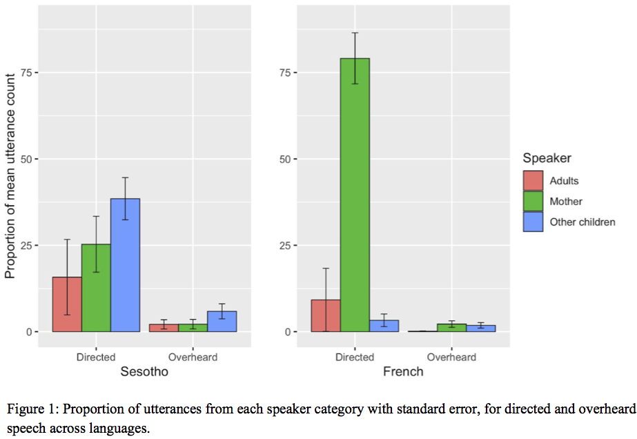

---

#### Child-directed speech of multiple socializes in Mayan Tsotsil acquisition: A qualitative and interactional look

[*Lourdes De León*](./authors.md)

lourdesdeleonp@gmail.com

Research on input and child-directed speech [hereafter CDS] has been strongly biased toward dyadic mother-child interaction. Language socialization studies have long argued that the communicative environments of children show cultural variation and that, in many cultures, CDS is low in frequency and may be distributed among multiple caregivers (de León 2012; Ochs & Schieffelin 1984). Recent cross-cultural studies in language acquisition provide statistical evidence on the low frequency of direct input to infants in several nonindustrial societies; they argue that, the low rate notwithstanding, children show no language developmental delays (Shneidman & Goldin-Meadow 2012). However, given its statistical orientations, these studies normally consider decontextualized linguistic items while neglecting the real-time interactions that originally mediated the data. As a result, we know very little of the interactional dimensions of CDS in such cultural contexts.

The present study aims to address this gap by providing a linguistic anthropological analysis of CDS in Tsotsil Mayan. As in many nonindustrial societies, CDS in Tsotsil has a significantly lower rate compared to Western middle-class input reports (see Casillas, Brown and Levinson 2019 for Tseltal, neighbouring language). However, I will document here how Tsotsil infants are immersed in a variety of interactions distributed across multiple caregivers. Among adult caregivers we find a collection of interactional routines (e.g., rhetorical questions, prompting, teasing, and directives) that normally occur in triadic and other multiparty interactions (de León 2012). Sibling socializers also engage with young charges in play and care interactions some of which highlight structural properties of the language. Both adult and sibling CDS provide variation sets with morphological and lexical substitutions as well as repetition and rephrasing (Küntay and Slobin 2002).

In contrast to the conventional definition of input, which constructs the infant as a receptive vessel of language, an interactional approach to CDS reveals children's emerging skills as semiotic agents who co-construct action and meaning with others. I argue here for including a broader spectrum of sources of input coming from multiple socializers to gain a more complete picture of communicative environments of children in nonindustrial cultures. To fully appreciate the richness of this process, we must consider the qualitative dimensions of CDS anchored in natural, everyday interactions.

The study is rooted in over three decades of anthropological and linguistic research in Zinacantán, Chiapas, México. It is part of larger longitudinal research on language acquisition and socialization of four children from 1 to 4 years old (de León 2012) and five supplementary children. For the present study, I focus on two focal children (a girl and a boy) of the same extended family. For the first child I look at a sample of data of interactional routines at 11 months old. For the second child I analyze twenty events of sibling play and care from 1;7 to 2;7 years old.

References

Casillas M, Brown P, Levinson SC. 2019. Early language experience in a Tseltal Mayan village. Child Development. DOI 10.1111/cdev.13349

De León L. 2012. Language socialization and multiparty participation frameworks. In The Handbook of Language Socialization, ed. A Duranti, E Ochs, BB Schieffelin, pp. 81–111. Malden: Wiley-Blackwell

Küntay, A., Slobin, D. I. (2002). Putting interaction back into child language: Examples from Turkish. Psychology of Language and Communication, 6:5-14.

Ochs E, Schieffelin BB. 1984. Language acquisition and socialization: Three developmental stories. In Culture Theory: Essays on Mind, Self, and Emotion, ed. RA Shweder, RA LeVine, pp. 276–320. Cambridge: Cambridge Univ. Press

Shneidman L, Goldin-Meadow S. 2012. Language Input and Acquisition in a Mayan Village: How important is directed speech? Developmental Science 15(5): 659–73

---

### Disorders and delay in language development

#### 22 October 11.30 - 12.30

#### Varying relationships between parent input and the neural mechanisms of language development in infants at high and low risk for Autism

[*Rachel R. Romeo, April Boin Choi, Laurel J. Gabard-Durnam, Carol L. Wilkinson, April R. Levin, Helen Tager-Flusberg, Charles A. Nelson III*](./authors.md)

rachelromeo@gmail.com

Introduction: Autism Spectrum Disorder (ASD) is a neurodevelopmental disorder characterized by general impairments in social communication skills, though children with ASD vary greatly in the development of other receptive and expressive language skills. Because early language skills predict later functioning in individuals with ASD, it is critical to better understand factors that influence language development in this population, how this may differ from typically developing children, and the neurobiological mechanisms by which these factors influence early development. 

Methods: We investigated these questions in a subsample of infant-mother dyads from a longitudinal, prospective study of ASD biomarkers in 218 infants at either high familial risk of ASD (HRA) due to having an older sibling with ASD, or low risk controls (LRC) who have no family history of ASD. The present subsample (n=48) included 25 LRC and 23 HRA infants, of whom 12 received ASD diagnoses (HRA+, oversampled) and 11 did not (HRA-). At 18 months of age, dyads engaged in 10 minutes of free-play with a set of experimenter-provided toys. Videos were transcribed verbatim and three measures of parent language input were extracted, including quantitative measures (word tokens) and qualitative measures of lexical diversity (word types) and grammatical complexity (mean length of utterance [MLU] in morphemes). At 24 months, standardized assessments of receptive and expressive language skills (Mullen Scales of Early Learning) and high-density resting-state electroencephalography (EEG) were collected. The EEG measure of interest is power in the gamma band (30-50 Hz) over the frontal scalp region, which has previously been found to relate to children's development of language and higher cognitive skills. 

Results: In the sample as a whole, all three input measures (types, tokens, and MLU) were positively correlated with expressive MSEL scores, indicating that infants exposed to greater quantity and quality of input at 18 months exhibited greater expressive language scores 6 months later. Only tokens correlated with receptive MSEL scores. A group-by-input interaction indicated that HRA infants showed stronger input-skill relationships than LRC infants, and within the HRA group, HRA+ infants showed stronger input-skill relationships than HRA- infants (Figure 1). Furthermore, in high risk infants, greater/higher quality input was correlated with lower baseline frontal gamma power, which significantly mediated relationships between input and later expressive language scores (Figure 2).

Conclusion: Results indicate frontal gamma power as a mechanism linking quantitative and qualitative measures of language input to language development in infants at elevated risk of ASD, and importantly, suggest that neural mechanisms underlying language input-output relationships vary depending on ASD risk and diagnosis. Furthermore, findings of a moderation by group suggest that infants at familial risk of ASD may be even more sensitive to the quantity and quality of their language environments. This has important implications for early intervention to support language development in high-risk children.

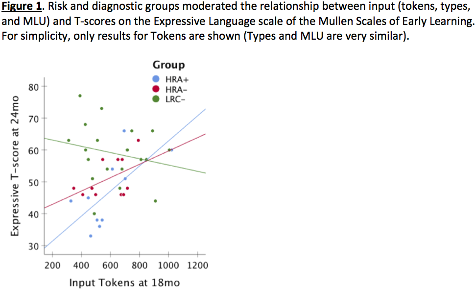

---

#### Naturalistic language input to Blind, Deaf/Hard-of Hearing, and typically-developing infants: A quantitative and qualitative analysis

[*Erin E. Campbell, Sarp Uner, Elika Bergelson*](./authors.md)

erin.e.campbell@duke.edu

Blind, deaf/hard-of-hearing (DHH), and typically-developing infants have divergent sensory experiences, but does their early linguistic input vary as well? Quantitatively, DHH and typically-developing children are reported to hear equivalent adult word counts in naturalistic recordings (VanDam et al., 2012); this has never been examined in blind children. Qualitatively, parent speech is found to vary across groups in utterance-type (blind vs. sighted; Kekelis & Anderson, 1984; Moore & McConnachie, 1994) and parent responsiveness (DHH vs. hearing; Nittrouer, 2010). While blind children quickly catch up to typically-developing peers on language milestones (Landau & Gleitman, 1985; Perez-Pereira & Conti-Ramsden, 1999), DHH children learning spoken language often experience persistent delays (Moeller et al., 2007). However, no previous work compares language input across blind, DHH, and  typically-developing infants, using one methodological approach. We tackle this here, asking whether parent speech varies by infants' sensory abilities: quantitatively (Analysis 1: talk amount), and qualitatively (Analysis 2: talk content). 

Analysis 1: We measured speech input using LENA daylong audio-recordings from blind infants (n=5; age: 9-31 mos.)*, DHH infants (n=11; age: 14-31 mos.), and typically-developing infants (n=22; matched to DHH on age or hearing-age, maternal education, and gender; age: 6-31 mos.). Using LENA's Adult-Word-Count estimate, we find no significant differences in speech input quantity across groups (ps> .05 by Kruskal-Wallis Test; Fig.1). 

Analysis 2: We collected 30-minute video-recordings of unstructured parent-child interaction from one blind infant (n=1; age: 10 and 14 mos.)*, and used analogous video-recordings from DHH (n=22; age: 13-16 mos.) and typically-developing infants (n=18; age: 13 mos.). These video-recordings were fully transcribed and part-of-speech tagged. We focus on sense-specific adjectives as one way parents may provide linguistic descriptions of perceptual features that their children cannot access. Adjective tokens were coded as amodal, visual, tactile, hearing, smell, or taste. While we found no difference in overall adjective quantity or in proportion of amodal adjectives (Kruskal-Wallis test; p>.05), adjective modality differed by group (Fig.2). Specifically, DHH infants heard the smallest proportion of hearing-related adjective tokens (Bonferroni-corrected Dunn Test, p=.035; Fig.2).

Taken together, these results suggest that (1) blind, DHH, and typically-developing infants are exposed to approximately the same amount of linguistic input but that (2) the content of this input may be tailored to the child's sensory experience, particularly for DHH infants. Notably, speech in the environment of DHH infants may misrepresent speech heard by these children; our qualitative result of fewer hearing-related adjectives said to DHH infants highlights a further difference in their input. In contrast, while Ns are low, blind infants appear to hear similar speech input as sighted peers, with more work needed. These results provide initial data on how much parents talk to blind, DHH, and typically-developing infants, and how modality-specific this language input may be. This in turn has implications for the language learning trajectories and lexicons of infants with differing sensory experiences.

\* In US/Europe: Incidence of blindness in children is 3/10,000; incidence of DHH (>40 dB) is ~10/10,000 (Gilbert 2003; CDC, n.d.). This difference is reflected in our sample sizes; recruitment is ongoing.

---

#### Task-dependent impact of adult words on vocalization patterns in Angelman and Down Syndromes

[*Lisa R. Hamrick, Amanda Seidl, Bridgette L. Kelleher*](./authors.md)

lrague@purdue.edu

Background: North American children who hear more adult speech vocalize more and have better language outcomes (e.g., Ramírez‐Esparza, García‐Sierra, & Kuhl, 2014). Furthermore, recent evidence suggests that adult and child vocalizations may vary by setting and task, meaning that certain tasks may be well-suited to evoke particular vocalization patterns in typically developing children and their caregivers (Soderstrom & Wittebolle, 2013). Children with neurogenetic syndromes, such as Angelman syndrome (AS) and Down syndrome (DS), exhibit language delays early in development; however, it is unclear whether adult speech and task context similarly impact early speech development among children with these syndromes, as most research has been conducted in non-syndromic populations. Importantly, children with neurogenetic syndromes may exhibit differences in their responsiveness to adult words or sensitivity to task context which influence the efficacy of standard intervention approaches. Therefore, clarifying these associations in neurogenetic groups provides an opportunity to tailor early intervention strategies to the needs of these unique populations (Mahoney et al., 2020). This study examines child vocalization patterns and the impact of adult speech across three discrete tasks – child-only play, unstructured parent-child interaction, and structured parent-child interaction. 

Method: Six children with AS (aged 11-19 months) and 15 children with DS (aged 5-20 months) completed PANDAbox, a series of parent-administered play-based tasks via telehealth. We focus on 3 tasks from PANDAbox: the Developmental Play Assessment (DPA), Parent-Child Interaction (PCI), and Story Time (ST). During DPA, children play independently with 3 sets of toys for 8.5 min while parents are instructed to refrain from engaging with their child. During PCI, the child and parent play together with another set of toys for 10 min. During ST, parents are provided with a short book to read with their child (task length: 1-6 min). We used the LENA system (Xu et al., 2008) to audio record all 3 tasks. We used utterance-level data obtained from LENA software to calculate the number of child vocalizations (CV) and adult words (AW) that occurred during each task, which we converted to rates (count/min) to account for varying task lengths. We predicted (1) that there would be a positive association between CV rate and AW rate during PCI and ST and (2) that CV rate would be higher during PCI and ST than during DPA. We also explored (3) whether CV and AW rates are different between PCI and ST. 

Results: We conducted analyses in R. We used non-parametric analyses (Wilcoxon, Spearman's) and discuss results in terms of effect sizes due to our small sample. We ran analyses for each group separately. CV and AW rate were not significantly associated during any tasks for either group (rho's<.37, p's>.497; Figure 1). CV rate during PCI and ST was generally higher than CV rate during DPA for AS (PCI: W=11, p=.310, d=.58; ST: W=11, p=.310, d=.65) and DS (PCI: W=78, p=.158, d=.71; ST: W=63, p=.042, d=.73; Figure 2). CV rate did not differ between PCI and ST for either group (p's=1.00; Figure 2). AW rate was higher during ST than PCI for both groups (AS: W=24, p=.394, d=.64; DS: W=181, p=.004, d=1.14; Figure 2). 

Conclusion: We found that children in both groups tend to vocalize at higher rates while interacting with a parent compared to supervised independent play, and parents' word counts were highest while reading a book with their child. However, child vocalization rate was not related to adult word rate in either interactive task, suggesting that adult vocal behavior may not impact child vocal patterns over and above the effect of task context during short, structured tasks. These findings can inform language treatment planning by clarifying which factors are relevant for increasing child speech rate for children with neurogenetic syndromes.

---

### Complexity in child-directed speech

#### 22 October 13.15 - 14.15

#### Parents' talk about conceptual categories with infants: Stability, variability, and implications for vocabulary development

[*Ran Wei, Anna Kirby, Letitia Naigles, Meredith Rowe*](./authors.md)

ran_wei@g.harvard.edu

Word learning stands at the crossroads of children's language and conceptual development and serves as a gateway to development in both domains (Waxman, 2007). Children's developing understanding of conceptual categories plays a critical role in their vocabulary development. Further, converging evidence has suggested that parental input varies by parent education and robustly predicts children's vocabulary development (Rowe & Goldin-Meadow, 2009). Thus, talk about conceptual categories is a potential mechanism through which parental input facilitates word learning. Regularities in linguistic input that highlight properties and boundaries of categories may support children's acquisition of concepts and corresponding labels (Mervis, 1987). 

Previous studies find that adults' use of generics (e.g., “Strawberries are delicious.”), one form of talk about categories, contributes to young children's learning about categories and their properties (Gelman et al., 2014). However, it remains unknown whether and how parents use generics with infants. Further, we know little about other ways in which parents discuss categories with children or about associations between parents' talk about categories and children's vocabulary development.

The current study addresses the following questions: 

1. Do parents discuss conceptual categories with infants, and if so how?

2. Does parents' input about conceptual categories vary by parent education?

3. Does parents' discussion of categories predict infants' size of vocabulary?

Participants were 46 American parent-child dyads with varying levels of parental education, M = 15.6 years, SD = 2.14, range = 10 – 18. Semi-structured play sessions were recorded at child age 10, 12, 14, and 16 months. Recordings were transcribed and coded for parents' talk about categories (see Table 1 for coding scheme), Cohen's Kappas > 0.80. We calculated the raw frequency of parents' generic language (GL), non-generic language about categories (CL), and total utterances about categories (GCL, including both GL and CL). To account for parents' overall talkativeness, we also calculated the density of GL, CL, and GCL (i.e., frequency divided by the total number of parental utterances). We derived parents' word types (i.e., the number of different words produced) from the transcripts as a control measure of parental vocabulary diversity. Parents reported children's receptive and expressive vocabulary using the MB-CDI at each visit, and we used the Mullen Scales of Early Learning to assess children's expressive language skills at 18 months. 

We found that individual differences in parent GL use were stable over time, whereas differences in CL use were more variable. That is, overall, parents who used more and denser GL at one visit also did so at other visits. Parents who had received more education produced more and denser GCL. The mean frequency and density of GL and GCL (averaged across the four visits), as well as the mean frequency (but not mean density) of CL, significantly predicted children' vocabulary at 18 months, controlling for parent education, 10-month receptive vocabulary, treatment status*, and parent mean word types across visits (see Table 2 for OLS regression models). Further, controlling for covariates, the mean frequency of GCL mediated associations between parent education and children's 18-month vocabulary. Our findings suggest that parents' talk about categories varies by education and supports children's vocabulary development. 

(* The current study uses data from a longitudinal training study aimed at increasing parents' use of gestures with infants (Anonymized, 2019). Therefore, we included parents' treatment status as a binary covariate, although treatment status was unassociated with children's vocabulary measures or parents' GL, CL, or GCL use at any visit, all ps > .1.)

---

#### Testing syntactic simplicity: wh-in-situ vs. fronted wh-questions in L1 acquisition

[*An Nguyen, William Howe, Gèraldine Legendre*](./authors.md)

an.nguyen@jhu.edu

A detailed examination of 10,000 English wh-questions from CHILDES reveals that the reported empirical picture of wh-question acquisition is incomplete: a type of wh-in-situ, probing questions (PQs), has been left out from most discussions despite its presence (>10%) in child-directed speech. Unlike wh-in-situ echo questions (EQs), PQs are used to request new information, and parents frequently use PQs and fronted information-seeking questions alternatively. An example from the Weist corpus is shown below:

FAT: if the dinosaur roars what's the baby gonna do? - CHI: it gonna roar [...]

FAT: but if the dinosaur roars the baby is gonna be what? - CHI:  scared.

The presence of PQs contradicts a popular claim that children never hear wh-in-situ questions in English (Yip and Matthews, 2007) or only hear them as EQs (Becker and Gotowski, 2015). Furthermore, the fact that PQs share the pragmatic space with fronted wh-questions while having fewer syntactic operations (no overt wh-movement or auxiliary inversion) allows us to test simplicity-based theories of syntax acquisition (e.g. Jakubowicz, 2011), which predict children's preference for PQs. This experimental study seeks to (1) confirm that children accept PQs as information-seeking questions and (2) test the simplicity-based account's prediction.

Nineteen native English-speaking children (M=4.01, 7 males) participated in a comprehension-production study. The comprehension task contained 12 vignettes. Children saw the stories on the screen while hearing true but under-informative statements (Figure 1). At the end of each vignette, children heard either a PQ or EQ (both have the same surface structure but differ prosodically, as EQs have a strong rising pitch while PQs have a flat/falling pitch). If they understand the pragmatics of EQs and PQs, they will repeat the under-informative statement given an EQ but provide the more specific answer given a PQ. Indeed, children gave new-information answers to PQs and repetition answers to EQs with an accuracy significantly above chance (t(147)=2.86, p=0.004), and provided twice as many target as non-target answers (Table 1). In the elicitation task, children were instructed to ask an alien several wh-questions. The experimenter first primed them by using both an in-situ and a fronted wh-structure in 2 practice trials. Children completed 10 additional trials. Despite the priming attempt, children only produced fronted wh-questions. 

The comprehension results confirm that children can use prosody to aid comprehension (Snedeker, 2008). Children differentiate PQs from EQs and understand that PQs request new information. This challenges the assumption that children only interpret English wh-in-situ as EQs. The elicitation results, however, do not support simplicity-based accounts (PQs were not produced). Two possible explanations are explored. First, children prefer to maximize the interrogative illocutionary force. This is supported by Pozzan and Valian (2016): despite 38% of non-inverted yes/no questions in child-directed speech, children never produce such structures when elicited. In their and our case, children choose to signal a question early by fronting the wh-word/auxiliary over a simpler syntactic structure. Second, in line with Schneider et al.'s (2019) proposal that children's production has less variability than their input because they filter out low-frequency variants, English-speaking children may treat PQs as ‘noise' and only regularize to higher-frequency fronted questions. However, frequency cannot be the sole determiner: despite having similar input frequencies of wh-in-situ, French-speaking children do produce this structure in elicitation tasks (Strik, 2007). Regularization may also be sensitive to the number of variants (types of wh-questions) as well as across-speakers variability within each type. French allows more wh- variants, and their wh-in-situ shows less prosodic variability than English.

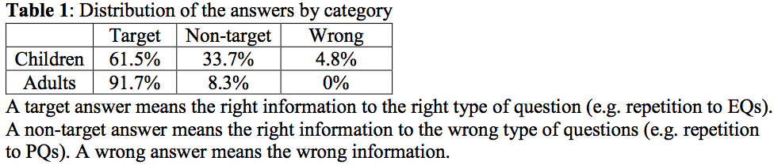

---

#### Characterising lexical richness in the language of children's books

[*Nicola Dawson, Yaling Hsiao, Kate Nation*](./authors.md)

nicola.dawson@psy.ox.ac.uk

Children learn from the language they hear (e.g., Cameron-Faulkner et al., 2003). Evidence suggests that children who experience greater amounts of sophisticated and diverse child-directed talk develop larger vocabularies and better reading skills, and are at an advantage in early school achievement (Hart & Risley, 1995; Huttenlocher et al., 1991, 2010; Rowe, 2008, 2012). Access to the language of children's books via shared reading may be a particularly rich source of linguistic input in the early years, but to understand how exposure to book language may support children's learning, it is important to identify how book language differs to everyday conversation.

In this study, we compared the lexical properties of children's picture books and child-directed speech. The picture book corpus comprised 160 texts commonly read to children aged 0-5 years (around 316,000 words), while the spoken language corpus comprised adult speech directed at children within a similar age range compiled from 10 corpora in the CHILDES UK database (around 3.8 million words). Our aims were to a) quantify how the language of children's books differs from child-directed speech on measures of lexical richness (e.g., lexical diversity and lexical density), and b) identify the words occurring in children's books that are most uniquely representative of book language, and examine how their lexical properties differ from words that occur more commonly in child-directed speech. 

Following Montag et al. (2015), we examined lexical diversity in each corpus by plotting the number of unique words (types) against the total number of words (tokens) at different sample sizes. These type-token ratio curves show that, at any given sample size, picture books contain a greater number of unique word types than child-directed speech, replicating the finding reported in Montag et al. (2015). Lexical density was calculated as the number of words in each corpus classed as ‘lexical' relative to the total number of words. Lexical items comprised nouns (excluding proper nouns and pronouns), adjectives, verbs (excluding modal and auxiliary verbs) and adverbs derived from adjectives (e.g., ‘fast' and ‘happily'). These analyses revealed that lexical density in the picture book corpus was 43%, compared to 29% in our sample of child-directed speech. 

To identify the words most unique to children's picture books, we performed a keyword analysis with the picture book corpus as the target corpus, and the spoken language corpus as the reference corpus (Kilgarriff, 2009). This method produces a ‘keyness' score for each entry in the target corpus which reflects frequency of occurrence in the target corpus relative to frequency of occurrence in the reference corpus. Words with higher keyness scores are more unique to book language, while words with keyness scores below 1 are more common in child-directed speech. We then selected the 300 words with the highest keyness scores and the 300 words with the lowest keyness scores and compared them on three lexical properties: age of acquisition, arousal, and concreteness. Our analyses indicated that the words most representative of children's picture books are later acquired, more abstract, and more arousing than the words more commonly encountered in child-directed speech (Figure 1). 

Our analyses show that the language of children's books is lexically denser and more lexically diverse than the language children hear via conversational spoken language. The words that are most unique to children's books relative to everyday spoken conversation are more advanced, and represent the types of words children need to read, understand and use as they become independently literate. These findings have implications for children's early language learning, as access to books via shared reading activities may help contribute to a richer, more sophisticated and more diverse linguistic environment.

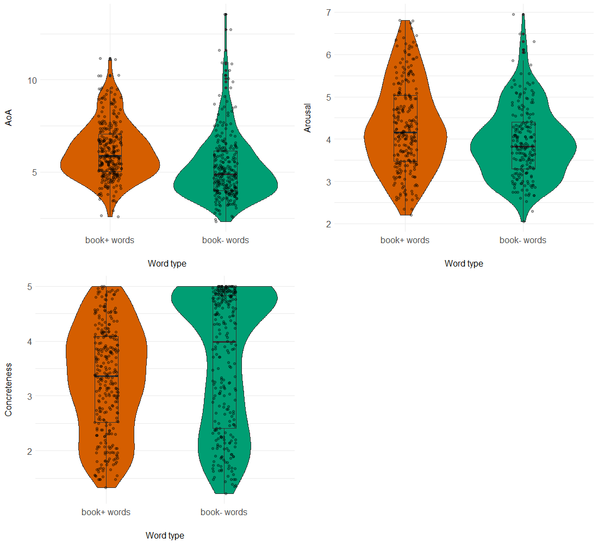

---

### Language processing across age and input characteristics

#### 22 October 13.15 - 14.15

#### Investigating the interplay between parental speech input, speed of processing and vocabulary development

[*Julia Egger, Caroline Rowland, Christina Bergmann*](./authors.md)

julia.egger@mpi.nl

Infants show wide variability in their early language acquisition. Past research has linked parental speech input, both in terms of quantity and quality, to this variability. But not only the parental input, also the infant's own abilities play an important role. Hurtado, Marchman and Fernald (2008) investigated the relationship between various measures of parental speech input (number of utterances, word tokens, word types and mean length of utterance) to the concurrent vocabulary size of 18-month-old infants and their vocabulary growth at 24 months (as measured by the CDI) as well as to the infants' lexical processing speed. They showed that the way mothers talked to their child affects both the infants' vocabulary growth as well as their individual speed of processing ability. Weisleder and Fernald (2013) took the investigations a step further and looked into how the amount of child-directed speech impacted vocabulary growth through speed of processing. Their results reveal that the effect of the speech input on vocabulary is mediated by the infants' individual processing capabilities.

However, it is still unclear which aspects of the speech input influence the infant's linguistic development and to which extent and how they then interact with individual speed of processing. 

Two of the aspects that Hurtado and colleagues studied were maternal (1) mean length of utterance (MLU) as an indicator of input complexity and (2) number of word types as an index of lexical diversity. While both of these are expected to play a major role in determining how children acquire language, we suggest that the impact they have on language development might be different for these factors. 

Parental MLU, indicating input complexity, might provide benefits for the children, but only if they can process these longer and more complex sentences. We therefore predict that the influence of parental input complexity on vocabulary development will be mediated through the infant's individual speed of processing. We hypothesise concretely that fast processors will benefit from higher parental MLU as they can process more complex sentences, whereas slow processors may be hindered by regularly hearing such complex sentences in their input.

Regarding lexical diversity, we would not expect an influence on processing capabilities. Rich variety in lexical input aids the children in building their lexicon, which then in turn can affect their processing. Thus, we hypothesise that lexical diversity correlates with vocabulary and has no direct link to speed of processing, which might indirectly be affected through vocabulary growth.

In order to verify these predictions, we tested 60 18-month-old infants learning Dutch. We assessed their lexical speed of processing in a looking-while-listening paradigm and used the Dutch CDI to determine their concurrent vocabulary size and subsequent vocabulary growth at 24 and 30 months. Parental speech input was sampled during a lab-based play session at 18 months. We used CLAN to compute the parental mean length of utterance in morphemes and lexical diversity with VOCD. We are only able to include 38 infants, as we needed both valid speed of processing measures and filled in CDI questionnaires at 18 and 24 months for our analyses. 

To be able to both quantify support for the alternative and the null hypothesis, we use Bayesian mediation analyses to test our predictions. Preliminary results (n=25) reveal an inconclusive relationship between parental MLU and vocabulary development (BF01 =.609). However, they indicate that our prediction is borne out at least numerically that faster processors benefit more when exposed to more complex language input (see Figure 1). Regarding type diversity, we do find preliminary evidence for a relationship between diversity and vocabulary growth. Taken together, our results demonstrate how we can further elucidate the role of input and infants' own processing skills in lexical development.

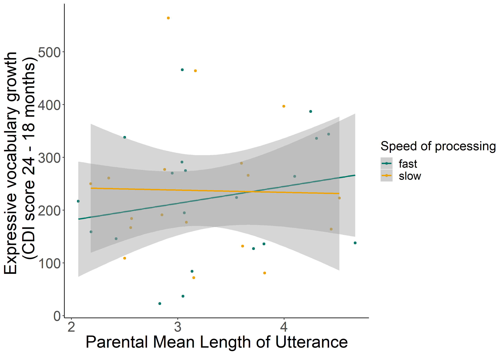

---

#### Predicting lexical processing efficiency at 9 Months from the home language environment: Child-directed vs. ambient speech

[*Jayde E. Homer, Abbie Thompson, Jill Lany*](./authors.md)

jaydehomer@wustl.edu

By 18 months of age, lexical-processing efficiency (LPE), or the speed and accuracy with which infants comprehend familiar words, leverages subsequent gains in language development (Marchman & Fernald, 2008). At this age, LPE is more strongly driven by child-directed speech (CDS) than by the sheer quantity of words heard in the home (Weisleder & Fernald, 2013). While this suggests that only speech directed to children supports language development, the aspects of the language environment that matter most can change across development (Rowe, 2012). Infants begin to comprehend words by 6 months, likely supported by advances in speech-sound perception and word segmentation. Both speech-sound perception and word segmentation rely on extracting statistical regularities, and are likely to be impacted by experience with ambient speech. Thus, we asked whether the total amount of speech that young infants hear is relevant to their developing LPE. We assessed 38 infants (primarily White and learning American English) at 9 months of age on their home language environment (HLE) and LPE. HLE was assessed by collecting 16 hours of audio recordings via LENA devices. LENA software provides automatic estimates of adult-produced word counts (AWC16). We identified two non-consecutive hours containing the most speech an infant heard across the two days (AWC2). We transcribed all the audible speech within those segments and annotated each utterance as CDS or Overheard Speech (OHS). Using these codes, we computed specific measures of HLE: tokens (total word count), types (number of unique words), and the type-to-token ratio (TTR; reflects both the amount of speech and its repetitiveness) for total speech, CDS, and OHS. These common measures provided estimates of language input that go beyond counts by telling us whether infants hear many of the same words repeated, or instead hear a diverse set of words.

LPE was assessed using a looking-while-listening task, in which infants saw images of two familiar items taken from a set of four early-learned items (i.e., dog, kitty, milk, banana) and heard the label for one of them. Infants' received an accuracy score reflecting the average proportion of time spent looking at the labelled item between 300ms and 3,300ms post label-onset. Replicating Bergelson and Swingley (2012), infants showed evidence of comprehension (M = .53, SD = .09) above chance (t(37) = 2.42, p < .05). Measures of the HLE revealed that the average AWC16 was 20395.03 words (SD = 10717.30), and AWC2 was 6080.66 words (SD = 2712.04), as shown in Figure 1. The word count of the transcribed two-hours recordings yielded slightly higher word counts than the LENA measures on that same sample (i.e. AWC2). In our transcriptions (Figure 2), infants heard 8213.79 words on average (SD = 3787.36), 26% of which was classified as CDS. Separate linear regressions revealed that AWC16 significantly predicted greater LPE (p < .05) while AWC2 did not. CDS tokens and types also did not significantly predict LPE (p = .78). In a multiple regression, AWC16 significantly predicted greater LPE (p < .05), while CDS tokens did not (p = .62). Thus, the only significant predictor was AWC16. Note that AWC16 was positively correlated (r = .38, p < .05) with maternal education (M = 16.42, SD = 2.57), while CDS token counts were not (p = .13). Maternal education was also correlated with LPE  (r = .41, p < .01), supporting the possibility that the AWC16 captures important variance that is associated with LPE. These results suggest that in the first year of life, the sheer amount of language infants hear may be more important to shaping lexical-processing skills than more fine-grained measures of smaller HLE samples, like CDS, or more specific features of the CDS, e.g. lexical diversity and repetitiveness. Thus, while CDS plays a stronger role in shaping toddlers' language development, the importance of ambient speech in early language development should not be discounted.

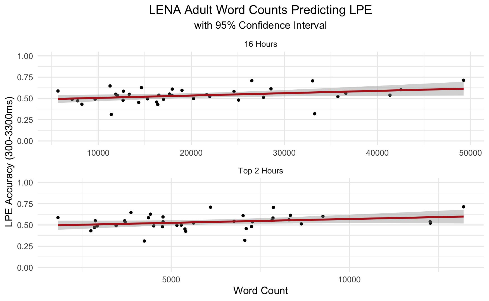

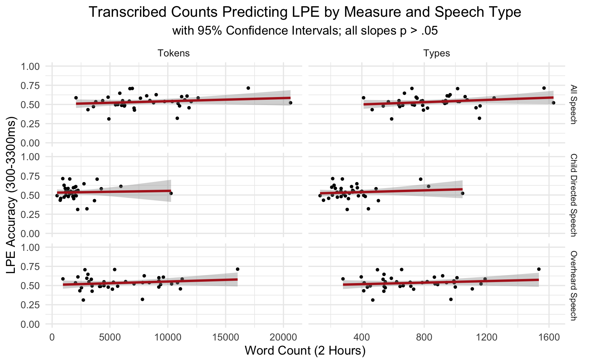

---

#### Developmental effects in the on-line use of morphosyntactic markers: Evidence from Tagalog

[*Rowena Garcia, Gabriela Garrido Rodriguez, Evan Kidd*](./authors.md)

rowena.garcia@mpi.nl

Studies have shown cross-linguistic differences in children's real-time use of morphosyntactic markers for thematic role assignment. Experiments in Turkish have revealed that children as young as 4 years can already use case marking to predict the upcoming second noun (Özge, Küntay, & Snedeker, 2019), while studies in German have demonstrated that even at the age of 6, children are not as efficient as adults in using case markers on-line (Schipke, Knoll, Friederici, & Oberecker, 2012). Based on models of language processing which assume that the parser makes use of distributional information (connectionist: e.g., Chang, Dell, & Bock, 2006; expectation-based: e.g., Levy, 2008), this difference may be due to the consistency of the case markers and the frequency of patient-initial sentences in the language. In this research, we tested this prediction in Tagalog (Austronesian), an understudied verb-initial language that uses pre-nominal morphosyntactic markers to assign thematic roles (i.e., voice-marking on the verb and a prenominal marker).

In Tagalog, the agent voice -um- indicates that the ang-marked noun is the agent [Table 1a, b], while the patient voice -in- marks the ang-phrase as the patient [Table 1c, d]. Post-verb word order is relatively flexible. Evidence from child-directed speech shows that the patient voice is overall more frequent, as well as the agent-initial order (Garcia, Roeser, & Höhle, 2019). Given this distribution, children are expected to learn the patient voice mapping before that of the agent voice, as children have more exposure to the former than the latter, facilitating the rapid implementation of online parsing decisions.

To test this hypothesis, we conducted an eye-tracking experiment with 32 adults (controls) and 151 children (fifty-three 5-year-olds, forty-nine 7-year-olds, forty-nine 9-year-olds), who saw a picture depicting a transitive action between two animals. After 1500ms of silence, they heard an audio-recorded sentence [Table 1a-d] that corresponded to the picture. They were told to pay attention because there would be questions about what they had seen and heard. There were 32 experimental items (8 per sentence condition) and 32 fillers. Our independent variables were voice and the order of the thematic roles; and the dependent variable was the proportion of fixations to the agent in the picture. Our analyses determined whether participants looked at the referent of the upcoming noun even before it is mentioned (Noun1 region), based on the voice-marking on the verb and the noun marker that they had previously encountered. 

A permutation analysis revealed that the ability to use morphosyntactic markers to assign thematic roles develops with age. The 5-year-olds showed divergence in the looks to the agent between agent-initial and patient-initial conditions only after the noun onset. However, similar to adults, 7- and 9-year-old children showed predictive use of the morphosyntactic markers in the patient voice. Thus, in Figure 1 (bottom panel), 7-year-olds looked more to the agent during the pre-noun regions when the sentence was agent-initial than when it was patient-initial (significant regions are shaded grey). However, in the agent voice we only found divergence after noun onset.

Our results showed that children's online use of morphosyntactic markers develops with age, with adult-like online predictive processing only beginning to emerge at 7 years. Furthermore, we found that the real-time use of the markers is modulated by voice—with the patient voice being used more efficiently than the agent voice. We interpret this to reflect the participants' sensitivity to the distributional properties of the language in line with expectation-based and connectionist sentence processing models.

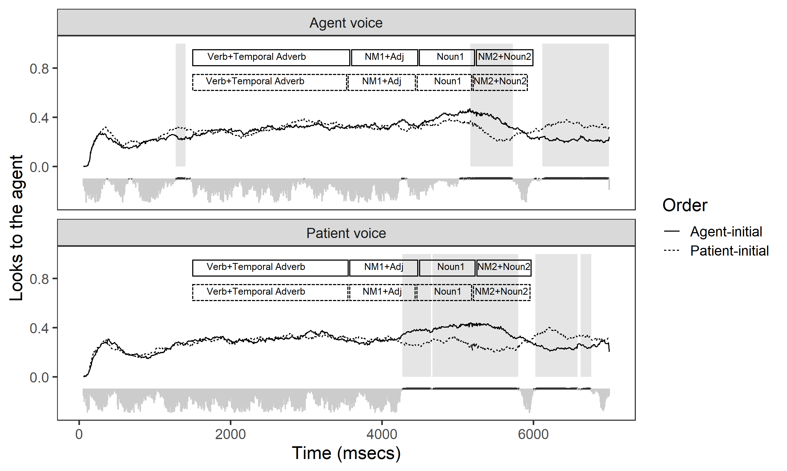

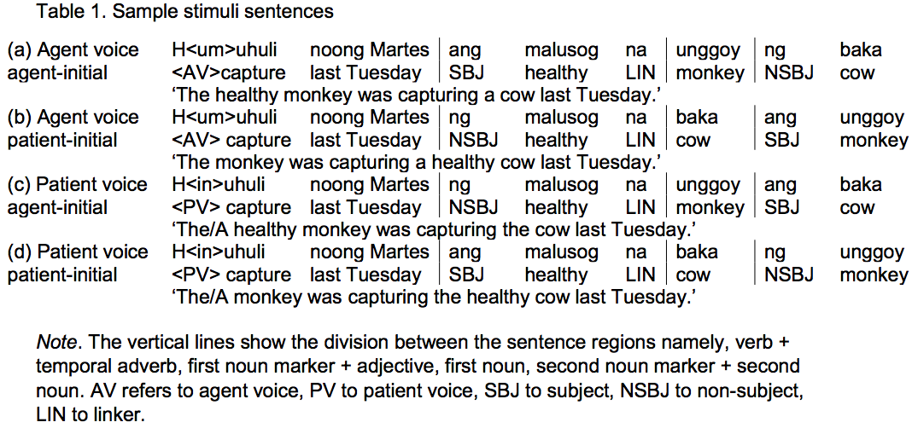

---

#### 23 October 11.15 - 12.15

### Socioeconomic status and language development

#### Reading practices and behaviors of Hispanic parents during shared book reading

[*Daniela Avelar, Adriana Weisleder, Maritza Marquez, Roberta M. Golinkoff*](./authors.md)

davelar@udel.edu

With the increasing number of Hispanic children in the U.S. and Hispanic children scoring lower than their non-Hispanic peers in assessments of early literacy at the start of Kindergarten (NCES, 2018), understanding the early literacy environments of Hispanic children is critical. Reading to young children can influence their language and emergent literacy skills (e.g., Bus et al., 1995). A meta-analysis revealed that dialogic reading, a style of reading involving questions, comments, and expansions, was a strong predictor of children's vocabulary (Mol et al., 2008). Notably, they found weaker effect sizes for children from low-income households or who had less educated mothers. Previous studies report that Hispanic families in the US have fewer books at home (e.g., Flores et al., 2005), are less likely to read with their children (e.g., Boyce et al., 2010), and view reading as an adult directed-activity in which children should be passive listeners (Melzi et al., 2013) than non-Hispanics. 

The current study presents preliminary results from a new survey that queries Hispanic parents' reading beliefs and behaviors when they read with their children in English and in Spanish. Existing surveys do not disentangle the differences between reading in each language and thus do not fully capture the home literacy environment and reading interactions in these families. The Bilingual Reading Survey was developed by adapting questions from the Parent Reading Belief Inventory (PRBI; DeBaryshe & Binder, 1994) and the STIM-Q (Mendelsohn et al., 2016). The goal was to provide a comprehensive description of Hispanic families' reading practices by examining the language in which shared reading occurs. 

Seventy-five Hispanic parents of children between one and six years of age completed the Bilingual Reading Survey over the phone or online. Maternal education was used as proxy for SES. 

A series of repeated measures ANOVAs were run to determine if there were differences between reading in English and Spanish for low SES (completed high school or less) and high SES (completed some college or more) families. For the number of books at home, there were main effects for language and SES, (p's<.001). High SES families reported having more books than low SES families and all families reported having more books in English than Spanish. Similarly, for the number of days a week parents read to their children, there were main effects for language and SES, (p's<.026; Figure 1). High SES reported reading more than low SES families, and families read more in English than in Spanish. There was no significant difference in how often parents asked their children questions during reading in each language. There was a marginally significant interaction in parents teaching children letters and sounds when they read (p=.071) suggesting that high SES parents teach their children about letters and sounds more often when they read in English than in Spanish. Finally, there was a significant difference in how often parents define words for children (Figure 2). Low SES parents define words less frequently when they read in English, while high SES parents define words equally when they read in either language. 

These results provide novel information about reading practices in US Hispanic families in both English and Spanish. These results suggest that Hispanic parents read less often in Spanish and that their behaviors differ based on mother's level of education and the language of the book, particularly for defining words. Due to the relationship between shared reading and language and literacy outcomes, it is crucial to further explore the complex nature of reading interactions in Hispanic families and in doing so, distinguish between reading in each of their languages since reading practices seem to differ. Obtaining a more comprehensive understanding of reading practices in Hispanic families in each language could inform culturally sensitive interventions.

---

#### Reading ability as a protective factor for word learning among school-aged low socioeconomic status children

[*Julie M. Schneider, Alyson D. Abel, Mandy J. Maguire*](./authors.md)

juschnei@udel.edu

Differences in language ability related to socioeconomic status (SES) are evident within the first years of life and have been shown to have detrimental effects on later language outcomes (Pace et al., 2019; Cunningham & Stanovich, 1997). While SES-related achievement gaps are known to widen throughout the course of the school years (Bradley & Corwyn, 2002; Ryan, Fauth, & Brooks-Gunn, 2006; Morgan et al., 2015; Biemiller, 2001), no research to date has identified whether SES-related gaps in language ability persist, grow, or diminish over the course of the school years. Additionally, most SES-related research has focused on static measures of vocabulary and reading ability; however, these measures are known to differentially contribute to word learning ability on the basis of SES, and therefore, subsequent language growth during the school years (Maguire et al., 2018). Therefore, the current study clarifies the role of age, SES, and language knowledge (vocabulary and reading ability) on word learning ability during the school years. 

One-hundred and twenty-four school-aged children (Mage = 136.28 months; SDage = 25.51 months; Range = 96 – 189 months) successfully completed a word learning from linguistic context task, as well as standardized measures of reading and vocabulary (GORT-5 and PPVT-4). SES was measured by self-reports of maternal education: l) less than 7th grade (N = 5), 2) less than high school (9th grade; N = 12), 3) partial high school (N = 9),  4) high school graduate (GED or diploma, N = 11), 5) come college (including an Associate's degree; N = 17), 6) college graduate (N = 45), 7) graduate degree (N = 25). We also included parental reports of bilingualism (N bilingual = 35) and home literacy environment (# of books in the home, average # of minutes read to, average # of minutes child reads) as covariates in all analyses. 

Multiple regression analyses indicated that SES was a significant predictor of word learning ability, vocabulary, and reading across the school years. On average, children from lower SES homes performed significantly worse on all three measures. To address whether SES-related gaps in word learning differ as a function of age, and relate to reading and vocabulary differently, we computed two multiple regression models investigating how age and SES interact with vocabulary and reading independently, to predict a child's word learning success. Vocabulary positively predicts word learning ability (ß= 0.005, p < .0001), as does age (ß= 0.26, p = .01), when controlling for reading ability, SES, bilingualism, and home literacy environment. Therefore, children with worse vocabularies perform worse on measures of word learning, both of which improve with age; however, this is independent of SES. Interestingly, an age x SES x reading ability interaction emerged (ß = 0.002, p = .05), independent of vocabulary. Simple slopes analyses indicated that for young children (< 11.5 years old) from households where mothers had not completed college (some college and below), individual differences in reading ability significantly accounted for variability in word learning success (Figure 1). 

Our findings replicate previous research demonstrating a positive relationship between SES and language outcomes but extends this work to focus upon the school years. Vocabulary is a critical predictor of word learning ability for all children and having stronger reading abilities early on serves as a protective factor for word learning ability in low-mid SES, young school-aged children. These findings point to different paths by which children's word learning abilities may be impacted by differences in the early home environment.

---

#### The effects of prematurity and socioeconomic deprivation on early speech perception: A story of two different delays.

[*Nayeli Gonzalez-Gomez, France O'Brien, Margaret Harris*](./authors.md)

ngonzalez-gomez@brookes.ac.uk

Two major developmental trajectories have been identified as markers of infants' specialisation on their native language. First, there is an increase in infants' ability to process native sounds and consequently, a preference emerges for the sequences that are either legal or have a high frequency of occurrence in their native language (e.g., Jusczyk, Cutler, & Redanz, 1993; Jusczyk, Luce, & Charles-Luce,  1994; Höhle,  Bijeljac-Babic, Herold, Weissenborn, & Nazzi, T. 2009). Second, infants' ability to process non-native sounds decreases over time, a process known as perceptual narrowing (e.g., Werker, & Tees, 1984; Mattock, & Burnham, 2006). These processes of learning have been assumed to be “universal” (Arnett, 2008). However, the vast majority of developmental studies have relied on “convenience samples”, consisting of infants born full term and from higher-SES families, which are, for the most part, unrepresentative of the larger population (Henrich, Heine, & Norenzayan, 2010). There is thus no evidence as to how much the time course of learning is affected by maturational and environmental factors. 

The present project addresses this issue. To do so, we investigated early phonological development in cases where: a) maturation is following an altered timetable: infants born preterm; and b) the environment is different: infants from lower-socio-economic status families. The linguistic abilities of both populations have been found to lag well behind their advantaged peers during the school years. Preterm children and children from low-SES families show poorer auditory discrimination and memory, reading difficulties, poor vocabulary, a specific delay in verbal processing and reasoning, less complex expressive language and lower receptive understanding than their matched controls (e.g., for data on preterm children see: Jansson-Verkasalo et al., 2004; Guarini et al., 2009; 2010; Sansavini  et al., 2010; for data on low SES children see: Fernald, Marchman, & Weisleder, 2013; Farkas, & Beron, 2004; Halle, et al., 2009). 

Three longitudinal studies using the head-turn preference procedure and the Intermodal Preferential looking explored 76 English-learning infants' phonetic, prosodic and phonotactic development at 7.5, 9, 10.5 and 12 months of age. The sample included 20 preterm infants from higher-SES families; 18 preterm infants from lower-SES families; 20 full-term infants from higher-SES and 18 full-term infants from lower-SES. Infants' sensitivity to non-native Cantonese tones (i.e., Tones 25 and 33 instantiated on a CV syllable pronounced ‘‘chee”) and a consonant Hindi Contrast (i.e., /t̪/ dental stop vs /t/ retroflex stop, instantiated on a CV syllable pronounced “t̪a”') were used to explore prosodic and phonetic development, respectively (see Fig. 1). Phonotactic development was explored using CVC English pseudo-words with either a high-probability or a low-probability of occurrence in the language. 

Linear mixed-effects models (i.e., lmer(TotalLook ~ SES * Term * Age * StimType + (Age\|SubjectID) + (1\|StimName))  showed no significant differences between the phonetic or the phonotactic development of the preterm and the full-term infants (see Fig. 2). However, a time-lag between preterm and full-term developmental timing for prosody was found. Socioeconomic status didn't have a significant effect on prosodic development. Nevertheless, phonetic and phonotactic development were both affected by SES, infants from lower SES showed discrimination of non-native contrast and a preference for high-frequency sequences later than their more advantaged peers. Overall these results suggest that different constraints apply to the acquisition of different phonological subcomponents.

---

### Multilingual language development

#### Examining verb-action co-occurrences in everyday contexts in Spanish-speaking and English-speaking families

[*Jane B. Childers, Aria Gaston-Panthaki, Priscilla Tovar-Perez, Gemma Smith, Marissa Young, Rayna Webb*](./authors.md)

jchilder@trinity.edu

Experimental studies of verb learning use varied methods including preferential looking and behavioral enactment.  Across these methods, children often hear a new verb while seeing a novel event during a learning phase.  However, there is little data about the frequency with which children see a relevant action with a corresponding verb in everyday contexts.  We observed Spanish- and English-speaking mother/toddler dyads to discover how often children see relevant events while hearing verbs.

Spanish-speaking (n= 10 dyads, in Guatemala City, Guatemala and Santiago, Chile) and English-speaking children (n= 10, in Austin, Texas) were recruited.  Half were male; half were aged 19-25 months while half were aged 27-36m.  Participants were matched for age, gender, and siblings, and were videotaped playing in their home. Two 45-60 minute samples were recorded (one with a standardized set of toys). Coders watched sessions second-by-second, noting the exact time a verb was said by the parent or child, and whether a relevant action was available in the scene. 

Overall, analyses show no significant differences by language.  For example, the rate of action-verb co-occurences was similar across languages (Spanish: Mprop=.11,SD=.08; English: Mprop=.12,SD=.06).  Instead, differences emerged by age (see Table 1).  In verb productions, independent samples t-tests reveal developmental change in the children's verb productions, t(18)= -2.80, p=.012, but not mothers' productions, t(18)=1.28, ns, suggesting that parents do not adjust their verb productions as children's productions increase.  

To test how often events accompanied verbs, we calculated the mean proportion of verbs that co-occurred with relevant events in the scene.  We found similarly low rates across ages (younger: Mprop= .13, SE=.02; older: Mprop=.10, SE=.02).  Put simply, children only saw relevant actions when they heard a new verb 10-13% of the time.  To examine the specific contexts in which events were present when verbs were heard, a RM ANOVA with action (3: action seen by child, done by child, both seen and done) by Age (2: younger, older), dv= proportion verbs, reveals a main effect of action, F(2,18)=76.79, p<.001, np2 =.81, with children most likely to hear a verb referring to their own action (Mprop.= .61,SE=.04) as compared to one seen performed by the parent (Mprop.= .29,SE= .03) or both (Mprop.=.07, SE=.02) (Fig 1). In addition, although we coded for actions within 10 seconds of the verb occurrence, the average link between verbs and actions was M=3 seconds (SD= 2s; range: immediate-7s).   

In sum, empirical studies of children's verb learning usually present children with co-occurring relevant events.  However, our data show that this is relatively rare in everyday contexts.  It also shows similarities across these two language groups.  Children increased their verb productions across the 1.5 year age span, while mothers' productions stayed the same.  Additionally, children heard verbs without seeing relevant events at least 87% of the time. When verbs were produced, it was often for children's actions, with a tight link (within 3s) between verbs and events. Thus, experimental studies that emulate these learning conditions are needed. It is important to know how children learn verbs to understand how they acquire their native language.

---

#### Bilingual infants disengage faster and switch attention more frequently than monolingual infants

[*Dean D'Souza, Daniel Brady, Jennifer X. Haensel, Hana D'Souza*](./authors.md)

dean.dsouza@anglia.ac.uk

Infants adapt to the external world by sampling and modelling it. The more variable the environment, the more sampling (exploration) is required to build better models and make better predictions. Exposure to different environments may therefore result in different models and predictions. One variable in the infant's environment is the number of languages that the child regularly hears. Infants who regularly hear two or more languages are necessarily exposed to more varied and less predictable language input than infants who regularly hear only one language (see, e.g., Bosch & Ramon-Casas, 2011). These ‘bilingual' infants are also likely to receive less input from each language than ‘monolingual' infants from their one language. Given these exogeneous sampling constraints, how does the bilingual infant keep pace (developmentally) with its monolingual peers? We propose that they do so by placing less weight on consolidating familiar information in order to orient sooner to (and sample) new stimuli. In other words, whereas monolingual infants are drawn to familiar stimuli so they can build detailed representations of their language environment, bilingual infants may err on the side of exploration and collect more samples from their more varied environments. Why might variation in language input affect attention? Building models of the external world may involve domain-general processes, including the integration of action, perception, and multisensory information processing.

Hypotheses

We hypothesised that infants exposed to bilingual environments would (1) more quickly abandon the visual processing of a stimulus to shift attention to a novel stimulus and (2) more frequently switch attention between two visual stimuli.

Methods and Results

We administered three eye tracking tasks to 7- to 9-month-old infants who were being raised in either bilingual (n = 51) or monolingual (n = 51) homes. Experiment 1 attempted to replicate the first (and one of only three studies) to find a bilingual advantage in infants (Kovacs & Mehler, 2009). Participants were presented with 9 pre-switch trials during which they learned to anticipate the appearance of a reward on one side of the screen, followed by 9 post-switch trials when the reward was presented on the other side. We could not replicate the finding: both bilinguals and monolinguals redirected their attention during the post-switch trials.

Experiment 2 tested the hypothesis that bilinguals would be faster at disengaging their attention by presenting infants with dynamic visual stimuli. The bilingual infants were faster at disengaging their attention from a central visual stimulus in order to shift it to a peripheral visual stimulus.

Experiment 3 measured switching frequency. Infants were presented with fifteen 5-second trials that each contained two visual stimuli. Linear mixed effects models demonstrate that the bilingual infants switched attention between the two stimuli more frequently than the monolingual infants (Fig.1), even when taking into account time spent looking at the stimuli (Fig.2).

Conclusion

In sum, we found that infants exposed to bilingual environments disengage attention faster and switch attention more frequently than infants exposed to a monolingual environment.

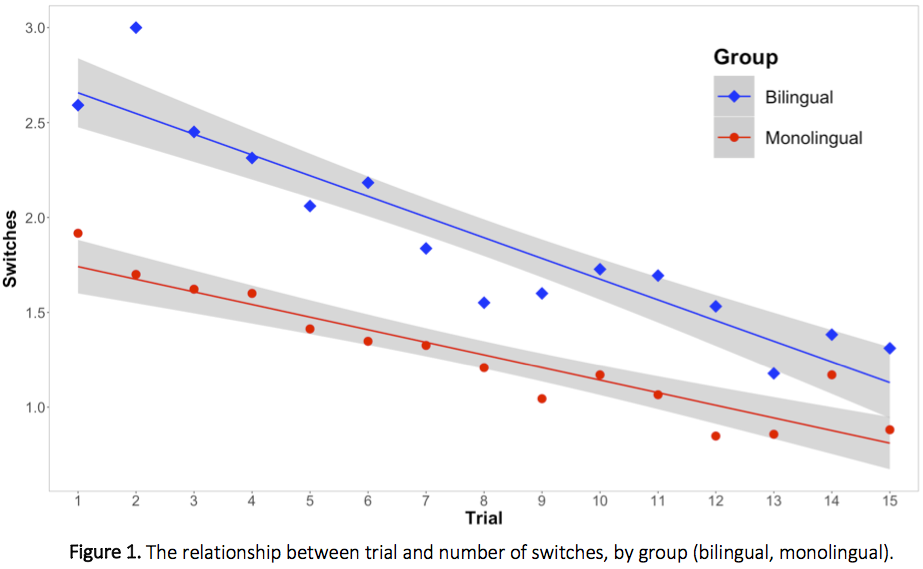

---

#### Spot it and learn it! A novel paradigm to examine word learning in school-aged children

[*Helena Levy, Adriana Hanulíková](./authors.md)

helena.levy@frequenz.uni-freiburg.de

Findings with monolingual and bilingual infants suggest that bilinguals outperform monolinguals when acquiring words in the context of increased phonetic variability (Mattock et al., 2010). Research with (pre)-school aged children shows that bilinguals surpass monolinguals in word learning tasks with unfamiliar referents (Menjivar & Akhtar, 2017) and are more accepting of phonological variations of words than monolinguals (Alt et al., 2019). 

Similarly to bilinguals, children growing up with more than one accent (regional and/or foreign) in their input might benefit from their experience with variability when learning unfamiliar words. We ask whether monolingual and bilingual school-aged children can learn new words in the context of accent variability, and whether experience with other languages and with regional and foreign accents enhances word learning from unfamiliarly accented speakers. 

Previous word-learning tasks have employed paired association tests, which correspond to word learning in a second language, or learning novel names for phantasy creatures, which are then recalled passively during picture selection tasks. While bilingualism has been shown to boost word-learning in tasks that resemble L2 acquisition (Kaushanskaya et al., 2014), it is unclear whether there is a bilingual advantage for word learning when the task involves mapping new words onto unfamiliar referents (Hill & Wagovich, 2020 vs. Menjivar & Akhtar, 2017). We present a novel game paradigm that resembles natural advanced lexical acquisition in the native language, where new words are mapped onto unfamiliar referents and have to be produced actively in peer-group interactions. 

We tested 36 monolingual and 45 bilingual German-speaking children (aged 7-11 years) on their acquisition of six unfamiliar German words (e.g. Amboss, ‘anvil'; Hippe, ‘pruning knife'). The children's amount of experience with regional and foreign accents and with another language was measured via parental questionnaire. The bilingual children were speakers of various other languages in addition to German. 

While playing a computerized card game similar to ‘Spot it' (Blanchot, Cottereau & Play Factory), subjects were required to find the one matching image among objects on two cards. Subjects took turns with six prerecorded child speakers, who had a Standard German accent, a Swiss accent in German or a Hebrew accent in German (the latter two were unfamiliar accents). Learning outcome was measured by the amount of correctly named target objects used by the subjects during the game and in a post-test. Preliminary results of 81 children show that children who had more experience with different types of accents (regional and foreign) learned more words from accented speakers than children with less accent experience (across conditions). Learning outcome was also affected by vocabulary size, age and short-term memory. We discuss how language background and accent experience affect word learning under variable input conditions. 

Alt, M., Arizmendi, G., Gray, S., Hogan, T., Green, S., & Cowan, N. (2019). Novel word learning in children who are bilingual: Comparison to monolingual peers. J. Speech Lang. Hear. Res. 62(7), 2332-2360.

Blanchot, D., Cottereau, J. & Play Factory (2009). Dobble (Spot It!). https://corporate.asmodee.com

Hill, M., & Wagovich, S. (2020). Word learning from context in school-age children: relations with language ability and executive function. J Child Lang. 1, 24.Kaushanskaya, M., Gross, M., & Buac, M. (2014). Effects of classroom bilingualism on task‐shifting, verbal memory, and word learning in children. Dev. Sc. 17(4), 564-583.

Mattock, K., Polka, L., Rvachew, S., & Krehm, M. (2010). The first steps in word learning

are easier when the shoes fit: Comparing monolingual and bilingual infants. Dev. Sc. 13(1), 229-243.

Menjivar, J., & Akhtar, N. (2017). Language experience and preschoolers' foreign word learning. Biling. Lang. Cogn. 20(3), 642-648.

---

### Influences on language and literacy

#### 23 October 13.00 - 14.00

#### The multivariate genetic architecture of language- and literacy-related abilities: Genetic evidence for different cognitive skill sets

[*Chin Yang Shapland, Ellen Verhoef, George Davey Smith, Simon E. Fisher, Bradley Verhulst, Philip Dale, Beate St Pourcain*](./authors.md)

Beate.StPourcain@mpi.nl

Introduction

Recent meta-analytic structural equation modelling studies reported strong to moderate interrelations between language, literacy and related traits, such as working memory (WM), spanning childhood to adolescence. A considerable part of these relationships can be attributed to shared genetic factors. However, our knowledge of multivariate genetic architectures across language and literacy and phonological working memory (PWM) has thus far been largely based on twin studies. Here, we structurally modelled multivariate genetic variance between reading fluency, spelling, phonemic awareness, oral language comprehension and PWM (non-word repetition) in 6,453 unrelated children from the Avon Longitudinal Study of Parents and Children (ALSPAC) with genome-wide information. 

Methods 

11 language- and literacy-related measures, including PWM, were assessed in 7- to 13-year old ALSPAC participants. Multivariate genetic architectures were investigated with Genetic-relationship-matrix structural equation modelling (GSEM) using novel combined Independent Pathway / Cholesky (IPC) models. The IPC model structures the genetic variance as an Independent Pathway model (with shared and specific genetic factors) and the residual variance according to a Cholesky decomposition. Thus, it combines the identification of shared genetic factor structures with a saturated model fit of residual variances, without loss of model fit.

Results 

Model fit comparisons with respect to exclusively Cholesky or Independent Pathway models showed that the IPC model fitted the data best. A single shared genetic factor explained the majority of genetic variance in non-word, word and passage reading fluency, ranging between 82%(SE=9%) for word reading speed to 93%(SE=4%) for passage reading accuracy. Utilising passage reading accuracy as a proxy of reading fluency, we identified a shared genetic factor that almost fully explained genetic variance in literacy (>90%, reading fluency, spelling, phonemic awareness) and to a lesser extent genetic variance in oral language (44%) and PWM (53%). Sensitivity analysis showed that the estimated common factor structures were robust and independent of reading fluency proxy selection. Despite these commonalities, oral language (56%) and PWM (47%) had large specific genetic factor contributions resulting in moderate genetic correlations with literacy-related measures. Also, residual correlations with literacy-related measures were low, especially for oral language. In contrast, literacy-only measures were both genetically and residually strongly correlated.

Conclusions

Our findings suggest a spectrum of interrelated, but aetiologically different cognitive skill sets contributing to language, literacy and PWM performance. The pattern of identified genetic and residual structures is consistent with mediated pleiotropy implicating, predominantly, effects of language on literacy.

---

#### Parental mental health, socioeconomic status, and children's verbal abilities

[*Francesca Scheiber, Allison Momany, Paige Nelson, Kelli Ryckman, Ece Demir-Lira*](./authors.md)

francesca-scheiber@uiowa.edu

Previous research has suggested that parental mental health disturbances and socioeconomic status (SES) may influence children's outcomes, including children's cognitive outcomes. Specifically, children of depressed parents and children of low-income parents tend to perform more poorly on measures of academically-relevant skills, like language and math, than their respective counterparts (Hart & Risley, 1995; Weisleder & Fernald, 2013; Pan et al., 2005; Yu & Wilcox-Gok, 2015). Research combining these two variables has suggested that affluence may act as a buffer against the negative effects of parental depression on children's outcomes (Petterson & Albers, 2001). 

In the present study, we sought to extend the literature on the role of parental mental health and SES in children's cognitive abilities in three ways. First, we examined whether prior findings could be replicated. Second, there is a paucity of research on parental mental health disturbances beyond maternal depression; we addressed this by both measuring anxiety in addition to depression and including fathers in our study. Third, little is known about the relationship between parental mental health, SES, and children's outcomes beyond general cognitive ability and verbal abilities; we addressed this by analyzing visual-spatial abilities in addition to verbal abilities.

Participants included 102 children, between the ages of 3 and 5 years, and their parents. Overall, families in this study came from high-SES backgrounds; the average annual household income was $115,761, and 77% of parents had at least a bachelor's degree. Children's verbal and visual-spatial abilities were represented by the Verbal Comprehension Index (VCI) and Block Design subscale on the Wechsler Preschool and Primary Scale of Intelligence (WPPSI-IV), respectively. Parental depression and anxiety were represented by the General Depression and Social Anxiety subscales on the Inventory of Depression and Anxiety Symptoms (IDAS-II), respectively. SES was represented by a composite variable including parental education and family income. 

Results indicated that: 1) parental depression was negatively associated with children's verbal abilities (r(82)= -.303, p = .005) but not visual-spatial abilities (r(86)= -.183, p = .088), 2) parental anxiety was negatively associated with children's verbal abilities (r(89) = -.353, p = .001) but not visual-spatial abilities (r(93)= -.058, p = .579), 3) symptoms of depression predicted children's verbal abilities, even when controlling for SES (Table 1), 4) symptoms of anxiety predicted children's verbal abilities, even when controlling for SES (Table 2), 5) SES neither moderated the effect of symptoms of depression nor of anxiety on children's verbal comprehension.

These results are consistent with previous findings that parental depression may influence children's verbal abilities. This was true even within a relatively high-SES sample. These results also show that parental anxiety, in addition to depression, may influence children's verbal abilities. Additionally, verbal abilities may be more sensitive to parental mental health symptoms than other cognitive domains. Future research should examine the mechanisms through which parental mental health may influence children's cognitive abilities.

---

#### Sources of plasticity in preterm children's vocabulary acquisition: Interacting roles of gestational age and parent-child interactions

[*Paige Nelson, Francesca Scheiber, Allison Momany, Kelli Ryckman, Ece Demir-Lira*](./authors.md)

paige-nelson@uiowa.edu

Children born preterm (< 37 weeks gestational age) risk suffering from delays in their cognitive development compared to their Term peers. Previous literature on Preterm children's development primarily focused on the role of biological factors, e.g. neurological injury. Recently, literature focusing on parental socioeconomic status (SES) has shown that SES might moderate the relationship between prematurity and cognitive outcomes – where negative cognitive outcomes are higher in Preterm children from disadvantaged SES backgrounds compared to those from advantaged backgrounds. However, parental SES is a composite factor consisting of various subcomponents. Studies on Term children highlight the role of more immediate parent-child interactions for children's cognitive development, over and above SES (Demir, Rowe, Heller, Goldin-Meadow, & Levine 2015). Here, we examined the role of parent-child language/literacy activities in Preterm and Term children's language development, in addition to parental SES. Considering the vast literature on the role of gestational age on children's outcomes, we also asked whether parent-child interactions plays the same or a different role for children born at different gestational ages (GA).

We administered two questionnaires to parents – one assessing language/literacy activities, one assessing child vocabulary skill. To assess parent-child language/literacy activities, we asked parents questions about how often they engage in various language/literacy activities with their children. For example, parents were asked how often they identify names of written alphabet letters with their children. To assess children's vocabulary skill, parents were administered the DVAP (Developmental Vocabulary Assessment for Parents) (Libertus, Odic, Feigenson, & Halberda 2015). 59 children 3 to 5 years of age were studied (M = 4.54 years, SD= 0.56) and were divided into four groups based on their gestational age across the full spectrum: 8 Early Preterm children (GA < 32.6 weeks), 10 Late Preterm children (GA 33 - 36.6 weeks), 11 Early Term children (GA 37 - 38.6 weeks), and 30 Term children (GA 39-41.6 weeks). 

We ran a two-way ANOVA with Group (Early Preterm, Late Preterm, Early Term, and Term), Language/literacy activities, and Group X Language/literacy activities interaction to predict DVAP, while controlling for children's age at testing and parent education. Controlling for age at testing and education, there was a trend in the direction of Language/literacy activities varying by group (F (3, 49) = 2.388, p = .08). Follow-up analyses showed that language/literacy activities were more predictive of DVAP for Late Preterm children than other GA groups. There was no significant effect of Group controlling for language/literacy activities. To sum, the results showed that parental cognitive stimulation might predict outcomes more than broad factors, such as parental SES. Further, parent-child interactions might play a larger role for Preterm children – specifically for Late Preterm children. Our results are consistent with the hypothesis that prematurity might exhibit a heightened case of plasticity where environmental influences might play a larger role in children's outcomes than Term (DeMaster, Bick, Johnson, Landry, & Duncan 2019). Further, late prematurity may be at the optimum point for plasticity, which could possibly explain the greater role of input for this group of children.

---

### Prosody and phonology in early infancy

#### 23 October 13.00 - 14.00

#### Individual variability in infants' cortical tracking of speech rhythm relates to their word segmentation performance

[*Tineke M. Snijders*](./authors.md)

tineke.snijders@mpi.nl

Young infants are very sensitive to the rhythm of speech (Nazzi et al., 1998). Rhythmic cues help infants to identify words and phrases in continuous speech, which is necessary to start building a lexicon (Cutler, 1994). Neural oscillations in the adult brain track the rhythm of speech, synchronising with the incoming speech envelope to focus on salient aspects of the input (Lakatos et al., 2008, Giraud & Poeppel, 2012). This cortical tracking of speech might be a possible neural mechanism through which infants can effectively use rhythmic cues for early language learning. 

In the current study we related individual differences in infants' cortical tracking of rhythm to later word segmentation performance. 7.5-month-old Dutch-learning infants (N=108) participated in an EEG experiment, in which infants listened to stretches of speech (nursery rhymes), as well as to rhythmically regular (2.5 Hz) and irregular trains of complex tones (beeps). At 9 months the same 108 infants took part in a headturn-preference task assessing their word segmentation ability. Here infants were familiarised with passages containing a reoccurring bisyllabic trochaic pseudoword, and then in the test phase their listening times were assessed for familiar and novel word-lists. 

At 7.5 months the infant brains entrained to the rhythm of the regular beeps, as evidenced by a larger 2.5 Hz power over bilateral frontotemporal electrodes for regular compared to irregular beep trains (cluster p<.001; N=51 datasets with enough trials after artifact rejection). Speech-brain coherence to the nursery rhymes was assessed by looking at the consistency of the phase difference between the EEG signal and the speech amplitude envelope, for frequencies from 1-7 Hz (encompassing the frequencies of occurrence for stress patterns, words and syllables). We compared the observed speech-brain coherence to speech-brain coherence of randomised data (for which the speech envelope data was shuffled), and we used cluster randomisation to assess significance of speech-brain coherence for all electrodes and all frequencies in one test. The infants showed significant speech-brain coherence over all electrodes from 1-7 Hz (N=58; cluster p<.001). 

In a next step, both the entrainment to the 2.5 Hz beeps and the speech-brain coherence were related to the infants' familiarity effect in the word segmentation headturn experiment. While there was no relation for the non-linguistic beep entrainment, there was a correlation between the nursery-rhyme speech-brain coherence and the familiarity effect. Again cluster-randomisation was used to assess the correlation for all electrodes and all frequencies in one test. A large left-lateralised cluster was identified showing a negative correlation between the nursery-rhyme speech-brain coherence at 1.5-1.75 Hz and the familiarity effect (cluster p=.033; Figure 1; N=39 included in both experiments). The infants who showed speech-brain coherence at 1.5-1.75 Hz over left electrode sides more often had a novelty effect in the word segmentation task, meaning they listened longer to the novel compared to the familiar word-lists (see Figure 2).

To conclude, infant brains synchronise to the rhythm of both simple beeps and speech. Specifically for 1.5-1.75 Hz, which corresponds to the stress pattern rate in our stimuli, speech-brain coherence was related to the outcome of the word segmentation task. Tentatively the 7.5-month-old infants showing left-lateralised speech-brain coherence at this frequency are more equipped to start segmenting trochaic words from continuous speech, resulting in a more mature novelty response in the word segmentation task at 9 months. The current study gives evidence for the functional relevance of neural tracking of speech. Around 7-8 months of age for Dutch infants the cortical tracking of stress rhythm might be particularly important for starting to identify words in continuous speech.

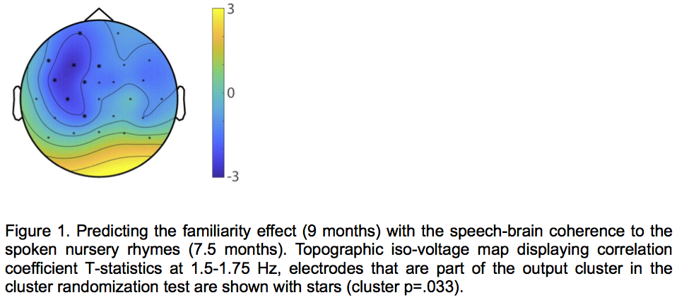

---

#### Opportunities and challenges of setting up global large-scale replications: ManyBabies1-Africa

[*Angeline Sin Mei Tsui, Christina Bergmann, The ManyBabies Africa Team*](./authors.md)

astsui@stanford.edu

From early in life, infants show a preference for infant-directed speech (IDS) over adult-directed speech (ADS). Infants' attention to IDS may be beneficial for their language development (e.g., Spinelli, Fasolo, & Mesman, 2017), pointing to the importance of examining infants' IDS preference across different ages and language backgrounds. Indeed, many studies (including a recent large-scale multisite study – ManyBabies Consortium, 2020) have shown that infants of different ages and from various language backgrounds have a preference for (North-American) IDS over ADS. However, almost all past studies examined infants in Western, educated, industrialized, rich, and democratic (WEIRD) populations (e.g., North America), with minimal inclusion of infants from non-WEIRD populations, as defined by geography and/or socioeconomic status (Figure 1). To our knowledge, there is no study in the current literature examining infants' IDS preference in any country in Africa, a continent home to over 4000 languages. Thus, we do not know whether infants across different cultures show the same IDS preference observed chiefly in WEIRD and almost exclusively in rich, industrialized societies. This sampling bias is a problem for applying theory and generalizing findings about infants' IDS preference to infants growing up in different cultures and languages. Our study addresses this problem by extending the ManyBabies Consortium (2020) paradigm to understudied African populations.

We present a planned large-scale, multisite study that will investigate whether infants show a preference for IDS over ADS in Africa. We have experienced challenges that are specific to the diverse cultures and the populations (e.g., negative attitudes towards clinical populations in some parts of Africa), as well as challenges related to supporting researchers with lower resources and less experience in running experiments (e.g., lack of experimental equipment). By adapting our strategies to fit the cultures and resources, we successfully gathered a team of researchers in Africa, organized a multi-day training workshop in Kenya in Winter 2020, and worked with laboratories to set up the experimental paradigm. Currently, 11 labs in sub-Saharan Africa (Figure 2) have joined and are projected to collect data from over 300 infants in total. These labs cover regions in central-east (e.g., Kenya), the west (e.g., Senegal) and the south (e.g., South Africa). We will collect data across a number of diverse regions in Africa, and will explore whether variations in infants' demographic factors within non-WEIRD societies may affect their IDS preferences. Further, with a larger sample size, our study can also provide a reliable estimate of the IDS preference effect size in Africa, enabling comparison of infants' IDS preference in existing WEIRD (e..g, North America) and high-income non-WEIRD (e.g., Singapore) samples. 

In sum, this study will measure the generalizability of a key infancy finding – infants' IDS preference – to more demographically diverse populations and will provide important insights into how variation in infant's demographics in these societies may affect their IDS preference. This work represents the ManyBabies Consortium's goals and efforts to provide a more global and comprehensive picture of infancy research.

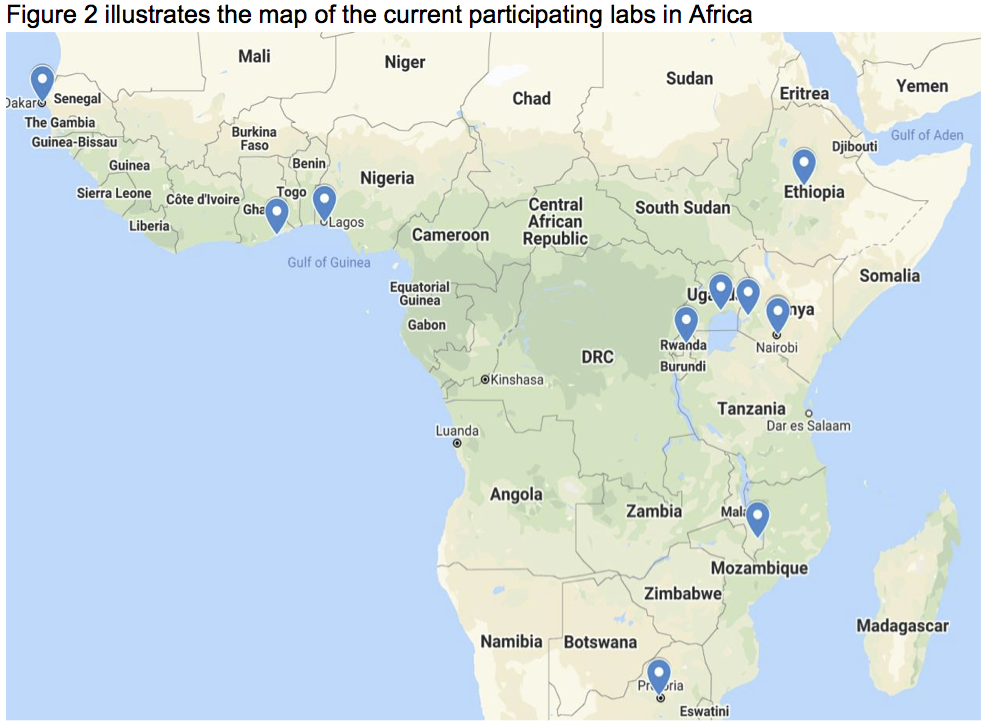

---

#### Measuring phonological systematicity in infants' early words

[*Catherine Laing*](./authors.md)

laingc@cardiff.ac.uk

Early in development, infants' words are often very simple in structure: Early productions are phonologically systematic (Laing, 2019; Vihman, 2016), and reliant on phonological structures that are simple to produce, such as consonant harmony (/beibi/ to represent baby) and open CV syllables (/da/ to represent dog). Furthermore, many of infants' earliest words are phonologically similar: in data from their bilingual (English-Spanish) daughter's early word acquisition, Deuchar and Quay (2000) show that 13 of her first 20 words are produced with a CV structure, and many words are phonologically identical: she produces car, clock, casa ‘house' and cat as /ka/, and papa ‘daddy', pájaro ‘bird' and panda as /pa/. This points to continuity in the transition from babble to words; Vihman (2017) proposes that infants draw on what is most accessible to them in early word production, with earliest words matching the simple structures and stop consonants produced in babble. 

Here I analyse the phonological similarity of infants' developing lexicon. Using data from the Providence corpus (Demuth et al., 2006), I analyse over 140,000 word productions from 5 infants (2 males) between ages 0;11 to 3;10. Measures of phonetic and phonological distance determine the similarity of each word in a recording session with each other word in the same session, and cluster analysis is used to identify clusters of phonologically- and segmentally-similar productions. A smaller number of larger clusters within a session suggests systematicity within that given session; this indicates that the infant is drawing on a smaller number of phonological resources (fewer consonant types, more similar phonological structures) in early word production. I hypothesise that systematicity will be higher in earlier sessions, as infants over-generalise well-rehearsed consonants and structures by adapting or simplifying target word forms to these. In later sessions, I expect to see a reduction in systematicity – indicated by more smaller clusters – as infants move towards a more target-like set of lexical items. 

Segmental and phonological distance is quantified using methods adopted from Monaghan and colleagues (2010), and analyses draw on variability-based neighbourhood clustering models (outlined by Gries and Stoll, 2009) and growth curve models. Preliminary models testing segmental and phonological systematicity over time show a significant effect for the kinds of consonants and structures in infants' early words (Consonants: χ2(2)=12.25, p<.01; Structures: χ2(2)=112.76, p<.001; generated via nested model comparisons). Closer inspection of the results shows a significant decrease in the use of early-learned consonants such as /b/ over time (β=-6.78, t=-3.29; see Figure 1), and a significant increase in the production of closed syllables over time (β=.001, t=5.4). Findings reveal preliminary evidence towards early systematicity giving way to wider phonological variability in infants' developing lexicons.

---

Go to [Main page](../MPaL_handbook.md)

