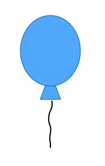

Programme

### Friday, 23 October 2020
09.00 &nbsp;&nbsp;&nbsp; Start program Day 1

09.10 &nbsp;&nbsp;&nbsp; [The role of stress in early language learning](./mpal/abstracts#the-role-of-stress-in-early-language-learning) ([videolink](./mpal/video)), [*Jan Janssen*](./mpal/authors)

10.10 &nbsp;&nbsp;&nbsp; [How do young children learn inflections](./mpal/abstracts#how-do-young-children-learn-inflections) ([videolink](./mpal/video)), [*Frank Smit, Floor van den Bos*](./mpal/authors)

11.00 &nbsp;&nbsp;&nbsp; Coffee break

11.30 &nbsp;&nbsp;&nbsp; [Title of talk three day one](./mpal/abstracts#title-of-talk-three-day-one) ([videolink](./mpal/video)), [author(s)](./mpal/authors)

12.30 &nbsp;&nbsp;&nbsp; Lunch

13.30 &nbsp;&nbsp;&nbsp; [Posters](./mpal/poster-overview)

14.30 &nbsp;&nbsp;&nbsp; [Title of talk four day one](./mpal/abstracts#title-of-talk-four-day-one) ([videolink](./mpal/video)), [author(s)](./mpal/authors)

18.00 &nbsp;&nbsp;&nbsp; End program Day 1

---

Abstracts

### 24 October

---

##### 09.10 - 10.00

#### The role of stress in early language learning

*Jan Janssen*

Stress describes a living thing's response to a threat or some other change in its environment. This change can be called a "stressor." Stressors can vary in size and impact. A stressor can be internal and come from inside the living thing - like an illness.

---

##### 10.10 - 11.00

#### How do young children learn inflections

*Frank Smit, Floor van den Bos*

In linguistic morphology, inflection (or inflexion) is a process of word formation, in which a word is modified to express different grammatical categories such as tense, case, voice, aspect, person, number, gender, mood, animacy, and definiteness. ... These two morphemes together form the inflected word cars.

---

Contact list

## Author Index

<!-- on alfabetic order of last name? -->

|Name|Affiliation|Contact|
|---|---|---|
|Van den Bos, Floor|Department of Psychology, Stanford University|f_denbos@stanford.edu|
|Janssen, Jan|Max Planck Instituut voor Psycholinguïstiek|jan.janssen@mpi.nl|
|Smit, Frank|Radboud Universiteit|f.smit@ru.nl|
