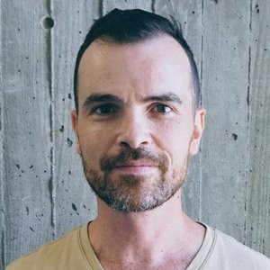

# Many Paths to Language

go to [Main page](./MPaL_handbook)
<!-- Fix this link to main page in all markdown files -->

---

## Invited speakers

### Gabriella Vigliocco (University College London)

Research carried out in my laboratory concerns psychological and neural mechanisms of human language use with a special emphasis on how conceptual and linguistic information are integrated. Our most important contributions to date include development of a theoretical framework for sentence production, and development of explicit computational models of lexical semantic representation informed by cognitive science and neuroscience. At present, our two main projects address: (1) the relationship between language and thought in spoken and signed languages; (2) the representation of abstract knowledge.

---

### Andrea Ravignani (MPI for Psycholinguistics)

<!-- This image is not displayed -- >

Who’s got rhythm? Why do we speak? In my research, I investigate the evolutionary and biological bases of rhythm cognition and flexible sound production, and the role they played in the origins of music and speech in our species. I perform sound recordings and behavioral non-invasive experiments in non-human animals (mostly seals), as a comparative effort to understand the evolutionary history of human capacities. I complement animal research with human testing, neurobiological evidence, mathematical models, and agent-based simulations.

---

### David Barner (University of California, San Diego)

Natural language, unlike animal communication systems, provides a rich combinatorial system that encodes meaning structurally, allowing a finite set of words to express an unbounded number of thoughts. My research investigates how children acquire the logical representations that underlie language, and how they acquire abstract, uniquely human, concepts. A guiding hypothesis of this work is that many important conceptual changes in human development do not require the creation of entirely novel representations, but instead emerge from the representational resources provided by natural language.

---

go to [Main page](./MPaL_handbook)