# Many Paths to Language

Go to [Main page](../MPaL_handbook.md)

---
  
## Poster Abstracts
  
### 22 October

### Child-caregiver interaction

#### The function of infants’ prelinguistic vocal sequences: implications for early communication and language

[*Steven L. Elmlinger, Jennifer A. Schwade, Michael H. Goldstein*](./authors.md)

sle64@cornell.edu

What are the functions of infants’ sequential vocal production, in which prelinguistic vocalizations are tied together closely in time, one after another? Few studies have proposed developmental mechanisms for the emergence of infants’ vocal sequences. Vocal learning studies on humans (The Authors, 2019), songbirds (The Authors, 2020), and primates (Gultekin & Hage, 2018) show that adults who coordinate their vocalizations with those of their offspring create contingent social feedback that facilitates learning of more advanced vocal patterns. While previous work has focused on the timing of feedback to individual syllables, the present study investigates caregivers’ responses to babbling sequences to assess their sensitivity to sequential structure in vocal precursors. There is a strong acoustic continuity between infants’ individual syllable production and early word production (McCune, & Vihman, 2001). Does the appearance of sequential structure in infants’ babbling relate to the timing of their transition into spoken language?

30 caregiver-infant dyads participated when infants were 5 (M infant age = mo) and 10 months of age (M infant age = mo). Dyads engaged in 15-minute unstructured free-play sessions. Caregivers were asked to play as they normally would at home. Audio-visual recordings of infants’ vocalizations and caregivers’ speech during free-play were obtained. Infants’ vocalizations were segmented into vocal sequences if they were bounded by silent gaps longer than 1 second in duration. Vocal sequences all contained at least two infant syllables. For each infant vocalization, we determined whether it elicited a caregiver response. Caregiver responses were defined as any verbal behavior which occurred within 2 seconds after infants’ vocalizations. Caregivers completed the Communicative Development Inventory (CDI): Words and Gestures when infants were 18 months old to assess infants’ word production (Fenson et al., 1994). 

We found that caregivers were more likely to respond to infants’ sequential vocalizations compared to individual syllables at 5 and 10 months (5 mo: t(24)=-2.52, p < .05; 10 mo: t(29)=-5.02, p < .001) (Figure 1). Higher response rates to 5-month-old infants’ sequences could be caused by the longer duration of these vocalizations, as the mean duration of sequences that elicited a response was longer (M = 3.22 s, SD = 1.67 s) than those that did not elicit a response (M = 2.33 s, SD = 1.08 s, p < .05). However, the average duration of 10-month-old’s sequences which elicited a response (M = 2.12 s, SD = 1.07 s) was not different from the duration of sequences which did not elicit a response (M = 1.82 s, SD = .88 s, p > .05). The increase in responses that vocal sequences elicit from caregivers may drive infants to structure their vocalizations as sequences.

A potentially important characteristic of sequential babbling is the degree of vocal compression, measured in the number of syllables per second. Compression is a common strategy for species that communicate acoustically to efficiently incorporate more vocalizations into vocal bouts of similar durations. By adulthood, spoken utterances approach 5-6 syllables per second (Walker, Archibald, Cherniak & Fish, 1992). We analyzed the relation between infants' vocal compression at 10 months and their transition into spoken language at 18 months. The extent to which infants compress their vocal sequences at 10 months predicted productive vocabulary at 18 months (Figure 2). The link between early compression and later productive vocabulary provides further evidence that infants' prelinguistic vocal development serves as the foundation of early language learning and communicative development. By selectively responding to infants’ vocalizations that incorporate more mature speech characteristics, caregivers provide infants with additional sources of information which guide infants’ communicative development.

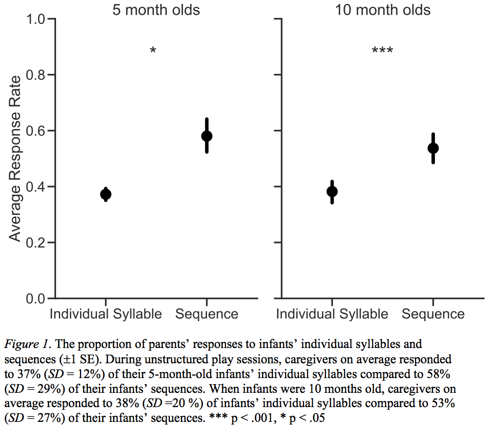

---

#### Caregiver behavior that facilitates vocal turn-taking with prelinguistic infants

[*Hanwen Vivian Zhang, Steven L. Elmlinger, Rachel R. Albert, Michael H. Goldstein*](./authors.md)

hz524@cornell.edu

What aspects of social interaction facilitate communicative development? Infant babbling in caregiver-infant interactions is crucial for infants’ language development (e.g. Goldstein & Schwade, 2010). In everyday learning environments, prelinguistic vocalizations happen in turn-taking interactions with their caregivers (Gratier et al., 2015). These early turn-taking interactions predict later language skills (Warlaumont, Richards, Gilkerson & Oller, 2014; Romeo et al., 2018; Hirsh-Pasek & Golinkoff, 2017). However, we know little about the time course of infant vocalizations within a turn-taking bout. When infants receive a contingent parental response to a vocalization, what happens next? Infant vocal quality tends to become more mature as a result of parental responding (Goldstein, King & West, 2003), but we do not know if responding influences the likelihood of infant vocalizing. Do infants contribute to vocal turn-taking by vocalizing in response to their parents’ contingent behavior? We 1) categorized parental responses to infant vocalizations as vocal or non-vocal, as well as sensitive or redirective, 2) calculated the babbling elicitation rate of caregivers’ responses and 3) plotted the response latency (RL) distribution of infant responses to their parents. 

Fifty-one mothers and their 9-month-old infants participated in a 15-min unstructured play session. The dyads were asked to play as at home in a 3.7-m x 5.5-m playroom containing infant toys. Infant vocalization onsets and offsets were coded. We coded the modality and sensitivity of caregiver contingent responses to infant vocalizations (Table 1). Infant vocalizations that occurred within 2 sec before or after the end of the caregiver response were counted as elicited. Infant RL was calculated by subtracting caregiver offset from infant onset. Elicitation rate was calculated as the number of elicited infant vocalizations divided by the total number of caregiver behaviors.

We found that caregiver vocal responses had a higher elicitation rate than non-vocal responses, and sensitive responses had a higher elicitation rate than redirective responses. We tested the modality and RL effects as well as sensitivity and RL effects with mixed-effects linear regression models in R (Bates, Maechler & Dai, 2009) of elicitation rate. Type III sum of squares analyses on both models revealed main effects of modality (vocal or non-vocal), sensitivity (sensitive or redirective), RL (9 time bins) and interactions between RL and modality as well as RL and type (all p < 0.0001). Infant RL to caregiver vocal (M  = 0.36, SE = 0.05) or sensitive behaviors (M = 0.14, SE = 0.09) peaked at 0-0.5s , while that to non-vocal (M = 0.12, SE = 0.22) or redirective (M = 0.22, SE = 0.19) behaviors was distributed uniformly, without a clear peak (Figure 1).

Our data suggest that the modality (vocal v. nonvocal) and sensitivity (sensitive v. redirective) of caregivers’ responses differentially elicit infants’ vocalizations and thus influence vocal turn-taking. Since the amount of conversational turns influences children’s language performance (Romeo et al., 2018), it is crucial that we understand what increases infants’ vocal responses and extends the turn taking interactions. We found that caregivers who respond verbally to their infants and who respond sensitively are more likely to get infants to talk back, increasing the number of turns. Our data contribute to the broader turn-taking literature by highlighting the bidirectional effects of vocal turn-taking, in which caregivers’ vocal and sensitive responses to babbling may serve as a training ground for the extension of early vocal turn-taking.

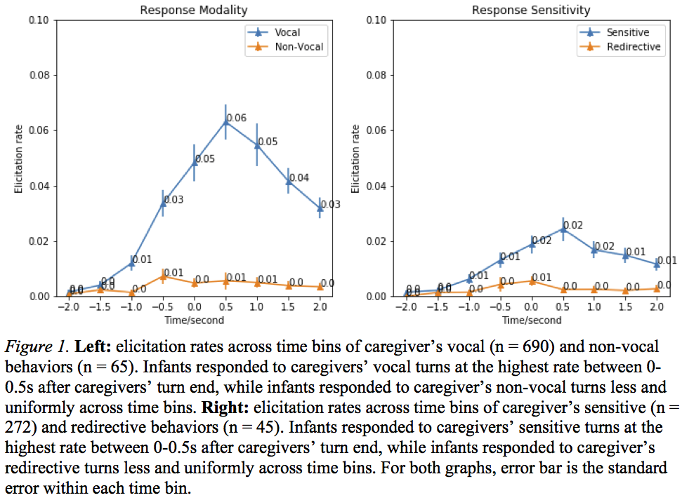

---

#### Exploring conversational exchanges and addressees among Tsimane forager-horticulturalists

[*Camila Scaff, Marisa Casillas, Jonathan Stieglitz, Alejandrina Cristia*](./authors.md)

camiscaff@hotmail.com

Parent-child conversations have been described as playing a substantial role in language acquisition (Snow, 1974; Hart and Risley 1995). The influence of conversational patterns (e.g. turn-taking, number of conversational partners) on language development in non-urban societies remains considerably understudied. We seek to fill this gap by examining the frequency of conversational turn-transitions by Tsimane forager-farmer children from the Bolivian Amazon.

We made day-long recordings of children's speech environments using child-friendly, wearable audio recorders with 25 children (aged 6-68 months; 28% female) from 15 families. For each recording, a trained phonetician annotated all vocalizations heard in one randomly selected minute per hour (mean= 13 coded minutes/child; range 4-16 min). Vocalizations were classified as originating from either the focal child, the "main female voice" (MFV, usually the mother), other female adults, other male adults, or other (i.e. nonfocal) children. 

We operationalized any vocalization preceding or following a focal child vocalization within -1 and 2 seconds as a contingent turn-transition (i.e., as prompts and responses to focal child speech, respectively).  We define as a "block" the time window surrounding the focal child vocalization (-1 and 2 seconds) characterized by the number and identity of other speakers' vocalizations.  For example, if during a block only the MFV interacts with the focal child then the block is labeled as a "MFV block" if another speaker is also present in the same time window, it is instead considered a "Multispeaker block". Four block types were identified: "Main Female Voice", "Adult", "Other child" and "Multispeaker". 

Children experience an average of 1.7 contingent responses per minute (range: 0.1- 5.2). Maternal contingent responses significantly decreased with child age whereas other children's responses increased (Figure 1). 

On average, 42% of all blocks were labeled as "Multispeaker" (i.e. two speakers or more). The majority (58%) of unique conversational partners (i.e. blocks exclusively between the focal child and another speaker) were fellow children. Thus, young Tsimane children experience mostly multiparty conversations and one-on-one conversations are more likely to occur between peers after 12 months of age. The accuracy and stability of these measures remain to be tested upon further data collection and analysis in the future. 

We conclude by discussing the implications of these findings in a broader cross-cultural context. If early conversational turns are mostly composed of third-party conversations, does this mean that exclusive infant-adult verbal interactions are less important than thought in this rural setting? Or are children raised in such contexts capable of focusing attention on multiple speakers simultaneously, as it has been described for other rural contexts (Rogoff, 1993)? These questions invite further study of children’s language experience in diverse socio-ecological settings.

Figure 1. The proportion of different block types as a function of the focal child's age

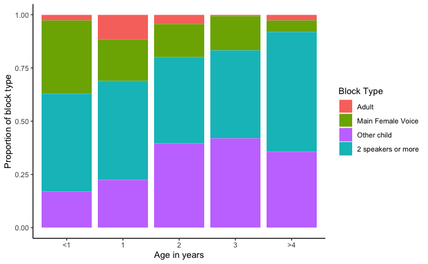

---

#### When do children most resemble their parents?

[*Virginia Valian, Paul Feitzinger, Martin Chodorow*](./authors.md)

vvvstudents@gmail.com

We examine the trajectory of children's language development, concentrating on their two-word sequences, or bigrams, and the similarity of those bigrams to the input bigrams they hear.  In a sentence like "Where's my pajamas?", we count 3 bigrams:  where's, 's my, my pajamas.  (Clitics are counted as a separate word.)  Using the Manchester corpus of 12 child-parent pairs, we track the similarity over time between children's and parents' bigram types (where "my pajamas?" is a type).  

If children are especially highly dependent on their parents' input at the beginning of acquisition, very frequent bigram types in the input should also be very frequent in the child's output.  Vocabulary similarity (shared unigrams), as expected, increases over time; the shared top bigrams also increase over time.  Children share more bigram types, not fewer, with their parents as they develop.  To measure similarity more finely, we use the Morisita index of similarity, since it is not affected by differences in sample size.

When we filter the child's and parent's vocabulary so that only words that they share are included, we see in Fig. 1 enormous variability by child in the development of the Morisita index.  But as Fig. 2 shows, there is an underlying uniformity:  the similarity between child and parent increases over age – the blue line is the average with standard deviations; the green line tracks the child with the highest similarity at each file and the orange line tracks the child with the lowest similarity in each file.  Children start and end at different places, and their development is jagged, but they all increase over time and are least like their parents at the outset of acquisition.  We discuss the implications of joint variability and uniformity in development.

---

### Developmental disorders and delays

#### Language environments are influenced by communication disorders

[*Hillary V. Ganek, Karen A. Gordon*](./authors.md)

hillary.ganek@sickkids.ca

This systematic review explores the effect of communication disorders on the natural language environments of young children. The language that children are exposed to everyday influences their long-term language, cognitive, and academic outcomes. Demographic factors that are external to the child, such as socioeconomic status or culture, have been shown to impact language learning. Conversely, internal factors, including ability, may also affect the language stimulation a child receives. Further, different communication disorders may influence language environments differently. For example, children with hearing loss may not be able to access the language stimulation provided to them because it is not clearly audible while children with autism spectrum disorder (ASD) may not have the ability to interact with the language to which they are exposed. The inability to access or process language may, in turn, influence how adults communicate with children who have communication disorders, thereby placing them at higher risk for more severe language delays. 

Over the last decade, daylong recording tools, like the Language ENvironment Analysis (LENA) System, have been used to unobtrusively observe the natural language environments of children with a wide variety of communication abilities. The LENA System can provide an objective measure of the language children use and are exposed to in their daily lives. We have conducted a systematic review of LENA System literature comparing the effects of childhood hearing loss and ASD on the language environments of young children. We hypothesize that both hearing loss and ASD affect language environments and that children with ASD will verbally engage less with adults while producing more vocalizations compared to children with hearing loss.

Evidence acquisition:

PsychINFO, MEDLINE, and Google Scholar were searched in April 2020. Studies that reported data acquired through the use of the LENA System from children with hearing loss or ASD were included, regardless of the inclusion of a typically developing control group. The main outcome measures were average adult word count, child vocalizations, and conversational turns.

Evidence synthesis:

A total of 319 abstracts and 101 full articles were assessed. Seventeen studies fit inclusion criteria (10 HL, 7 ASD) and 7 of those were included in meta-analysis (5 HL, 2 ASD). These 7 studies were the only ones to include both a typically developing control group and the information needed to calculate effect size. Communication disorders had an effect on all 3 language variables. Both children with hearing loss (d=-.33) and ASD (d=-42) demonstrated a reduction in turn-taking compared to typically developing peers. ASD moderately decreased adult words (d=-.63) and child vocalizations (d=-.27) while hearing loss increased them (d=.13; d=.43). These effects were not significantly different between the HL and ASD groups for any measure: average number of turns (F(2,19)=1.2, p=.33), adult words (F(2,15)=.83, p=.46), or child vocalizations (F(2,10)=.48, p=.63). 

Conclusion:

The evidence suggests communication disorders influence language environments and that hearing loss and ASD may have distinct effects. These distinctions are not yet made clear by the current evidence likely due to population variability, small samples in each study, and the precision of currently available daylong recording tools.

---

#### Neurodevelopmental Differences in Autism Spectrum Disorder Applied to Language Learning

[*Kelly L. Coburn, Diane L. Williams*](./authors.md)

klc92@psu.edu

Background:  Neurodevelopmental processes that begin in utero and continue throughout childhood typically contribute to language development. Improved models of the neurofunctional bases of language can help us to understand typical development, as well as the disruptions to language that occur in neurodevelopmental conditions like autism spectrum disorder (ASD). ASD is one of the most common neurodevelopmental conditions, currently estimated to affect 1 in 54 American children (Maenner et al., 2020). Understanding the structural and functional differences in the brains of autistic children may provide guidance for speech-language pathologists in the selection of current evidence-based practices to support the development of language of children with ASD. Furthermore, recent findings may assist in the design of more effective interventions to support communication development. 

Method: We conducted a focused literature review to identify reports of neurological studies or review articles that inform language learning and related learning processes in ASD. Studies included in this tutorial were peer-reviewed, published since 2005, and addressed behavioral and neurological aspects of language learning in children with typical development and/or ASD. We then integrated this knowledge with the literature on evidence-based speech-language intervention practices for autistic children.  

Results:  In this session, typical postnatal brain development (TD) will be discussed in relation to the known neurodevelopmental differences that occur in ASD. Evidence from structural and functional magnetic resonance imaging (fMRI), diffusion tensor imaging (DTI), magnetoencephalography (MEG), and electroencephalography (EEG) will be summarized. Structural differences in ASD include altered patterns of cortical growth with most studies reporting increased cortical thickness relative to TD (Anagnastou & Taylor, 2011). Alterations in myelination are evident in ASD as indicated by the results of DTI studies (Travers et al., 2012), suggesting less efficient conduction of neural signals.  

Functional differences occur at all levels of the brain, from lateralization of functions (e.g. Eyler et al., 2012) in the cortex to the rhythmic activations of single neurons. Neuronal oscillations are rhythmic patterns of excitation and inhibition of brain cells that contribute to the synchronization of diffuse cortical regions and play a role in our human sense of timing (Simon & Wallace, 2016). Neuronal oscillations, in particular, could help explain disrupted language development by elucidating the timing differences in autistic brains that contribute to reduced functional connectivity, complex information processing, and speech parsing (Simon & Wallace, 2016). Disrupted neuronal oscillations could contribute to uncoordinated timing of speech perception and word segmentation. Findings related to implicit statistical learning, explicit learning of behavioral tasks, multisensory integration, and reinforcement in ASD will also be discussed.  

Conclusion:  Implications of known neural differences can be extended to language instruction and clinical intervention for autistic children at early stages of language learning. The reviewed findings lend additional scientific support to some commonly-used evidence-based treatment strategies. Some of those strategies are: the use of short, simple phrases; repetition of syntactic structures with varied vocabulary, rather than over-repetition of single words; cautious use of pause time; visual supports, including augmentative and alternative communication (AAC) tools; and individualized sensory accommodations. These and other related suggestions for neurologically-informed language intervention will be discussed.

---

#### Relative clause production abilities of children with ASD

[*Nufar Sukenik*](./authors.md)

nufar.sukenik@biu.ac.il

Relative clauses (RCs) are complex syntactic structures because they are grammatical constructions that consist of multiple clauses and also involve syntactic movement. They have been previously found as reliable indicative markers of syntactic impairment in different languages. Children with Autism Spectrum Disorders (ASD) have been found to struggle with comprehension and production of RCs, and it remains unclear whether these difficulties stem from a pragmatic or a syntactic deficit. Furthermore, most previous studies were conducted with English-speaking participants. The current study tested Hebrew-speaking children—37 children with ASD (age 8–17 years) and 24 typically developing children (age 8 years)—on a semi-structured definition task. Typically developing children were found to produce more RCs than children with ASD. Children with ASD produced mainly pronoun errors and productions of single words instead of sentences. The current study contributes to the discussion regarding whether the syntactic differences seen in the production of some children with ASD are a specific form of language deficit, or merely a delay in language acquisition

---

#### Parental Speech to Typical and Atypical Populations: A Study on Linguistic Partial Repetition

[*Luca Onnis, Gianluca Esposito, Paola Venuti, Shimon Edelman*](./authors.md)

luca.onnis@unige.it

Parents naturally speak utterances containing partial self-repetitions with variation in successive utterances (e.g., Want to get your ball? Get your ball? Do you want to get your ball?). Such ‘variation sets’ contain latent distributional information about the building blocks of language and are predictive of children’s lexical and grammatical structures. Because these properties in parents of atypically developing children are virtually unknown, we compared for the first time variation sets in parental speech directed to toddlers with Autistic Spectrum Disorders (ASD, n=25), Down Syndrome (DS, n=25), and a baseline group of Typically Developing toddlers TD, n=31). In Study 1 (Figure 1), we analysed transcripts of mothers’ child-directed utterances during naturalistic dyadic play interactions. While children’s mean developmental age was the same across the three groups, we found that measures of partial repetitions in child-directed speech were larger in the ASD than in the DS and typical groups. 

In Study 2 (Figure 2) we also found that these larger measures in the ASD group were mainly driven by the mother, as opposed to the father. Because partial repetitions decrease with chronological age of the child in typical groups, and the atypical children were older than the TD group, our findings suggest compensating modes of communication in parental speech to atypical populations, especially the ASD group. The study validates the extension of structural/statistical analyses of language to compare parental communication to typical and atypical populations.

Figure 1. Mean values and standard errors for the four measures of parental variation sets (`Varsets` in the figure) across experimental group, gap and n-gram, in Study 1. First row: Proportion of utterances in variation sets. Second row: Proportion of unique words in variation sets. Third row: Diameter of variation sets. Fourth row: Length of variation sets.

Figure 2. Mean values and standard errors for the four measures of Variation Sets across parent, gap and n-gram, in Study 2. First row: Proportion of utterances in variation sets. Second row: Proportion of unique words in variation sets. Third row: Diameter of variation sets. Fourth row: Length of variation sets.

---

#### Co-development of language and social action in a child with Down Syndrome

[*Iris Nomikou, Alessandra Fasulo, Joanna Nye, Leanne Chrisostomou*](./authors.md)

iris.nomikou@port.ac.uk

Language development in children with Down Syndrome is characterised by an asynchrony (Miller, Leddu, Miolo & Sedey, 1995). On the one hand there are difficulties in sound articulation, in syntax and the development of the lexicon and therefore difficulties in the ability to form longer utterances and express more complex messages. So children remain at the one-word period longer than typically developing children, also experiencing failure in being understood. On the other hand, compared to typically developing children they will have gained more interactional experience as they will have participated in communicative exchanges for much longer than the TD children with the same language development in terms of e.g. mean length of utterance or grammatical competence. So there seems to be a tension between what these children would want to communicate about and the resources they can use to achieve this. We suggest that this tension is interesting in making visible how children develop ways of displaying understanding and achieving intersubjectivity.

Furthermore, assuming that language development is driven by acting and interacting in the physical and social world (Nomikou, Schilling, Heller & Rohlfing, 2016), we suggest that to understand the development of language in children with Down Syndrome there is a need for a detailed analysis of their social interactions. According to this approach, we would expect that as a child’s interactional experience becomes more variable, there would be a need to express oneself in a more differentiated way.

To explore this developmental trajectory, we conducted a longitudinal, exploratory, microanalytic case study of a girl with Down Syndrome at three time points (three, four, and five years of age) during three fifteen-minute free play interactions with her mother. This girl, whom we will call Felicity, has a very limited productive vocabulary and makes use to a large extent of non-lexical vocalisations and Makaton signs. From the video recordings we collected all Felicity's utterances and, using a Conversation Analysis approach, analysed their sequential position (initiating or responding), the social actions they pursued (e.g. requests, proposals, assessments) and the full range of verbal, non-verbal and prosodic resources used to implement these actions.

Our first results suggest that, at the first time point, Felicity’s vocalisations are often used in overlap with Makaton signs, to signal speakership and announce upcoming actions. There is very little phonological variability in these vocalisations but a very rich modulation of intonation. In combination with gaze and pointing gestures, the child can preface actions, make proposals and requests, and agree or disagree with the mother’s proposals and respond to questions. Interestingly the vocalisations punctuate very brief fragments of actions, for example picking up one object and putting it on another to make a tower.

With time, in visits two and three we can see an expansion of the repertoire of vocalisations, with different sounds and voice modulation, as well as one-word utterances (such as “yes”, “floor”). The repertoire of actions correspondingly widens. Other actions start to emerge, such as assessments, which allow the child to go beyond communicating about how to play the game and share with the adult what might be noteworthy ‘about’ the ongoing action. Finally, we see that play itself becomes less fragmented and more stretched as a narrative. The child can now plan and perform a series of events and, with the use of vocalisations, gaze and pointing, create what seems to be a narrative about it.

Our data suggest that language development is shaped by the interdependence of the increasing complexity of how the child constructs the play, her ability to perform more differentiated social actions, and the need for her to use more specific linguistic resources to navigate interactions.

---

#### Do older children with ASD continue to show lack of a right-hand bias for gesturing?

[*Nevena Dimitrova, Christine Mohr, Sandra Pache, Seyda Ozcaliskan*](./authors.md)

nevena.dimitrova@hetsl.ch

Handedness is closely associated with language abilities in child speakers (Bates et al. 1986; Vauclair and Imbault 2009). More importantly, right-handed children show better language skills than their left-handed peers (Somers et al. 2015). Research also suggests that hand preference in gesture production predicts language abilities (e.g., Cochet and Vauclair 2010). Specifically, typically developing (TD) children’s production of deictic gestures with their right hand (e.g., point at cat) serves as a reliable predictor of their spoken language abilities (Cochet and Vauclair 2010; Esseily et al. 2011). Recent work suggests that even though children with autism spectrum disorders (ASD) do not show the strong right-hand preference for gesturing found in TD children, gestures with the right hand–especially deictic ones–predict language abilities in young children with ASD (Dimitrova et al., 2020). The aim of this study is to determine whether patterns of hand preference for gesturing and its links to language abilities remain similar for older children with ASD and with TD.

Sixty-eight children including 41 TD children (mean age=3.5 years, age range=26-60, 24 girls) and 27 children with ASD (mean age=5.8 years,  range=33-146, 7 girls) participated; the two groups were comparable in expressive vocabulary (EVT; Williams, 2007) at the time of our observations.  All children were videorecorded for 10 minutes (M=10.13, SD=.64), while playing with structured toys with their primarily caregiver. Children’s gestures were further coded for hand preference: they were then tallied for hand preference (Left vs. Right) for all gestures and for only deictic gestures (e.g., point at cat).

Our results showed similar patterns of differences in hand preference for gesturing in the two groups of children at the later ages. TD children produced more right-handed gestures (M=62%, SD=.28) than children with ASD (M=47%, SD=.29; p=.033), showing a pattern in gesture production akin to production of other manual activities in younger children in earlier work (Cornish and McManus 1996; Dane and Balci 2007). TD children also produced greater number of right handed deictic gestures than TD children, further extending earlier work to older children. There was, however, no reliable correlations between either right or left-handed gesturing and child vocabulary size—for either overall gesture production (TD: ps≥.623, ASD: ps≥.561) or for deictic gesture production (TD: ps≥.255, ASD: ps≥.638). 

These results thus suggest that even though children with ASD continue to show a greater preference for left-handed gesturing than TD children at the later ages, the relative production of right-handed gestures no longer plays a predictive role for child vocabulary in either group. Taken together, these findings suggest that the language learning difficulties and delays found in children with ASD (Tager-Flusberg and Caronna 2007) might be associated with long-lasting atypical laterality for gestures, likely stemming from a reduced left hemisphere dominance for language in autism.

---

### Lexical development

#### Children learn new words with the help of classifiers

[*Ming Yean Sia, Julien Mayor*](./authors.md)

siayean@hotmail.com

Often, children hear novel words as they see several objects. One way children learn meanings of novel words is through the Mutual Exclusivity constraint (ME; Markman & Wachtel, 1988), which argues that children assume each object to be given only one name. This way, children are able to reject any familiar object as the referent of the novel label. Although syntactic cues also help children in learning words (e.g., making mass-count nouns distinction; Barner & McKeown, 2005), Sloutsky et al. (2017) argued that syntactic cues does not allow children to distinguish between two count nouns. Yet, this is not true for numeral classifier languages such as Mandarin. In numeral classifier languages, numeral classifiers group count nouns based on various specifications, such as shape and animacy. This classifier information allows children to pick the correct target object among several novel objects (Li et al.; 2010). 

Malay is also a numeral classifier language that categorises count nouns through numeral classifiers (Salehuddin & Winskel, 2008). Therefore, when a “rod-classifier mipo” is asked for, a rod-like novel object is likely to be the target. As Li et al. (2010) showed that Mandarin-speaking children are able to apply classifier information on novel objects, the present study examined whether Malay children will employ syntactic cues to disambiguate between count nouns.

Sixty-seven Malay children (age range = 5 to 9 years, M = 7.21 years, SD = 1.29) were presented with 32 pairs of novel and familiar objects and asked for a novel label (e.g., Find a rod-classifier mipo!). There were four conditions in the present study; (a) a congruent condition, where the classifier is only suitable for the novel object, (b) an incongruent condition, where the classifier is only suitable for the familiar object, (c) a syntax-neutral-match-both condition, where the classifier is suitable for both objects, and (d) a syntax-neutral-mismatch-both condition, where the classifier is suitable for neither object (see Figure 1). It was hypothesised that if children rely on syntactic cues, they would select the object that matches the classifier regardless of the novelty of the object.

A binomial mixed-effect logistic regression was conducted with condition, age and the interaction between condition and age set as fixed effects. There was a main effect of condition (β = -1.45, SE = 0.67, p = .030) and a significant interaction between condition and age (β = 1.41, SE = 0.53, p = .008). The main effect of condition was further analysed by testing the proportion of novel object selection against chance (i.e., proportion of .50). We found that children selected the novel object significantly above chance in the congruent condition (χ² (1) = 187.48, p < .001); the syntax-neutral-match-both condition (χ² (1) = 11.64, p < .001); and the syntax-neutral-mismatch-both condition (χ² (1) = 17.55, p < .001). In the incongruent condition, children selected the familiar object significantly above chance (χ² (1) = 25.54, p < .001).

The significant interaction between age and condition is illustrated in Figure 2, where older children relied more on classifier information than younger children in the incongruent condition. It is likely that older children’s stronger reliance on syntactic cues stems from their experience in using classifiers. Hence, the present findings are in line with Salehuddin and Winskel (2011), who found that Malay children start to learn about classifiers formally at about 6 years of age and continue to do so till adolescence.

In short, we showed that Malay-speaking children can use syntactic cues to disambiguate between count nouns. This result suggests that children are flexible learners, as they are able to rely on syntactic cues when it is available. Moreover, by recruiting Malay-speaking children, we provide further support to previous researches on the universality of syntactic bootstrapping in language acquisition.

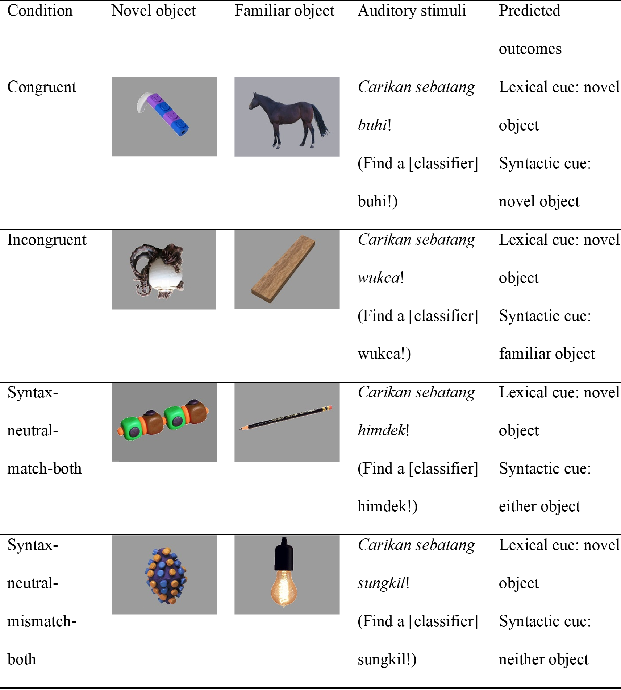

---

#### The Effect of Temperamental Differences on Language Acquisition

[*Liesl Melnick, Sarah C. Kucker*](./authors.md)

sarah.kucker@okstate.edu

Introduction: Children vary incredibly from each other in their temperament and behaviors. Different temperaments are thought to influence variation in children’s vocabulary development as well. For instance, consistent research suggests that higher scores for surgency and effortful control are positively correlated with advanced speaking skills and vocabulary at young ages. Additionally, research demonstrates that personality in adults influences the types of words they use regularly. For example, adults’ neuroticism affects their use of negative emotion words (Pennebaker et al, 2003). However, no study has examined how specific differences in vocabulary might arise in children. Thus, this project seeks to discover if, as children learn to speak, individual temperament affects the categories of words which they learn more efficiently.

Methods: A total of 300 parents of 17- through 37-months-old children participated in the study with 250 completing it online and 50 in person in the lab. Each parent completed the Early Childhood Behavior Questionnaire (ECBQ) very short form (Putnam, Jacobs, Garstein, & Rothbart, 2010) to assess temperament as well as the MacArthur-Bates CDI: Words and Sentences (Fenson et al, 1994) to measure vocabulary. Then, correlational analyses were performed between the child’s score for surgency, effortful control and negative affect and their knowledge of mass and count nouns (Samuelson and Smith, 1999), positive and negative words, and sound words. It was hypothesized that children’s surgency would be positively correlated with knowledge of count nouns and mass nouns, effortful control would be inversely related to sound words, and negative affect would be positively correlated with knowledge of negative words and vice versa for positive words. 

Results: The results demonstrated that effortful control was inversely related to the number of sound words known, r(299)=-.181, p< .001, suggesting that since children with low effortful control typically have a lower vocabulary size (Usai et al 2009), they may instead express themselves through sounds. The results also showed that effortful control was inversely correlated with the number of negative words known, r(299) =-.123, p=.006, which could be related to their typical controlled behavior, leading their parents to use fewer negative words when addressing them. Finally, negative affect was found to be inversely related to the number of mass nouns known, r(299)=-.089, p=.045, suggesting that a fussy nature may influence how frequently children interact with nonsolid objects. Other relationships examined were statistically insignificant. 

Conclusion: Taken together, these findings suggest that variability in the child’s temperament may lead to differences in the child’s vocabulary. This indication demonstrates the importance for future research studies to be cognizant of these differences. In particular, there are important implications for incorporating sources of individual variability in vocabulary for speech therapy and education.

---

#### Exploring item-level variability in the Communicative Development Inventory (CDI) across monolingual and bilingual populations

[*Ancelma Vazquez, Helena Wippick, Elizabeth B. Miller, Caitlin F. Canfield, Daniel S. Shaw, Pamela A. Morris, Alan L. Mendelsohn, Adriana Weisleder*](./authors.md)

helenawippick@nyu.edu

Children's early language production is surprisingly similar across different languages and cultures but is not invariable (Braginsky et al., 2019). Previous research utilizing the Communicative Development Inventory (CDI), a parent-reported measure of children’s vocabulary comprehension and production, found considerable consistency in the first 10 words that children produced across three languages, English, Mandarin, and Cantonese (Tardiff et al., 2008). Using Wordbank, an open repository of CDI datasets (Frank et al., 2017), Frank and colleagues (2020) expanded these findings using data from 17 languages. They found that a third of the earliest produced words were the same across all languages, reflecting salient features of children’s environments such as words for family members, animals, household objects, and routines. However, there was also considerable variation in children’s emerging vocabularies, and as children matured their vocabularies became more culturally variant.  One outstanding question is whether the cross-linguistic variation in vocabulary development is the result of cultural differences in environmental input or linguistic features of the languages.

Importantly, much of this research is based on monolingual populations. Bilingual children are an interesting case study because, while the linguistic features of the languages they hear are minimally changed, the ecological context in which they hear these languages can differ significantly from that of monolinguals. Thus, bilingual children’s early learned words can provide additional clues as to the factors driving early lexical acquisition and cross-linguistic variation. 

The current study explores these topics by comparing item-level CDI performance of bilingual Latinx children in the US to monolingual English-speaking children and monolingual Spanish speaking children. We conducted a secondary analysis of data from an early parenting randomized control trial, Smart Beginnings, consisting of low-income families from two major US cities (see Roby et al., 2020). This study focuses on 64 English-Spanish bilingual children in New York City at child age 24 months. All participants were administered the English CDI-Short Form (SF) and the Mexican-Spanish CDI-SF. Monolingual samples were retrieved from Wordbank (Frank et al., 2017) and were from datasets containing either the US English CDI-Long form (LF) or Mexican-Spanish CDI-LF at 24 months. Analyses are restricted to words on the short forms. 

Our primary research questions are 1) are the words most frequently produced by Spanish-English bilingual children similar to those most frequently produced by Spanish- or English- monolingual children, 2) are there words that bilingual children are more or less likely to produce, and 3) do bilingual children produce particular word kinds (e.g. people, animal, sound words) in one of their languages versus the other. 

Our preliminary results are consistent with literature on emerging words (Tardif et al., 2008; Braginsky et al., 2019). There was substantial overlap in the most frequently produced words for bilingual children and monolingual children at 24 months, with 10 out of the top 15 words being in common across both comparisons (see Table 1). However, there were a number of items that varied across the populations (see Table 2). Particularly, bilingual children produced sound words (baa baa, yum yum, muu) in both languages more frequently than either of the monolingual groups, and may have a stronger bias towards shorter words. Analyses are ongoing, and forthcoming analyses will explore whether bilingual children prioritize particular kinds of words in one of their languages over the other. 

This work will extend previous research on cross-linguistic patterns of early language development by studying bilingual children and contributing to longstanding questions of the relative contributions of input, cultural variation, and linguistic features.

---

#### Language acquisition in time of Covid-19 – a multi-site, multi-country, multi-language study

[*Natalia Kartushina, Julien Mayor*](./authors.md)

Natalia.Kartushina@psykologi.uio.no

In an attempt to contain the Covid-19 pandemic, kindergartens closed nation-widely across the globe. In the current, preregistered, longitudinal study, we evaluate the consequences of home-“schooling” on language acquisition in 8-36-month-old children. In particular, we aim to assess home activities and infant-parent interactions during confinement, and their role in early vocabulary development.

We hypothesized that vocabulary gains during confinement would be modulated by (a) differences in SES, as low-SES families might provide their children with a learning environment less conducive to rapid increases in vocabulary size (Kelly et al., 2011, Melhuish et al., 2008), and (b) activities that parents engage in with their children during confinement; positive effects of shared book reading and structured parent-infant interactions, and negative effects of screen exposure (O'Farrelly et al., 2018; Sénéchal & Young, 2008).

To test these hypotheses, we contacted parents of young children via social media and participants databases and asked them to fill in Communicative Development Inventories (CDI) early (T1) and towards the end (T2) of the confinement period, supplemented with questions about daily routines and activities parents engaged in with their children during confinement.

Preliminary results on data collected in Norway (n=182) confirmed our hypotheses that parent-infant interactions (in particular, free-play with a child) predicted larger increases in vocabulary (in both production and comprehension) while tablet/iPad-based games had negative impact on vocabulary gains in comprehension. While our initial analyses did not find any impact of SES, higher SES (as indicated by mother’s education level) was correlated, on the one hand, with less screen exposure and digital baby games use, and, on the other hand, with more book reading and free-play with the child. 

In parallel, data collection is about to be finished across a dozen countries (e.g., France, Germany, UK, Turkey, USA, Canada, Russia) with over 4000 children contributing to data at T1.

---

#### Determinants of lexical development in Dutch toddlers

[*Josje Verhagen, Mees van Stiphout, Elma Blom*](./authors.md)

J.Verhagen@uva.nl

Children typically acquire words like “mommy” and “banana” before “interesting” and “washing machine”. Previous work suggests that specific properties of words predict which words are acquired first, including word frequency, concreteness, and phonological properties, such as word length, phonological complexity, and neighborhood density (Ambridge et al., 215; Hansen, 2017). Since these factors are often correlated (e.g., shorter words tend to be more concrete and more frequent than longer words), it is crucial that multiple factors are analyzed together. To date, two studies have assessed the independent effects of a large set of factors on children’s early lexical development. In the first, Hansen (2017) investigated how frequency, concreteness, word class, and neighborhood density impacted on acquisition (CDI) data from 5,674 Norwegian children, and showed that frequency was the most important predictor, followed by concreteness. In the second, Braginsky and colleagues (2017) investigated CDI data from over 38,000 children across 10 different languages. In all languages, word frequency and concreteness were amongst the most important predictors of whether children had acquired a word, with phonological factors playing a less important role. The authors also observed interactions with age and word class, such that effects of frequency and concreteness became more important with age, and effects of concreteness were stronger for nouns than function words. In the current study, we build on these earlier studies in two ways. First, we investigate the determinants of early lexical acquisition in a new language: Dutch. Second, by including not only word-based predictors, but also child-based predictors (i.e., age, gender, parental education), we assess the relative weight of the word-based predictors, once variation at the child level is controlled. Specifically, we address the following questions: (i) How do frequency, concreteness and phonological factors predict lexical acquisition in Dutch-speaking toddlers, once differences in age, gender and parents’ level education are controlled? (ii) Do the effects of the word-based predictors vary with age and word class? Data were analyzed from 1,075 monolingual Dutch children (mean age = 28 months, SD = 3.6 months) whose parents had completed the short form of the Dutch CDI (Zink & Lejaegere, 2002). CDI items were coded for word frequency (based on CHILDES), concreteness (Brysbaert et al., 2014), word class (nouns, adverbs/adjectives, verbs), word length (in phonemes), neighborhood density, and number of consonant clusters. A generalized linear mixed-effect regression model showed main effects of frequency and concreteness after controlling for age, gender and parental education, such that words that were more frequent and concrete were more likely to be acquired than words that were less concrete and less frequent (ORfrequency = 13.31 ORconcreteness = 6.70, ps < .001). Word class and phonological factors showed no effects. Regarding interactions with age and word class, the results showed that the effects of frequency and concreteness decreased with age and that the effect of frequency was stronger for nouns as compared to adverbs, adjectives and verbs. These findings support earlier results and extend these in several ways. First, as in other languages, concreteness and frequency were the strongest predictors in Dutch (Braginsky et al., 2017; Hansen, 2017). Second, the effect of frequency was stronger for nouns than for other word classes (Braginsky et al., 2017; Goodman et al., 2008). Third, like in Braginsky et al. (2017), effects of frequency and concreteness changed with age, albeit in the opposite direction. Finally, we add to earlier work by showing that concreteness and frequency predict lexical acquisition once differences in age and gender are controlled. Implications of these findings for theories of early word learning will be discussed.

---

### Assessments and interventions for developmental disorders

#### An online scale for the Assessment of Language in Adults using Self-reported Skills (ALASS)

[*Hannah Joyce, Javier Aguado-Orea*](./authors.md)

j.aguado-orea@shu.ac.uk

Introduction. There is a growing body of literature that highlights the persistent nature of Developmental Language Disorder (DLD) across the lifespan, yet little is known about the presentation of DLD in adults as diagnostic for adults is problematic. Previous research focuses on social outcomes and fails to understand the wider impact of DLD from the individual’s perspective. This study aims to tackle these issues, by developing an online screening tool for adults with language difficulties, incorporating objective language and self-perception measures to provide an in-depth understanding of the potential impact of language disorders beyond childhood (e.g. Conti-Ramsden et al., 2018).

Design. An online survey was partly developed by the researchers, comprising of four sections: two objective language tests, a subjective one, and demographic data including income level and academic achievement.

Participants were 192 adults (49 male, 141 female, 2 undisclosed) aged 18-73 years (M=25.3 years; SD=12.2 years), who were either currently studying (n=150), or had previously studied at university or college level (n=42). Of 192 participants, 13 had achieved post-graduate qualifications, 52 undergraduate qualifications and 127 A-level qualifications. Modal participant yearly earnings was <£10,000.

Materials and procedure. The study was run online using Psytoolkit (Stoet, 2010; 2017). The objective scales were [t1] a lexical test (partly based on LexTale, Lemhöfer & Broersma, 2012); [t2] a syntactic component developed by the researchers: participants were presented with sentences containing a non-word and asked to decide if they are acceptable in English. t1 and t2 were converted into z scores and averaged. The subjective measure [t3] was a questionnaire assessing self-reported language skills (the Assessment of Language in Adults using Self-reported Skills, ALASS), a 20-item questionnaire also developed by the researchers to provide a measure of perceived language ability, specifically in relation to academic and professional skills across the lifespan (Kemp and Seagraves, 1995). Participants were asked to rate skills from 1 (‘I am not very good’) to 10 (‘I am very good’). An average perception score for each participant at three key age points (before 6yrs; before 18yrs; at present) was produced. The initial set of 20 items was reduced into three components: literacy, performance and social, with a principal component analysis.

Results. A linear mixed model analysis was computed, entering the overall language score as criterion. The three ALASS components were entered as predictors (fixed effects) and the participant’s age was entered as random effects. Results of the model are reported in Table 1. The age of participants (range 18-73) is not a good predictor of the objective language scores, but all three ALASS components are significant predictors of the objective language scores.

Scores achieved in the objective tasks (t1 and t2) are good predictors of the self-perfection of competence in literacy (e.g. participants with a good language score tended to score high in items like “writing a story” or “understanding something I have read”) and social functioning (e.g. “speaking in public” or “talking on the telephone with someone you don’t know well”). In turn, language objective scores are a good inverse predictor of performance (e.g. “producing sentences’ or “understanding verbal instructions”), as shown in Figure 1.

Discussion. Language-related skills can be organized around three well-differentiated areas: literacy, language use (performance) and social functioning. Participants with good scores in the use of language at a lexical and syntactic level have a positive self-perception of their reading, writing and social competencies, and a negative self-perception of their linguistic performance. This is an interesting result, providing internal validity to the ALASS tool for adults.

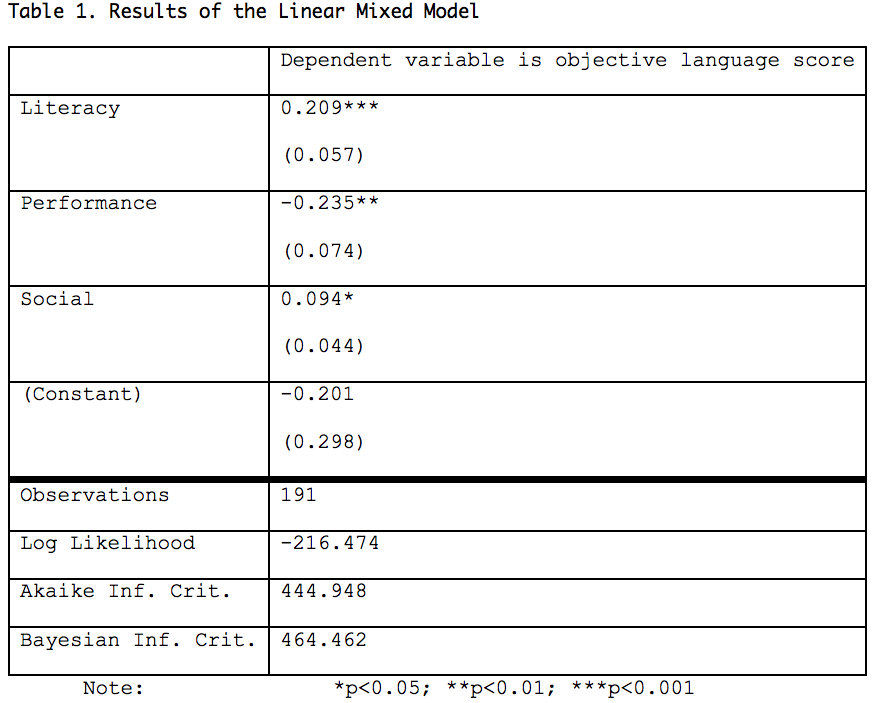

---

#### DYNAMIC-SYSTEMS REFINEMENTS  & INSIGHTS INTO LANGUAGE AQUISITION FROM MULTIPLE INTERVENTIONS WHERE SIGNIFICANT LANGUAGE ADVANCES WERE TRIGGERED ACROSS 4 MONTHS OR MORE

[*Keith E. Nelson*](./authors.md)

keithnelsonart@gmail.com

A key problem for fields of language acquisition and language intervention is that children's achievement of truly life-relevant substantial advances in language skills under well-specified causal conditions has seldom been revealed. This limits refinements of theory and refinements of educational/clinical approaches. Rigorous causal experiments which actually triggered clear cut acquisition by children of syntactic, semantic, and narrative structures are a powerful methodological foundation for understanding language acquisition processes and individual pathways.

  Here we present 3 separate, well-controlled intervention experiments (@20 or more children). The actual poster/talk will include brief information on still more related studies, with a range of participants widely varying across typical development, language delay, deafness, and autism spectrum disorders.

  Study 1. Children received conversational treatment for complex syntactic structures such as passives, relative clauses, coordinative conjunctions, and infinitives.  They acquired these structures, but also made substantial gains on vocabulary tests. Surprisingly, but of great theoretical interest, under the richly supportive and challenging interventions language delayed children showed intact acquisition mechanisms by matching the progress rate of typically developing children.  This was true despite a high degree of language delay before intervention--2 to  3 years below normative. 

  Study 2.  Here all children were children with Specific Language Impairment (SLI).  Their progress was a replication of the language acquisition outcomes in Study 1. The causal nature of the conversational treatment for syntax was illuminated by double controls. First, each participant was tracked on control syntactic structures which received no treatment whatsoever, and for all such control targets progress was zero or extremely minimal.  Second, matching for language levels, a comparison group of SLI who were put on a waiting list and thus receiving no treatment also failed to show advances in syntax--for all cases progress was zero or extremely minimal.

  Study 3. Children received dialogic treatment for narrative complexities and coherence (cf. Veneziano & Nicolopoulou, 2019).  They not only acquired new narrative structures, but also made significant gains on vocabulary and complex syntax.

  Conclusions. In the context of the  prior literature, the outcomes covered above are exceptional. A key reason for this is that the preceding intervention work almost never presented such high language challenges studied across multiple months of intervention.  The experiments also share these  two key elements which need to be given attention in any theory of language acquisition:

1. By framing each intervention within Dynamic Systems (Thelen & Smith, 1994) , a  strong emphasis was placed upon creating converging and positive social-emotional engagement to accompany any presentation of a target challenge and to embed patterns of conversation that would increase processing ease. Further, positive expectations kept increasing across time as  early signs of progress and deeper engagement emerged between the child and the experimenter/clinician. These conditions in the treatment dynamic mixes served to perturb acquisition mechanisms toward focused processing and learning of new language structures.

  2.  Beyond the remarkable overall pace of acquisition during intervention, detailed individual pathways were revealed which indicated that the basically same presentation patterns across children triggered sub-steps that were strikingly different among the children as they each moved toward full acquisition of language structure

---

#### Intervention for word-finding difficulty for Arabic preschool children starting to use English as additional language

[*Roaa Alsulaiman, Peter Howell*](./authors.md)

roaa.al-sulaiman.17@ucl.ac.uk

Introduction: Approximately 5% of pre-school age children exhibit episodes of stuttering Howell (2011). These and other speech disfluencies need to be identified at an early age so that intervention can take place before the problem becomes acute. When children are not speaking their native language, instances of whole word repetitions (WWR) occur which is an indication that they are having Difficulty Finding Words (WFD). WFD is a communication difficulty that can occur in the speech of monolingual children, but it is more frequent in the speech of children who use English as an Additional Language (EAL) (Howell et al., 2017). This study aimed to treat WFD in Arabic children with EAL by training them on aspects of English phonology that they lack. It was hypothesized that intervention involving exposure to unfamiliar phonological sequences should increase familiarity with such structures, improve overall fluency, lexical access and language measures. 

Methods: Twenty two Arabic typically-developing children (Mage = 5.5; 15 female) with EAL and twenty nine children with other first languages including English and French (Mage = 5.6; 12 female) participated in the study. The two groups were recruited at two different schools. Children were assessed pre- and post-intervention. The intervention involved repetition of English phonotactic non-word structures that are absent from Arabic. A spontaneous 200-word speech sample was analyzed for whole word repetitions (an indication of WFD) and the percentage occurrence of dysfluency symptoms out of all syllables spoken (%SS).  Phonological performance was assessed by non-word repetition (NWR) performance. Narrative comprehension and picture-naming tasks were conducted in English. Picture-naming required phonological structures to be used that corresponded to those included in the intervention materials.

Results: Results supported the overall effectiveness of the intervention; this was indicated by a significant reduction in reaction time (RT) in the picture-naming task, (F (1, 50) = 5.32; p =.02), significant reduction in %SS (F(1,50) = 4.17; p=.04) and a significant increase in NWR performance (F(1,50) = 7.8 ; p<.000).  A slight (non-significant) reduction occurred in WFD. Additional analyses were conducted across school-groups to determine similarities and differences in patterns between them. Repeated-measures ANOVA were conducted with one within-group factor (two levels, before and after the intervention) and one between group factor (school) and RT as the dependent variable. A main effect was found for occasion (F (1, 49) = 7.04; p = .01), and for the school, (F (1, 49) = 12; p < .000), There was also a significant interaction between time and school, (F (1, 49) = 4.5; p < .04), so RT varied between the two schools.  

Discussion: The preliminary results reveal that this rapid and easy-to-score phonological training task has promise for addressing WFD for Arabic children with EAL. This is in line with previous findings by Howell et al. (2017) on the effectiveness of phonological training in treating WFD. The improvements relative to baseline occurred immediately post-intervention. In ongoing analysis, we process data from follow-up tests to examine whether there are sustained improvements and determine why schools differed.

---

#### Impact of an early auditory training on the electrophysiological functioning underlying language acquisition: evidence from typically developing infants

[*Chiara Cantiani, Chiara Dondena, Massimo Molteni, Valentina Riva*](./authors.md)

chiara.cantiani@lanostrafamiglia.it

Developmental Language Disorder (DLD) is the most common childhood disorder. It is becoming increasingly clear that the key to its ultimately remediation lies in understanding the early mechanisms that come into play as the developing brain assembles functional networks. Basic auditory perception develops very early in life and is involved in language acquisition. Studies from our research group show that (a) early auditory processing is impaired in infants at familial risk for DLD and (b) it impacts later linguistic development. These pieces of evidence pave the way to the development of interventions that may be administered early in life within the period of known maximum cerebral plasticity. The overall study aims at developing an innovative and ecological early intervention based on environmental auditory enrichment to be tested on infants with/without risk for DLD (7-9 months of age), in an attempt to modify their developmental trajectories before the emergence and crystallization of any behavioural symptoms. Here, the efficacy of the intervention on typically developing infants (without risk for DLD) is tested on the electrophysiological markers of auditory processing and on early linguistic skills investigated before and after the intervention activities.

27 typically developing 6-month-olds participated to this study: 13 infants participated to the early auditory intervention (INT+) whereas 14 did not (INT-). The intervention provides exposure to and active synchronization with complex musical rhythms (through specific “tapping” and “bouncing” tasks). It took place in small groups of infant-caregiver pairs (N=4) for 1 hour/week for 6 weeks and indications were given to caregivers in order to continue the interventions at home. All infants underwent the same evaluations. Basic auditory skills at age 6 and 12 months were characterized via EEG/ERP using a double-deviant oddball paradigm. Pairs of tones were presented at a rapid rate (70ms inter-stimulus interval) and stimuli differing in either frequency or duration served as deviants. At age 6 and 12 months also expressive and receptive early language skills were assessed by means of standardized tests (Bayley Scales).  

The results show that INT+ infants presented at age 12 months a more mature ERP pattern, characterized by shorter latency of the P1 component (standard stimuli) and enhanced P2 component (MisMatch Response). Interestingly, such ERP pattern resembles that of INT- children at age 24 months (see Figure 1). In addition, comparisons between groups in the linguistic measures show significantly broader improvement in INT+ infants, both concerning expressive and receptive language skills (F(1,25) = 4.74 p = .039 and F(1,25) = 11.40 p = .002, respectively – see Figure 2). 

Taken together, these results provide some preliminary evidence on the efficacy of an early intervention based on active acoustic experience in modifying infants’ neuronal and electrophysiological functioning underlying auditory processing skills, as well as early linguistic competences. The next steps of the present study will include the investigation of the efficacy that this intervention may have on infants with a family history for DLD, who have higher risk of atypical linguistic developmental trajectories.

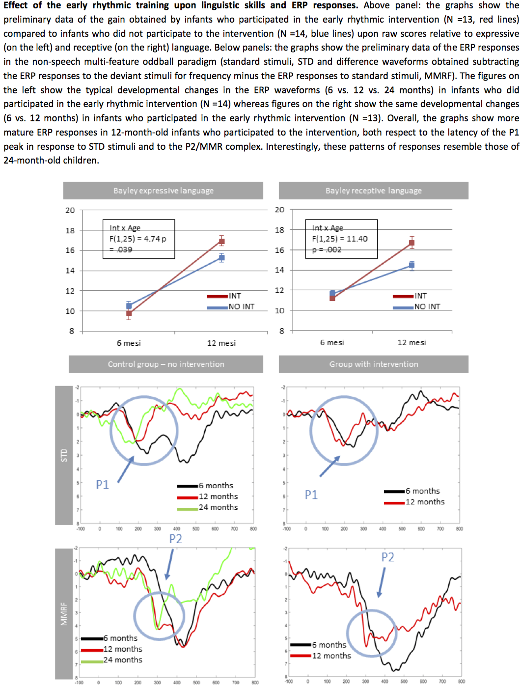

---

### Differences in linguistic input

#### Optimal Learning from Minimal Input: How Pirahã Infants Acquire Language

[*Peter Gordon, Zhongyu Li, Stasha Medeiros, Jean Ee Tang, Nick Bisbee, Erin Kirby, Daniel Everett*](./authors.md)

pgordon@tc.edu

Recent trends in language acquisition research have focussed on the quantity of language spoken to children as a predictor of educational attainment and other cognitive measures. The so-called 30 million word gap controversy illustrates how researchers are seeking to show the precariousness of language development if not enough language is heard.  Other researchers have suggested that language learning is scaffolded with recasts and expansions of utterances that are indirect ways of correcting grammar, while others have suggested that joint attention is a crucial precursor to language learning.

Cross-cultural studies of language interactions between adults and young children have revealed several cultures where speaking to infants and children is rare. A recent systematic study by Schneidman and Goldin-Meadow (2012) showed that direct speech to Yucatec Mayan infants was relatively low (~ 55 utterances per hour on average), as compared to infants in the US, who heard a mean of 605 utterances per hour. In lieu of directed speech to infants and children, it has been suggested that overheard speech might serve as a substitute to directed speech.

The present study originated from naturalistic observations of everyday interactions of members of the Pirahã tribe who live on the Maici river in lowland Amazonia. The Pirahã live in a monolingual hunter-gatherer society that does not integrate with mainstream Brazilian culture. There is no system of writing, counting, representational art, or education. In studying and living with this tribe, it is informally apparent that adults almost never speak directly to preverbal infants, and only rarely to children who have acquired the early stages of language. Dan Everett has been working with the tribe for several decades, and Peter Gordon spent three summers working and living in Pirahã villages for up to 6 weeks at a time. On two visits, PG, set up video cameras to record naturalistic interactions within the village, and these videos are available on Databrary (2012). Filmed sessions recorded on six 2-hour tapes included spontaneous events -- when possible, the camera was left on a tripod unattended to capture naturalistic interactions. We used ELAN to systematically analyze adult-infant/child interactions and behaviors of the Pirahã villagers from these videos. We first coded situations as Opportunities to Interact (OTI), if two or more individuals were in close proximity within a scene. From the OTIs, we coded for direct speech, overheard speech, and instances of joint attention. We categorized non-adults into “preverbal infants” and “linguistically-fluent children” (approx. 4-10 years of age).

Of the 12 hours of video recording, there was only 38 minutes of talking -- the Pirahã spend large amounts of time sitting and not talking. Adult-to-infant directed speech occurred for only 16.876 seconds. For non-infant children, adult speech directed at them occurred for only 3.174 seconds. No utterances of direct speech appeared to be intended as ritualized language teaching - no conversational recasts or vocabulary expansion were found after translating these verbalizations. Also, in no cases was joint attention found as a precursor to direct speech. Since direct speech to infants and children was almost non-existent, their language input consisted almost entirely of indirect overheard speech or conversations between linguistically fluent children. The present data suggest that Pirahã speech of adults to infants is even more impoverished than previous studies of the Mayan Yucatec tribe or any previously documented group. These data suggest that systems of language learning vary considerably from culture to culture. Situations in which the source of input is almost entirely overheard speech have provided compelling evidence for infants’ and children’s almost optimal efficiency in mapping input language samples to developing internal representations of grammar.

---

#### Trivers-Willard hypothesis tested using daylong recordings

[*Valentin Thouzeau, Alejandrina Cristia, Coralie Chevallier*](./authors.md)

valentin.thouzeau@gmail.com

The amount of speech produced by adults varies between families, and its determinants are still poorly understood (Ellwood-Lowe et al., 2020). Speech quantity can be construed as a type of investment in children because 1. parents who talk more to their children are spending some effort on the child, and 2. the child can benefit from this effort, since studies have shown over the past years that children with more plentiful language environments subsequently show better language skills (Huttenlocher et. al. 1991; Rowe, 2006; Grantham-McGregor & Smith, 2016). Evolutionary biology, which has been trying to determine trends in parental investment for several decades, provides a novel perspective on the question of why some parents talk more to their child than others. Specifically, the Trivers-Willard hypothesis proposes differences in investment from parents to their sons and daughters as a function of the parental social status and resources. We test this hypothesis reusing data archived in Homebank (Warlaumont et. al.; 2016, Bergelson, 2017). We drew 14 measures of speech quantity and derived the first principal component as a measure of parental investment. The means of language investment were higher for higher SES compared to lower SES, regardless of the gender of the children (Figure 1). The mean difference between the language investment was larger for male children than for female children for higher SES, and was larger for female children than for male children for lower SES. Kruskal-Wallis test was significant (chi-squared = 13.273, p-value = 0.004), indicating that the repartition of the language investment across the sex-SES groups differ. The pairwise-wilcoxon test indicated one significant difference between higher SES males and lower SES males after correction for multiple comparisons (p-value = 0.001). These results align with Trivers-Willard's predictions. They were not pre-registered and remain preliminary because of small sample size, futur extensions with larger dataset and pre-registration could be necessary for further investigations.

---

#### Efficient estimation of bilingual children’s language  exposure from daylong audio recordings

[*Margaret Cychosz, Anele Villanueva, Adriana Weisleder*](./authors.md)

mcychosz@umd.edu

The language that children hear early in life is associated with later vocabulary size (Hoff, 2003) and speech processing rate (Weisleder & Fernald, 2013). This research relies on naturalistic observations of children’s language input, often captured with daylong audio recordings. However, the large quantity of data that daylong recordings generate requires novel analytical tools to feasibly parse thousands of hours of naturalistic speech. 

This study outlines a workflow to efficiently process and sample from daylong audio recordings when estimating two key elements that define children’s early language environments: 1) quantity of child-directed speech and 2) dual language exposure. The automated tools currently available cannot differentiate between different languages or between child- and adult-directed speech, so this information must be captured through human annotation. In an attempt to minimize manual annotation, we employ a general sampling with replacement technique to annotate small portions of each recording. Previous work in the annotation of daylong recordings has consciously sampled from the recording, for example selecting portions from morning, afternoon, and night, that contain high, medium, and low amounts of speech (Orena et al., 2019; Weisleder & Fernald, 2013). We hypothesize that our selection criterion and workflow will result in less manual annotation to achieve similarly stable estimates.

Data from two daylong corpora of bilingual children (aged 0;6-1;0) are used: children acquiring Quechua and Spanish in southern Bolivia (n=5) and English and Spanish in the United States (n=3). Families completed a daylong audio recording (average duration: 13.24 hours; range 8.78-16) with a Language ENvironment Analysis recorder (Xu et al., 2009). Each child wore the recorder inside of a small pocket on the front of a researcher-provided garment. Caregivers were instructed to turn the recorder on once the child awoke and turn it off once the child went to bed, aiming for 12 hours per day. 

To annotate the data, each recording was first split into 30-second clips that contained human speech (as determined using a standard vocal activity detector [Usoltsev, 2015]). Then, clips were randomly drawn, with replacement, and presented to an annotator. The annotator determined the language spoken in the clip (Quechua/English, Spanish, Mixed, No speech, Unsure), the speaker (Target child, Adult, Other child, Unsure), and the addressee (e.g. target child, adult, other child). After each clip was annotated, a ratio of Quechua/English clips to Spanish clips, and variance in language assignment, was calculated for that child (Figure 1). Variance was measured over a moving window of 60 ratio estimates. 

Preliminary results show that an average of 175 30-second clips (range: 120-261) of manual annotation were required to reach a stable estimate of each child’s dual language exposure and proportion of child-directed speech (Figure 2). This is 60-131 total minutes, or just an average of 11.53% of each overall recording. Previous work estimated language dominance from 24 hours of audio, or 50% of three 16-hour recordings (Orena et al., 2019). We are currently validating the random sampling approach by annotating 50% of each daylong recording to compare with the random sampling results. 

Largescale audio recordings permit close observation of naturalistic language behavior. However, the careful sampling techniques employed in previous work require hours of manual annotation. So long as researchers continue to (understandably) find this time investment unreasonable, parental reports of language use will dominate developmental research (Kaushanskaya & Crespo, 2019). This study will outline how random sampling techniques can mitigate the time required to estimate characteristics of children’s language environments, perhaps making this a more feasible methodological tool in developmental science.

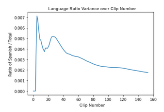

---

#### Individual variation across the socio-economic strata : a differential contribution of mothers’ and fathers’ speech in high- and low-SES families.

[*Stéphanie Barbu, Ludivine Glas, Bahia Guellaï, Alban Lemasson, Virginie Durier, Aurélie Nardy, Jean Pierre Chevrot, Jacques Juhel*](./authors.md)

stephanie.barbu@univ-rennes1.fr

Parental speech to the child has a major influence on language acquisition and individual differences. Much of the early research has been conducted with mothers as mothers remain the primary caregiver in various cultures and are generally more available to researchers than fathers. Despite a growing interest in fatherhood, studies observing both mothers and fathers with their child remain too rare to evaluate accurately any possible interaction between parents and child characteristics. Family socio-economic status (SES) has also profound and pervasive effects on parenting and language input. These findings and shortcomings stress the need to study the complex interactions between child x parent x family characteristics throughtout early language development. To do so, we focused on how young children from 2 to 6 years old, from two contrasting social backgrounds, acquire a frequent phonological alternation in French: liaison. Liaisons represent a challenging task for young learners in word segmentation and learning from the flow of speech leading to frequent errors in young children. Moreover, liaisons are of two types: obligatory liaisons, which are categorical and do not vary with speakers’ characteristics in adults; and variable liaisons, which are a sociolinguistic variable and are more frequently produced by high-SES adults and women. Liaisons are therefore prone to evidence the impact of quantitative and qualitative differences in children’s input and to explore the causes of individual differences in language. In this perspective, 100 French monolingual children and their parents participated in a set of studies. Using a picture naming task eliciting the production of the two types of liaisons, we evidenced early, but temporary SES differences for obligatory liaisons as well as sex differences in low-SES children, but not in high-SES children; low-SES boys presented the lowest performances. Variable liaisons revealed SES differences that appeared progressively during preschool years, but no sex differences. Different developmental and social patterns were thus observed for the two types of liaisons. To investigate whether these differences were related to differences in the input children receive in relation to parents and child characteristics, both parents participated in a picture naming task and in a book reading task with their child. We evidenced SES differences in parents’ productions of variable liaisons in both tasks, but no overall sex difference. Nevertheless, we found an unexpected result: high-SES fathers realized liaisons less frequently with their 2-3 year-olds than fathers with older children and mothers whatever the child age (3-4, 4-5, 5-6 years old). This pattern was not observed in the picture naming task and not for low-SES parents. We also found a relation between parents’ and children’s productions for high-SES fathers in the book reading task only. These findings suggest that high-SES fathers adjust their speech to the youngest children. By realizing fewer liaisons, fathers may help their child to identify words in the flow of speech; and this probably helps for the first steps of liaison acquisition. This also leads to re-examine in the light of possible differences related to family SES the assumption that mothers are seen as providing more linguistic support for their child by tuning their speech to the child’s needs, whereas fathers are seen to be more challenging.

---

### Language and perception

#### Language Highlights Event Components: Japanese Ground-Path Categories

[*Alexus G. Ramirez, Dani Levine, Hannah Puttre, Kathy Hirsh-Pasek, Roberta Golinkoff*](./authors.md)

alexusgr@udel.edu

Japanese speakers encode ground-path distinctions: different verbs are used if the ground is bounded (e.g., street) or unbounded (e.g., field). English speakers typically do not lexicalize the type of ground a figure crosses. At 14-months, both English- and Japanese-reared children discriminate between these ground-path categories in nonlinguistic dynamic events. By 19-months, only Japanese-reared children maintain these distinctions, suggesting the ambient language influences children’s perception of event components (Göksun et al., 2011). Yet this distinction is not “lost” by English-reared children; when these event categories are accompanied by sentences containing two novel prepositions, toddlers at 23-months discriminate them (Konishi et al., 2019). Adults, however, do not discriminate these event categories given the same exposure (Konishi et al., 2019). The current study explored whether older English-reared children, hearing language that calls attention to ground-path categories, can detect this non-native distinction. 

Thirty 4- to 5-year-olds (48.43-68.60 mo., N=30, 15 males) were tested using the Intermodal Preferential Looking Paradigm (Hirsh-Pasek & Golinkoff, 1996) with the Konishi et al. (2019) stimuli. No a priori preference emerged for either type of ground event. Across 12 exposure trials (each 6-seconds), children viewed three bounded and three unbounded dynamic events, each repeated twice, and heard differential language labeling the bounded and unbounded events (e.g., “She’s walking keet the road”; “She’s walking toke the field”). Then, across three familiarization trials (each 12-seconds), children viewed in silence events from a single ground-path category, either bounded or unbounded. Two test trials then presented a split-screen video of an actor walking across one novel unbounded and one novel bounded ground. Novelty-preference scores (NPS) were calculated to assess whether children showed a preference for the ground-path category not presented during familiarization trials, indicating discrimination of the ground-path categories.

Due to null findings when analyzing children’s performance on the full test trials, children’s performance during the first three seconds, in which participants saw the actor walk halfway across the ground, was explored. This initial response may be a better indicator of older children’s understanding of the ground-path distinction, because they may lose interest over the full trial. A repeated-measures ANOVA was conducted with trial type (salience vs. test average) as the within-subjects variable, and gender and age (sample divided at median age) as between-subjects variables. Results revealed a significant interaction between trial type and gender, F(1, 26)=5.989, p=.02 (Figure 1). Follow-up analyses conducted separately by gender revealed a significant main effect of trial type, F(1, 14)=12.195, p=.004, with higher NPS at test (M=.58, SD=.16) relative to salience (M=.48, SD=.11) only for females. This suggests that, unlike males, females were more likely to perform like infants in that they were able to detect the novel ground-path category at test. 

  Children in the age group of 4 to 5 overall had difficulty detecting the non-native ground-path distinction, performing similarly to adults. Yet, results revealed a significant interaction between children’s performance and gender, suggesting females may have been sensitive to the ground-path distinction following exposure to labels distinguishing those categories. A possible explanation is that males’ greater familiarity with English spatial words in the preschool years (Pruden & Levine, 2017) may serve as a catalyst reducing their ability to detect a non-native semantic distinction. Future work should address limitations by assessing children’s overall language abilities, as well as their knowledge of spatial words, and consider how these factors influence children’s sensitivity to ground-path categories.

---

#### “How Individual Difference Measures Inform Event Processing in Monolingual and Early and Late Bilingual Spanish Speakers”

[*Cloe Zeidan, Eleonora Rossi*](./authors.md)

czeidan@ufl.edu

Seminal work on language prediction processes has demonstrated that speakers’ language comprehension is incremental and predictive (e.g., Altman & Kamide, 1999; Kamide, 2008).  More recent literature has proposed that speakers activate different object representations during on-line event comprehension (e.g., Hindy et al., 2012; Hindy et al. 2015), and that those objects representations compete for selection during language comprehension. This study investigates the on-line prediction processes in native Spanish speakers, late L2 learners of English. More specifically, it investigates the comprehension of object change state and the linguistic and cognitive underpinnings during event processing (Tolentino & Tokowicz 2011). Three groups of participants were tested at three sites: monolingual English speakers at the University of Connecticut, early English-Spanish speakers at the University of California, Riverside, and late L2 learners of English at the University of Granada. Across the three sites, participants completed a main visual world paradigm task to measure prediction abilities for change of state verbs. For example, they listened to sentences that elicited a minimal or a maximal state change, such as: “The bride will admire/unwrap the gift”, while looking at a computer display with four target objects. In addition, data from a number of cognitive tasks such as attention, memory, inhibitory control, and goal maintenance were collected to better understand how differences in cognitive function modulated the processing of object state change.

The innovative aspect of this project was to understand how individual differences in bilingual language use and cognitive function modulate event processing. This research produced important preliminary findings showing that prediction and cognitive control abilities modulate real-time event processing in native speakers. In addition, contrary to previous findings, the results demonstrated that early and late- bilinguals were also able to predict as accurately as their monolingual counterparts.

---

#### Children’s linguistic environment and their use of sound symbolism in language acquisition

[*Anja Gampe, Jan Schaltegger, Moritz M. Daum*](./authors.md)

anja.gampe@uni-due.de

Sound symbolism is a non-arbitrary relationship between speech sounds and meaning and has been shown to help infants and toddlers learn words. Previous research has shown that monolingual children are sensitive to these sound symbolic features in the early stages of word acquisition but supersede this sensitivity between around two and four years of age by a preference for words (Thom & Sandhofer, 2014). Given the smaller vocabulary sizes in bilingual children, it has been hypothesized that bilingual children show a prolonged sensitivity for symbolic features, proposed as the wedge hypothesis (Petitto et al., 2012). With the current study we investigate the influence of different linguistic environments on sound symbolism at the age of 3 years to disentangle the factors of growing up with two languages vs. having smaller vocabulary. 

We tested 36 monolingual, 17 bidialectal and 23 bilingual children in a child-friendly adaptation of the guess meaning task (Dingemanse et al., 2016). Children guessed the meaning for ten auditory presented ideophones (words described as iconic) in Japanese, Korean, Semai, Siwu, and Ewe by choosing one of two visual meaning representations. Furthermore, parents filled in a questionnaire on their children’s label for 18 animals. Parents provided the percentages of children’s production of onomatopoetic sounds (“meow”) vs. common nouns (“cat”) for each animal.

Results revealed that monolingual children were less likely to choose the correct meaning for the ideophones compared to bidialectal and bilingual children (estimate = 0.374, SE = 0.175, p = 0.033) and that boys were more likely than girls (estimate = 0.506, SE = 0.177, p = 0.004). In the animal label questionnaire, we found that bilinguals used more animal sounds compared to monolinguals (estimate = 1.900, SE = 0.511, p < 0.001) and bidialectals used animal sounds comparable to monolinguals (estimate = - 0.562, SE = 0.525, p = 0.284). 

Taken together, the results confirm that being exposed to two very close languages results in a similar language acquisition as in monolinguals in the domain of animal labels (Bosch & Ramon-Casas, 2014). Beyond, they provide evidence that even a small variation in input as with two dialects and being a boy associated with smaller vocabulary prolongs the sensitivity to sound symbolism and goes hand in hand with a better guessing of ideophones at the age of three years. The findings indicate the assumption that smaller vocabulary and exposure to slightly different languages support symbolic flexibility.

---

#### The Many Colours of Dolphins: Functional colour knowledge across development

[*Christina Bergmann, Teun van Gils, Lena Ackermann, Markus Ostarek, Jeroen van Paridon, Guillermo Montero-Melis*](./authors.md)

christina.bergmann@mpi.nl

Colour knowledge permeates our lives and plays a central role in pervasive tasks like object recognition. How does this knowledge develop in children? To address this question it is important to consider which skills are at play: separation of the continuous colour space, attaching labels, and extracting colour information from visual input. 

In this study, we focus on functional colour knowledge, i.e. how children and adults use their knowledge about entities to categorize them. In other words, we tap into higher level skills related to colour term acquisition, which involve not only correctly partitioning the colour space and assigning the appropriate label, but also sampling over many examples and accessing some stored common property. To test the developing ability to use colour knowledge in such a way, we asked children (N = 48, aged 3 to 11) and adults (N = 28, aged 24 to 65 ), to categorize 16 animals by colour in a tablet study (Figure 1, top panel). A second task was to assign a colour to each group (Figure 1, bottom panel). Data collection took place during an outreach event, and a current online study aims to increase our sample size to obtain data from over 100 participants evenly distributed between the age of 3 and 16 and a matched adult sample. 

Our results show that throughout childhood, functional colour term use is changing and progressively becoming more adult-like. There was a clear developmental pattern from large variability and low consistency in the responses of young children (e.g., dolphins are grey or blue, ants are black or red; Figure 2, Panel A) to large consistency among adults (dolphins are grey, ants are black). Moreover, we show that not only the groupings of animals differ among children and adults (and among children at different ages, Figure 2, Panel B) but also the colours assigned to those groups (Figure 2, Panel D). For instance, while both children and adults assign turtles to a “green” cluster, the green of that cluster is brighter for young children than for adults, and shows a clear developmental pattern from brighter to darker for children as they become older. However, we do not observe extension errors that have been reported previously for children up to the age of 11, as participants from age 3 onwards overwhelmingly pick colours that match the label (Figure 2, Panel C). Taken together, our results suggest that developmental differences in categorization of animals and thus the functional use of colour terms is not due to a delay in acquiring these words per se but rather reflects differences in the colours children prototypically assign to animals.

More broadly, our data suggest that linguistic and visual input interact in complex ways and that there is a developmental trajectory in colour knowledge. First, children differ in their judgement of prototypical colours for categories that might seem uncontroversial for adults (dolphins are grey, not blue) and this might be related to their visual input, because many dolphins they are exposed to can indeed be blue. Second, the observation that children tend to pick brighter colours for the same animals and colour labels leads to questions about how children establish prototypical categories and which information they have at their disposal and use to arrive at prototypical animal colours. For example, picture books tend to depict dolphins as blue, but adults know that this is not a reliable source of information on natural animal colours. Do children weigh the evidence differently, simply compute statistics over the input, or only consider drawn animals for the specific task at hand? Future research will have to address these and other questions posed by our results, including tracing individual children's trajectory towards adult-like colour term knowledge and the factors that might shape this path.

---

#### Different developmental trajectories in Dutch and Turkish children’s acquisition of space-pitch terminology

[*Sarah Dolscheid, Simge Çelik, Hasan Erkan, Aylin Küntay, Asifa Majid*](./authors.md)

sarah.verlage@uni-bielefeld.de

Languages vary considerably in how they describe sensory experiences like colors, odors, or sounds. For instance, some languages express auditory pitch in terms of spatial height (high vs. low pitch), while others use thickness terminology (thick = low frequency vs. thin = high frequency). To what extent do these cross-linguistic differences affect the way children learn space-pitch vocabulary and how do children associate spatial dimensions and pitch when no language is used? We addressed these questions by examining the developmental trajectory of linguistic and non-linguistic space-pitch associations in children who acquire Dutch (using height-pitch terminology) vs. Turkish (using thickness-pitch terminology). Five age-groups (5-year-olds, 7-year-olds, 9-year-olds, 11-year-olds, and adults) were tested in linguistic height-pitch and thickness-pitch comprehension tasks as well as in nonlinguistic height-pitch and thickness-pitch association tasks. Overall, we found better performance for thickness-pitch than for height-pitch associations in both linguistic and non-linguistic tasks. This was true for Turkish speaking children but also for Dutch children who are not exposed to thickness-pitch terminology in their input language. Consequently, associations between spatial thickness and pitch do not seem to originate in linguistic pitch terminology and appear more intuitive for children than height-pitch associations. By contrast, Dutch speaking children did not show reliable height-pitch associations and full comprehension of height-pitch terminology until age 11, thus rather late in development. Turkish speaking children even reversed height-pitch associations. That is, they consistently associated higher spatial elevation with a low-pitched sound and vice versa for high-pitched sounds in both the linguistic and the non-linguistic height-pitch task. The acquisition of height-pitch mappings thus appears less stable than thickness-pitch associations and leads to more pronounced differences between Dutch and Turkish speaking participants. In sum, our findings demonstrate that even within a single domain (i.e., pitch terminology) different degrees of linguistic influence seem to be at play. While thickness-pitch associations are acquired in similar ways by Turkish and Dutch children, the acquisition of height-pitch terminology differs more substantially across cultures.

---

### Methodological advances

#### Investigating the relationship between infant learning and measured effect size in preferential looking paradigms

[*Martin Zettersten, Alexis K. Black, Christina Bergmann, Desia Bacon, Haley Weaver, Jenny Saffran*](./authors.md)

martincz@princeton.edu

In looking time studies, individual infants show a wide range of preferential responses. How should we interpret individual differences in looking times? Does the size of a looking time difference index the individual’s strength of discrimination or amount of learning? Most methodological and analytic approaches are based on the premise that the size of individual infants’ looking time differences are meaningful (e.g., Hoareau et al., 2019). Some analytic approaches, however, treat direction of preference as a binary outcome and ignore variability in preference size (e.g., Newman et al., 2006). An underlying difficulty in interpreting the magnitude of looking time differences is that our understanding of the relationship between learning processes and looking behavior is limited (Bergmann et al., 2013). 

The aim of the project is to ask whether the magnitude of the effect size in looking time studies is a meaningful index of the degree to which infants have learned. To address this question, we test infants’ recognition of novel auditory stimuli following a training phase - a fundamental task for infant learners (Jusczyk & Aslin, 1995) - while manipulating a factor that is expected to affect learning: frequency of exposure. During the training phase, infants hear a list of nonce words, in citation form. While all infants hear the same total number of nonce words during familiarization, the frequency of target words varies. After the training phase, we test infants’ preference for two (familiarized) target words and two (novel) nonce words they did not hear during the exposure (counterbalanced across infants - see Figure 1). The central question is whether more frequent exposure to target nonce words - and hence, stronger learning of these items - results in larger effect sizes as measured through infants’ looking behavior.

In a preliminary experiment (pre-registration: https://osf.io/j49gr/?view_only=124728c565994d5fa27bfc10ab250078; data repository: https://osf.io/db2t3/?view_only=a1c10a1b601147b7a8f13acbd83ebac4), we are investigating two between-subjects boundary conditions: a condition where the target words are heard relatively infrequently (4 occurrences each in 80 total words; 4x condition), and a condition where the target words are heard relatively frequently (16 occurrences each in 80 total words; 16x condition). These data will inform decisions for a planned large-scale test of the relationship between frequency of exposure and effect size. The full design (planned for subsequent data collection) will include a continuous manipulation of nonce-word frequency across several additional conditions (as depicted in Figure 1). 

Preliminary inspection of the data (data collection ongoing; N=51 of a pre-registered final sample of 64) suggests no clear evidence of learning in infants in the 16x condition (difference in looking to novel vs. familiar words: M = -260 ms, 95% CI = [-1581 ms, 1062 ms], t(23) = -0.41, p = .69; moderate evidence in favor of the null hypothesis: BF01 = 4.32; see Figure 2) and infants in the 4x condition (difference in looking to novel vs. familiar words: M = -665 ms, 95% CI = [-2112 ms, 782 ms], t(26) = -0.95, p = .35; moderate evidence in favor of the null hypothesis: BF01 = 3.27). In our presentation, we will discuss our next steps towards studying how systematic changes to infants’ exposure  - and consequently, to infants’ learning - modulate effect sizes in looking time tests.

---

#### Towards a large-scale collaboration for infant online testing: Introducing ManyBabies-AtHome

[*Christina Bergmann, Helen Buckler, Rhodri Cusack, Sho Tsuji, Lorijn Zaadnoordijk, The Manybabies-AtHome Consortium*](./authors.md)

christina.bergmann@mpi.nl

How do we study individual infants on their way to language? In addition to recording their own output and asking parents about vocabulary skills, laboratory studies are a cornerstone of individual differences research. A key dependent measure in assessing different levels of linguistic skills, from language and vowel discrimination over the processing speed of words to processing syntactic structures, are measures of gaze. The dependent variable, often looking times to a specific region on the screen or to the screen itself, can be measured by approaches such as offline and online video coding, and more recently by automated eye-tracking using infant-friendly remote eye-trackers.

Classically, such experiments are conducted under - at least per lab - highly standardized conditions with regard to relevant factors such as distance between participants and screens, lighting, and ambient noise. However, as online testing for adults has become ever more accessible, there have been several promising initiatives to move these types of experiments online to allow caregivers to participate from their home environments (e.g., https://lookit.mit.edu/, Scott & Schulz, 2017; https://www.onlinebabylab.com/, Libertus & Violo, 2016; Semmelmann, Hönekopp, & Weigelt, 2017). 

Online testing holds great promise for individual differences research, because the samples that can potentially be reached are larger and more diverse. Further, in addition to reduced variability in the testing protocol due to its codified, automatic nature, the fact that infants are tested in a familiar environment and without the additional burden of a lab visit and associated travel, might yield a clearer signal and/or allow for testing the same infants across multiple time points more easily. 

Despite tremendous advances in at-home testing, there are significant obstacles, especially when aiming to increase accessibility. For example, remote data collection of infant audio and video data poses ethical issues ranging from recruitment, consent and reimbursement, to privacy protection and data storage. Such issues are necessarily bound to institutional and national regulations. In addition, in order to be inclusive, any at-home solution should be able to accomodate a large variation in home environments, including lighting and type of digital device. This issue poses challenges from standardized stimulus display up to analysis of video data, especially when venturing into automatic gaze coding. 

To address these challenges, we introduce ManyBabies-AtHome. This project aims to collaboratively address the challenges of infant online testing by building on knowledge and tools already present in the research community. We will develop a remote testing method that is robust across a range of home environments across the world, and in doing so we will also work towards best practices in procedure, documentation, standardization and analysis. All these measures will aim to increase the comparability of procedures across diverse locations and populations and support researchers who are just beginning to use this novel way of testing.  

In this presentation, we will address the conceptual, ethical, and practical challenges of online testing (see Figures 1 and 2) and present our proposed (working) solutions. The first steps have been taken: We have assessed the needs of the community, created platforms for knowledge exchange, and surveyed existing solutions. We are currently designing a first proof of concept study to assess the feasibility of our proposed workflow for asynchronous online testing (illustrated in Figure 2). This study will also yield a dataset that can be used for training and evaluating automatic methods for coding infant looking behaviour in the noisy home environment. Such methods are key for implementing gaze-contingent paradigms such as habituation and familiarization studies and will at the same time increase reliability of look coding.

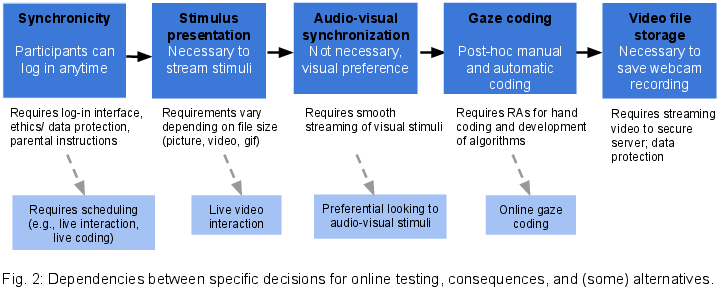

---

### Processing and learning

#### The Relation between 9-month-olds' Neural Sensitivity to the Rhythm of Speech and their Word Segmentation ERP response

[*Fleur M. H. G. Vissers, Lisa Rommers, Sophie Arana, Anne Kösem, Tineke M. Snijders*](./authors.md)

f.m.h.g.vissers@gmail.com

Infants use rhythmic information as one of the important cues in word segmentation (Jusczyk et al., 1999). However, little is known about the neural mechanisms behind this sensi-tivity to rhythm. Neuronal oscillations in the auditory cortex track the rhythm of the speech in-put, and synchronize with the incoming speech envelope (Giraud & Poeppel, 2012). In adults it has been found that this cortical tracking makes speech processing easier (Cason & Schön, 2012). Cortical tracking of the speech envelope is also present in infants, especially when lis-tening to infant-directed speech (Kalashnikova et al., 2018). It is unclear however what the re-lation is between infants’ neural sensitivity to the rhythm of speech and word segmentation. 

The current study aims to gain insight into the functional relevance of infants’ cortical tracking of speech for word segmentation. The following questions are investigated: Does the rhythm of the speech signal influence infants’ ability to segment words from continuous speech? Does infants’ speech-brain coherence differ between rhythmic and non-rhythmic speech? How is infants’ neural sensitivity to speech rhythm related to their word segmentation ERP responses? 

To answer these questions, 65 monolingual Dutch 9-month-old infants participated in a two-session experiment (one rhythmic and one non-rhythmic session) during which EEG-data was collected. Each session consisted of 20 blocks, with each block containing a familiariza-tion phase of eight sentences and a test phase of four words. The eight sentences each con-tained a repetition of a bi-syllabic low-frequent word with a strong/weak stress-pattern. In the test phase the familiarized target word and an unfamiliar word were presented each two times in isolation. To increase rhythmicity all sentences consisted of thirteen syllables with alternating strong/weak syllables. Stimuli were recorded with a metronome, resulting in a syllabic rate of 3.2 Hz. For the non-rhythmic sentences the syllable duration was manipulated by speeding up or slowing down the speech across several syllables. The fragment with the target word was not adjusted, to make sure its duration remained the same between conditions. 

Segmentation of the target words will be inferred by looking at the ERP word familiarity effect (Kooijman et al., 2005), comparing within the test phase the ERPs evoked by the isolat-ed target words with the ERPs evoked by the unfamiliar words. Speech-brain coherence during the familiarization phase will be assessed by looking at the consistency of the phase difference between the EEG signal and the speech amplitude envelope. We will specifically assess the frequencies of 3.2 Hz (syllabic rate) and 1.6 Hz (stress rate). It is expected that infants show enhanced word segmentation ability and have stronger speech-brain coherence in rhythmic compared to non-rhythmic speech. Additionally, it is expected that infants with a higher neural sensitivity to rhythm, especially for the stress rate, will show an enhanced word segmentation ERP response. Data for this study has been collected and the results will be presented at the meeting. The outcome will inform about the functional relevance of the cortical tracking of speech for infants’ word segmentation.

---

#### How does language experience support language development? Short-term priming and long-term learning.

[*Leone Buckle, Katherine Messenger, Holly Branigan, Laura Lindsay*](./authors.md)

Leone.Buckle@warwick.ac.uk

Children’s language closely reflects their recent and long-term experiences of language. Within conversations, children often repeat the words and sentence structures that they have just heard [1]; their vocabulary and grammatical development tends to reflect the diversity and complexity of their caregivers’ language [3]. But little is known about how children’s short-term language experiences contribute to their longer-term language learning. Syntactic priming effects may offer a promising explanation: growing evidence suggests such effects persist and accumulate to affect language use within the same interaction and even a week later [1]. Accounts of syntactic priming as learning predict age-related differences in the magnitude of immediate priming and cumulative learning over multiple immediate experiences of syntactic structures which should lead to long-term changes in speakers’ representations of syntactic structures [2]. This study investigates whether children’s behaviour at different stages of development supports these predictions. 

We are running two experiments examining the timecourse of experience-based effects in children at early and later stages of acquisition and a comparison adult group. Both experiments involve two testing sessions, consisting of a relatively large number of items (N=48), separated by one week. Experiment 1 assesses priming of noun phrase structures where participants take turns in describing target pictures with an experimenter who alternates between adjective-noun (AN: a blue cat) and noun-relative clause (RC: a cat that’s blue) primes. We have tested 7/44 2.5-year-olds, 39/44 4.5-year-olds and 36/44 adults so far. Experiment 2 tests verb phrase structures (specifically actives (a cat chased the dog) vs passives (the dog was chased by a cat)). To date, 17/44 3.5-year-olds, 33/44 5.5-year-olds and 41/44 adults have been tested. We predicted that all groups will show immediate priming effects within sessions such that participants will produce more target structures after the same prime than after the alternative prime. We also predicted long-term effects of experience, such that participants will be more likely to produce target structures in Session 2 than Session 1. Moreover, we expected younger children to show larger immediate priming effects than older children or adults, leading to greater long-term learning effects for children at earlier stages of acquisition.

At present, Experiment 1 data show larger priming effects for relative clauses in children than in adults in session 1: 31.5%  for 2.5-year-olds, 43% for 4.5-year-olds and 12% for adults but no clear increases to priming in Session 2: 36% for 2.5-year-olds, 25% for 4.5-year-olds and 10% for adults. Experiment 2 data show slightly larger priming effects for passives in children and adults in session 1:  20% for 3.5-year-olds; 22%  for 5.5-year-olds and 14% for adults but smaller priming effects in session 2: 12% for 3.5-year-olds; 11% for 5.5-year-olds and 4% for adults. See Figures 1 and 2. Both experiments show patterns that are consistent with immediate priming effects at all ages, but though children are showing the largest effects, it is not necessarily only in the youngest age group. Contrary to expectations, the data suggest that there could be either no difference, or a decrease in priming across sessions. Possible explanations for these trends in the data will be explored.

1. Branigan, H. P., & Messenger, K. (2016). Consistent and cumulative effects of syntactic experience in children’s sentence production. Cognition, 157, 250–256. 

2. Branigan, H. P., & McLean, J, F. (2016). What children learn from adults’ utterances. Journal of Memory and Language, 91, 141–157. 

3. Huttenlocher, J., Waterfall, H., Vasilyeva, M., Vevea, J., & Hedges, L. V. (2010). Sources of variability in children’s language growth. Cognitive Psychology, 61, 343–365.

---

#### The changing contributions of prior knowledge and offline processes to vocabulary learning across development

[*Emma James, Gareth Gaskell, Lisa Henderson*](./authors.md)

emma.james@york.ac.uk

Prior linguistic knowledge is proposed to facilitate vocabulary consolidation, akin to the ways in which cognitive schema facilitate the acquisition of new declarative knowledge (James et al., 2017). The accumulated language knowledge learners bring to the task of word learning presents a source of variation between individuals and across development: adults have typically acquired more prior knowledge that can support learning relative to children. However, children experience a higher proportion of slow-wave sleep stages that are associated with memory consolidation, and may be less reliant on prior knowledge to support new learning (Wilhelm et al., 2012). We conducted two sets of three pre-registered experiments examining how children (aged 7-10 years) and adults benefit from related lexical knowledge during word learning and subsequent consolidation (osf.io/s2628; osf.io/stx6q). 

We taught participants pseudowords that varied in their number of English phonological neighbours (none, one, many), and tested recall and recognition of the pseudowords at three test points (immediately after learning, the next day, one week later). Under an explicit training regime, both children and adults benefited from phonological neighbours at the immediate test point, but offline consolidation reduced the benefit on longer-term memory (James et al., 2018). In an incidental learning paradigm in which the pseudowords were embedded in spoken stories, the neighbourhood benefit was less robust and did not change over time (manuscript in preparation). While access to prior lexical knowledge did not seem to differ between children and adults (or relate to individual differences in vocabulary ability), the role for offline mechanisms did: children consistently demonstrated greater improvements in recall across the course of the week in exploratory analyses. These offline benefits were most striking for pseudowords without phonological neighbours, such that only adults retained a lasting benefit for prior knowledge. 

In conclusion, phonological neighbour benefits can be reduced following offline consolidation in some circumstances, suggesting that related lexical knowledge and offline processes play complementary—rather than interacting—roles in supporting vocabulary acquisition. However, phonological neighbours have a limited role in accounting for individual variability in word learning, and we consider alternative ways in which learners’ prior knowledge might drive differences in vocabulary learning. We highlight the capacity of the developing brain to consolidate new language, and the importance of examining the longevity of prior knowledge influences on new word acquisition.

---

#### Language co-activation in the simultaneous bilingual child’s lexicon: A primed picture selection and eye-tracking study

[*Elly Koutamanis, Gerrit Jan Kootstra, Ton Dijkstra, Sharon Unsworth*](./authors.md)

e.koutamanis@let.ru.nl

Background. Adult bilingualism research provides considerable evidence for language co-activation in the form of between-language lexical priming (e.g., Kroll et al., 2006), whereas research on such effects in bilingual children is limited and largely restricted to toddlers (e.g., Von Holzen & Mani, 2012). Individual-level factors, known to influence co-activation in adults (e.g., Van Hell & Tanner, 2012), have not yet been systematically investigated in children. Therefore, the current study aims to uncover:
1. to what extent between-language priming at the phonological level and the conceptual level takes place in school-aged simultaneous bilingual children;
2. how between-language priming compares to within-language priming; 
3. how within- and between-language priming are affected by children's individual differences in proficiency, exposure and use.

Method. 26 Greek-Dutch simultaneous bilingual children, aged 4;10-9;2, matched pictures to auditorily presented Dutch target words and Greek and Dutch prime words, while their eye movements were recorded. Following Von Holzen & Mani (2012), Singh (2014), and Floccia et al. (2020), prime and target words overlapped phonologically (e.g., between-language: roda(GR) 'wheel'-rok(NL) 'skirt'), conceptually (e.g., fousta(GR) 'skirt'-rok(NL)), or phonologically mediated by conceptual overlap (e.g., vrachos(GR) 'rock'-rots(NL) 'rock'-rok(NL)). Participants were tested in two sessions: a Dutch-to-Dutch and a Greek-to-Dutch priming session. The Dutch-to-Dutch session was repeated with a monolingual Dutch control group. Proficiency was assessed using sentence repetition and vocabulary tasks, exposure and use using a parental questionnaire. We predicted:
1. priming effects at all levels of lexical representation, including mediated priming;
2. stronger within-language than between-language priming effects;
3. stronger within-language effects (i.e., Dutch-to-Dutch priming) for participants with stronger Dutch proficiency, and stronger between-language effects for participants with stronger proficiency in both languages.

Results. Linear mixed effects models of reaction times revealed:
1. between-language phonological, conceptual, and mediated priming effects;
2. within-language priming effects at the conceptual level only, for both monolingual and bilingual children;
3. effects of individual differences in both within- and between-language conditions. Within-language priming effects interacted with bilingual participants' proportion of Dutch exposure and use. Mediated priming effects were affected by their proportion of Greek use.
For eye-tracking, we expect to find priming effects in all conditions, given the direct, sensitive nature of this method.

Discussion. These results provide new evidence for language co-activation in simultaneous bilingual children at both the phonological and the conceptual level of lexical representation, and demonstrate that the degree of co-activation depends on individual-level factors. By showing which sources of variation between bilingual children constrain their lexical processing, the present results also contribute to our understanding of individual differences in children's language processing in general.

References.
Floccia, C., Delle Luche, C., Lepadatu, I., Chow, J., Ratnage, P., & Plunkett, K. (2020). Translation equivalent and cross-language semantic priming in bilingual toddlers. Journal of Memory and Language, 112, 104086.
Kroll, J.F., Bobb, S. & Wodniecka, Z. (2006). Language selectivity is the exception, not the rule: Arguments against a fixed locus of language selection in bilingual speech. Bilingualism: Language and Cognition, 9, 119-35.
Van Hell, J.G. & Tanner, D. (2012). Second language proficiency and cross-language lexical activation. Language Learning, 62 Supplement 2, 148-171.
Von Holzen, K. & Mani, N. (2012). Language nonselective lexical access in bilingual toddlers. Journal of Experimental Child Psychology, 113, 569-586.

---

#### Syntactic variation due to processing factors in Mandarin child-caregiver speech

[*Jidong Chen, Gan Fu, Shu Yang, Bhuvana Narasimhan*](./authors.md)

jchen@csufresno.edu

During communication, children must often choose between alternative structures that can convey the same message (e.g., active vs. passive). The variation in the choice of structure is influenced by several factors in adult language, including the topicality or givenness of a referent, conceptual accessibility, the ease of retrieval of the referent’s label, priming due to prior occurrence, and the weight of the noun phrases (Bock, Irwin, & Davidson 2004]. But little is known about how these factors influence syntactic choices in naturalistic child-caregiver speech. 

Our study investigates the role of two processing factors—the weight of noun phrases and priming—in influencing syntactic choices in Mandarin child-caregiver speech.  We examine how these factors influence alternations between the SVO construction (e.g., ni chiwan fan ‘you eat-finish food’ ‘You eat up the food’) and the SOV ‘ba’ construction (e.g., ni ba fan chiwan ‘you BA food eat-finish’ ‘You eat up the food’) (Li & Thompson 1981). Across languages, ‘light’ constituents (e.g., containing fewer syllables) tend to occur earlier in an utterance, presumably because they can be processed faster than ‘heavy’ constituents (with more syllables) (Hawkins, 1994). Since the SOV ‘ba’ construction involves preposing the object NP, speakers may tend to produce the ‘ba’ construction with ‘light’ object NPs. Prior occurrence of the ‘ba’ construction in discourse may also encourage reuse of the same construction due to priming. Prior research shows that Mandarin-speaking adults’ use of the ‘ba’ construction is sensitive to object NP weight as well as prior occurrence in discourse (Liu 2007, Yao 2014). Although children acquiring Mandarin use both constructions early (Hus 2014, 2018), no research examines how priming and NP weight influence their construction choice.

We examined 1085 utterances produced by a mother-child dyad (age range: 1;07 to 3;04) in child-caregiver interactions (Tong corpus, CHILDES) (Deng & Yip 2018). We identified the 25 most frequent verbs used in the ‘ba’ construction and extracted all utterances containing these verbs in ‘ba’ constructions (n=222) and SVO constructions (n=863). The utterances were coded for speaker type (‘child’, ‘caregivers’), weight in syllables (‘1’, ‘2’, ‘3’, ‘4’, ‘5+’), and priming (‘prior use of ba in a 10-utterance window’, ‘no prior use of ba in a 10-utterance window’). Our findings revealed significant coefficients for priming and syllable weight, but not speaker type (see Figure 1 and Table 1). Model comparisons using likelihood ratio tests support the significant contribution of these two factors (p < .05). The interactions of the two variables with each other or with speaker type are not significant. Post-hoc comparisons show that ‘ba’ constructions are used significantly less often when the object NP has 2 syllables versus 1, 3, or 5+ syllables.

Our study demonstrates that the same processing factors that influence adult Mandarin speakers’ structural choices play a similar role in child and caregiver speech. Our findings extend experimental research demonstrating priming effects in children’s use of ‘ba’ constructions (Hsu 2019) to spontaneous production. But the non-linear effects of noun phrase weight suggest that ease of processing considerations may not be the only factor driving syntactic choice.

---

### 23 October

### Computational and cognitive models of learning

#### ‘Long nose’ and ‘naso lungo’: establishing the need for retrodiction in computational models of word learning

[*Francesca Zermiani, Atiqah Khaliq, Raquel G. Alhama*](./authors.md)

zermiani.francesca@gmail.com

Distributional information plays a crucial role for many tasks in language acquisition (Saffran, 2020). The distributional regularities in a given language are necessarily subject to typological variability, and different word order patterns will favor different regularities. For instance, prepositions favor backward predictability (in “in London”, “in” is more likely to be followed by any city (i.e., IN-LOCATION), while “London” has few preceding candidates); instead, post-positions are more likely to yield predictable forward patterns (LOCATION-IN).

In this work, we investigated how typological variability influences the acquisition of adjectives in their interplay with nouns. We focus on two languages: English, in which adjectives occur pre-nominally, and Italian, where adjectives can occur either pre-nominally or post-nominally, albeit with preferential restrictions. We present two studies: Study 1 is an analysis of the predictability of adjectives in child directed input in each language; and Study 2 presents computational modeling work investigating whether these dependencies are captured by a learning model during online processing.

Study 1 used naturalistic data from the English and Italian corpora in CHILDES (McWhinney, 2000). Using the lemmatized version of the words, we analyzed the statistical dependencies between descriptive adjectives and nouns. This required annotation of syntactic categories, which was conducted using an automatic part-of-speech tagger, followed by additional manual revision. We then computed the transitional probabilities (TPs) between adjectives and nouns, and between nouns and adjectives (the latter only in the case of Italian). Figure 1 shows that, whereas forward TPs better predict the adjectives occurring in the Italian canonical N-Adj ordering, the opposite is the case for English. In the case of the Adj-N order in Italian, both forward and backward probabilities are equally informative, possibly due to the highly formulaic nature of this syntactic pattern. 

Typological effects on statistical dependencies have been previously identified (Onnis&Thiessen, 2013), but discussion of them in models of distributional language learning is sparse. To this end, Study 2 aimed to establish whether a Recurrent Neural Network (RNN), a well established account of language learning and processing, is sensitive to these cross-linguistic differences. An analysis of the Age of Acquisition (AoA) norms in Wordbank (Frank et al. 2017) revealed no statistically significant difference in the acquisition of adjectives in Italian and English; therefore, if the RNN can capture both types of dependencies, it should learn adjectives in each language equally well. 

We trained the RNN on the the child-directed speech data from Study 1. Since this model processes language incrementally in the forward direction, we expected this model to favor forward over backward dependencies. To test this, we also implemented a variant of the RNN that experiences language in the reverse direction (we refer to it as bwRNN). Although this model is not cognitively plausible, its relative success in the prediction of adjectives would provide an indication for the necessity of extending the standard RNN model to account for retrodiction during language learning.  As can be seen in Figure 2, at the end of training, the standard RNN is less successful in learning English than Italian (where success is quantified by low entropy), suggesting that the standard RNN is not capturing the backward dependencies in English. In contrast, the bwRNN performed much better for English –consistent with the reliability of backward over forward dependencies in this language– and had greater variability for Italian. These results suggest a full account of language acquisition will have to account for typological influences on distributional information, which likely require children to attend to statistical dependencies that both predict and retrodict.

---

#### A computational study of the mechanisms underlying infant speed of processing and vocabulary development

[*Andrew Jessop, Gary Jones, Caroline Rowland*](./authors.md)

andrew.jessop@mpi.nl

During their second year, infants experience rapid vocabulary growth while simultaneously becoming faster and more efficient at processing familiar words (Fernald et al., 2006). Longitudinal studies have found that children with the fastest language processing speeds tend to have larger concurrent vocabularies and faster vocabulary growth throughout development (Peter et al., 2019). However, there is currently no concrete mechanistic account that explains why some children are fast or slow at processing language, and how this speed of processing is related to vocabulary development. The present work used computational models to test two theories of speed of processing. As it is often assumed that there are individual differences in children’s intrinsic processing abilities that shape their vocabulary development, the first theory was an intrinsic processing account where speed of processing stems from endogenous differences in the child’s ability to process language input. Another possibility is that individual differences in speed of processing reflect variance in the infant’s language knowledge, so we also considered whether a more parsimonious experience-only account could capture the findings of previous behavioural studies. These two theories were tested in the CLASSIC model (Jones et al., 2014), which uses chunk-based learning to acquire vocabulary by binding adjacent sequences in the input and learning them as larger chunks. At first, the model needs many small chunks to represent the input, but it gradually shifts to using fewer and larger chunks with experience (e.g., /w/e/n/t/ → /we/nt/ → /went/). We tested the intrinsic processing theory by varying the number of chunks CLASSIC can process at any one time (2-7 chunks on average) while keeping the language input constant. Increasing this limit allows the learner to process more of the input in the same period, thus models that can retain six chunks are faster processors than those limited to three. To test the experience-only theory, this processing limit was held constant and we measured the average number of chunks the model used to process the input, which varied in quantity (5000-30,000 utterances). Here, learners that need fewer chunks are faster, as each chunk incurs a cost and consumes a portion of the limited resources available. The results showed that raising the number of chunks the learner could process led to a larger vocabulary and faster growth, consistent with the intrinsic theory. Furthermore, the models that received the most language input used fewer chunks and tended to have larger concurrent vocabulary sizes, consistent with the experience-only theory. This work represents one of the first mechanistic studies of individual differences in speed of processing and vocabulary development. The results demonstrate that, while this relationship can be modelled by manipulating the learner's intrinsic processing abilities, it can also be observed through a purely emergent process.

---

#### Syntax acquisition in children and bilingual speakers: A pre-registered syntactic priming study

[*Sophie M. Hardy, Ema Ushioda, Katherine Messenger*](./authors.md)

sophie.hardy@warwick.ac.uk

Language speakers come in various guises: adult native speakers; child learners of their native language; learners of a non-native language. Correspondingly, fields of research investigating language development for each type of speaker have grown largely independently. However, given that basic commonalities underlie these different speakers – all are human users of human languages – there is considerable scope for theories which can link explanations of child language development and adult language processing, both native (L1) and non-native (L2). Despite this, current theoretical models differ in the underlying mechanisms of syntax acquisition, with some proposing that speakers use error-based implicit learning to acquire abstract representations of syntax (Chang et al., 2006), while other suggest early stages of syntax learning are lexically dependent (Hartsuiker & Bernolet, 2017; Tomasello, 2003). The aim of this study is to experimentally investigate language learning in different types of speakers (child language learners, second language learners and native adult speakers) in order to develop a more unified theory of language development.

Specifically, we investigate syntactic priming: the tendency of speakers to repeat recently experienced syntactic structures (Bock, 1986). Syntactic priming is a highly pervasive effect that can provide insight into underlying syntactic representations and the mechanisms that support language learning (Pickering & Ferreira, 2008). We employ a dialogue syntactic priming paradigm in which the participant and the experimenter alternate describing pictures of transitive verb events. The experimenter describes their prime picture according to a script (active vs. passive), but the participant can describe their picture however they wish – this constitutes the target response (see Figure 1). We manipulate whether the prime and the target contain the same or different verbs in order to investigate both lexically-independent (i.e. abstract) priming and lexically-dependent priming. We also manipulate the lag (i.e. intervening trials) between the prime and target (0-lag vs. 4-lag) in order to investigate short- and long-term syntactic priming. We have pre-registered the study on the Open Science Framework and data collection is currently ongoing.

We will recruit 60 participants from each of the following five groups: L1 English adults; L1 English 3-4-year-olds; L1 English 7-9-year-olds; Low proficient L2 English adults; High proficient L2 English adults. Comparing child language learners and L2 adult learners provides a unique insight into the universal features of language development across different groups. According to the implicit learning model (Chang et al., 2006), the magnitude of abstract priming will be highest in the younger children (3-4-year-olds) and low proficient L2 adults because rates of error-based learning are highest at the earliest stages of language development. By contrast, if initial syntax learning is lexically-specific (Hartsuiker & Bernolet, 2017; Tomasello, 2003), then we would not expect young children or low proficient L2 adults to display abstract priming as they have not yet developed fully generalisable abstract syntactic representations. Lexically-specific accounts of syntax acquisition do though predict that lexically-dependent priming should be observable right from the start of language learning. Alternatively, in the implicit learning model, lexically-dependent priming is driven by explicit memory of the prime (Chang et al., 2006); as such it should increase with a speaker’s age and cognitive ability, independent of language proficiency, meaning that low proficient L2 adults, but not young children, should show lexically-dependent priming. Experimentally investigating these predictions will contribute towards the development of a more parsimonious model of language learning that can explain syntax acquisition in a diverse range of speakers.

---

#### How the Empirical Distribution of Words Solves the Variability Problem in Child Directed Speech

[*Maja Linke, Michael Ramscar*](./authors.md)

maja.linke@uni-tuebingen.de

Numerous results have shown that children are sensitive to the probabilistic structure of the input they are exposed to, and this is often taken to imply that languages are themselves probabilistic systems. However, when take together with the complex probabilistic structure of languages (see e.g., Zipf, 1949), this presents a puzzle. While every individual speaker (e.g. a child versus an adult) will have experienced and learned from very different sample of their linguistic environment, the idea of a probabilistic implies in turn that users of the system share their models of its probabilities: how are any two language users whose experience differs dramatically nevertheless capable of converging on the same model of those parts of the system they have both been exposed to?

Children clearly learn to use the various parts of their languages in the contexts in which each is used. Recent results (Ramscar 2019, 2020) show that when word distributions are considered in the communicative contexts in which they occur, their probabilistic structure is geometric. A critical and unique property of geometric distributions is that they are memoryless, which means, in theory at least, their structure supports a transmission process impervious to sampling differences. That is, this suggests that even though word recurrence rates tend to be highly irregular, such that the probability of observing a word varies depending on the amount of time that has elapsed since the last time it was observed, the overall probability distributions of words in the contexts in which they will be encountered will experienced in remarkably constant fashion, and thus support the learning in models of the probabilities of those distributions that are largely independent of the sample an individual learner has been exposed to.

A key implication of this discovery is that it suggests that individual linguistic distributions in context are shaped by a process that somehow ensures that any random sample of a reasonable size will be sufficiently representative of that distributions overall, thereby guaranteeing that speakers exposed to different samples of different sizes at different rates will nevertheless learn probabilistic models that allow them to establish and maintain similar linguistic expectations. Previous analyses have shown that the distributions defined by context in conversational English satisfy this requirement at multiple levels of description (Linke & Ramscar, 2020), and simulation studies have shown that in contrast to other word distributions, random samples drawn from word categories that have geometric distributions do succeed in yielding representative subsamples.

To examine whether support for this model of probabilistic alignment could also be found in child language learning, we conducted a simulation study to examine the sampling properties of a set of high-frequency nouns selected from a corpus of child/caregiver speech (CHILDES; MacWhinney, 2000). The results of these simulations confirm that the distribution of nouns in speech produced by children and directed at children are geometric and that random subsamples drawn from these speech samples yield identical geometric distributions, while maintaining stable relationships between word probabilities independent of the subsample size. 

The results of these analyses show how the distributions of forms in child/caregiver speech solve the problem of random variance in the sampling process. Moreover, the distributions observed in the sample provide further support for the suggestion that human communicative codes are structured in a way that maintains alignment between speakers independent of the time and the rate at which they are exposed to speech (Figure 1).

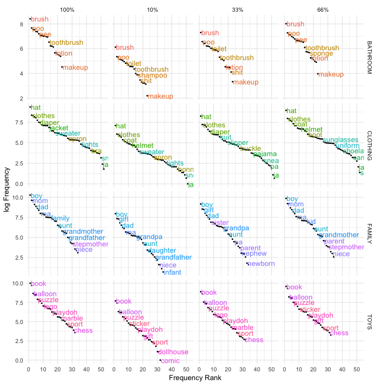

---

#### How young children integrate information during word learning

[*Manuel Bohn, Michael Henry Tessler, Megan Merrick, Michael C. Frank*](./authors.md)

manuel_bohn@eva.mpg.de

Language is learned in complex social settings. Children can learn the meaning of novel words by reasoning about the speaker’s underlying intentions, that is, by making pragmatic inferences (Tomasello, 2003). Yet, pragmatic inferences require integrating multiple information from the social context of the utterance. While many studies have shown that children make pragmatic inferences based on a range of different information sources (see Bohn & Frank, 2019 for a review), the process by which information is integrated is rarely studied directly. Here we address this gap. 

We focus on three information sources that operate on different timescales: (1) expectations that speakers communicate in a cooperative and informative manner license inferences in the moment, (2) semantic knowledge which stores previously learned word-object mappings and continuously grows during early development and (3) common ground that is built up over the course of a social interaction. 

We present a formal theory of the integration process in the form of a Bayesian model of Gricean pragmatics from the rational Speech Act (RSA) framework. RSA models are characterized by their structure in which hypothetical interlocutors make inferences about the interpretation of literal utterances based on the assumption that partners communicate in an informative way (Goodman & Frank, 2016). We relate the three information sources to parameters in the model architecture and generate a priori model predictions for how they should be integrated in a word learning scenario. The model also presents an explicit theory of development. It assumes that, while children’s sensitivity to the individual information sources increases with age, the way integration proceeds remains constant.

We test the predictive and explanatory power of the model on the basis of new experimental data collected with two to five year old children (N = 368). Children were tested on a tablet in a US children’s museum. All experiments, models and analysis were pre-registered. The model predictions were closely aligned with childrens’ learning and the model explained 79% of the variance in the data. 

We also formalized a series of competitor models to test alternative hypotheses about information integration. First we considered a range of lesioned models according to which children follow the heuristic “ignore X” (with X being one of the information sources) when multiple information sources are presented together. Using Bayesian model comparison via marginal likelihood of the data, we found little support for the use of such heuristics. In fact, the data was several orders of magnitude more likely under the rational integration model compared to any of the lesioned models (Fig. 1). This result shows that children considered all available information sources. 

Next, we considered alternative hypotheses about the integration process itself. According to a biased integration model, children also consider all information sources (also in an age specific way), but they are biased towards some of them. Model comparison strongly favored the rational integration model. Finally, we considered a model that assumed that children are in fact biased towards some information sources, but that this bias changes with age. This presents an alternative view on the locus of development. The rational integration model assumes that childrens’ sensitivity to individual information sources changes with age but that the integration process itself remains constant. When directly compared, the rational integration model provided a much better explanation of the data and the underlying developmental process

This research shows that children flexibly integrate multiple information sources during language learning. To answer the question of how children integrate information, we presented a formal cognitive model that assumes that information sources are rationally integrated via Bayesian inference.

---

#### Children’s Acquisition of Morphosyntactic Variation

[*Naomi L. Shin, Karen Miller*](./authors.md)

naomishin@unm.edu

Child language acquisition involves learning both categorical and variable grammatical patterns. Categorical patterns are invariable; language users do not deviate from them. For example, English determiners always occur before nouns, as in the computer rather than after nouns, as in *computer the. In contrast, variable patterns are characterized by optionality; speakers can choose from more than one form to express the same basic meaning. For example, speakers of English can express or omit complementizer that, as in ‘I think (that) Ana is nice’. Similarly, in Spanish and many other languages speakers have the option of expressing subjects or omitting them. Patterns of grammatical variation are highly systematic among adults (Carvalho et al., 2015; Labov 1994, Poplack 2018, Tagliamonte 2012, among others). Nevertheless, we still know very little about how such patterns develop during childhood. 

In this talk, we present our four-stage developmental pathway for the acquisition of morphosyntactic variation (Authors, under review), according to which children must first override the tendency to regularize variable input (Stage 1) and then override the tendency to assign different meanings to different forms (Stage 2). We argue that overriding these tendencies involves increased exposure to the forms in variation and increased experience with variation itself. The talk includes suggestions for testing the hypotheses generated by the proposed pathway of development of morphosyntactic variation, which we illustrate by drawing on the acquisition of variable Spanish subject pronoun expression. We also discuss what happens after children have assigned one meaning to two forms, and suggest that further development proceeds in a piecemeal fashion such that children first alternate between variable forms in contexts for which there is abundant evidence for variation in the input (Stage 3), and over time they vary between constructions in more contexts (Stage 4).

References

Carvalho, Ana Maria, Rafael Orozco, & Naomi Shin. 2015. Subject pronoun expression in Spanish: A cross-dialectal perspective. Washington DC: Georgetown University Press.

Erker, Daniel, & Gregory Guy. 2012. The role of lexical frequency in syntactic variability: Variable subject personal pronoun expression in Spanish. Language 88(3), 526-557.

Labov, William. 1994. Principles of linguistic change: Internal factors. MA: Blackwell.

Poplack, Shana. 2018. Categories of grammar and categories of speech: When the quest for symmetry meets inherent variability. In N. Shin & D. Erker (Eds.), Questioning Theoretical Primitives in Linguistic Inquiry (pp. 7–34). Amsterdam: John Benjamins.

Shin, Naomi (2016). Acquiring patterns of morphosyntactic variation: Children’s Spanish subject pronoun expression. Journal of Child Language 43(4), 914–947.

Tagliamonte, Sali. 2012. Variationist sociolinguistics: Change, observation, and interpretation. Malden, MA/West Sussex: Wiley-Blackwell.

---

### Literacy and education

#### The nature and frequency of relative clauses in the language children hear and the language children read: a developmental cross-corpus analysis of English complex grammar

[*Yaling Hsiao, Nicola Dawson, Nilanjana Banerji, Kate Nation*](./authors.md)

yaling.hsiao@psy.ox.ac.uk

Written language is lexically more diverse than speech. Child-directed text contains more unique words than child-directed speech (Montag et al., 2015). Few studies have examined grammar in the language children hear and read. In the current study, we compared the distributional frequency of a canonical complex grammatical structure – relative clauses – in three developmental corpora: (1) child-directed speech (CHILDES UK, speech directed to children age 0-5, 3.8 million words), (2) child-directed text (160 picture books for shared reading with children age 0-5, 310,000 words) and (3) text for independent reading (Oxford Children’s Corpus, texts from books, magazines, websites targeted at children age 5-16,  34 million words). 

The goal of the study is to understand relative clause usage in the spoken and written registers. We also examined the corpora developmentally - two corpora representing language exposure pre-literacy and one representing text exposure as children’s literacy skills are developing. We predicted that relative clauses would be more frequent in written language than in speech, and that relative clauses usage would increase as the intended age increased. 

Due to the large size of the corpora, we used automatic parser instead of hand coding to identify relative clauses. A high-accuracy parser Berkeley Neural Parser (Kitaev & Klein, 2018) was used to parse all sentences in the corpora, and the pattern extraction software Tregex (Levy & Andrew, 2006) was used to extract relative clauses. Three types of relative clauses were of interest: subject relative clauses (e.g. “the boy who jumped”, “the boy who kissed the girl”), object relative clauses (e.g. “the girl that the boy kissed”, “the crayon that you drew with”), and passive relative clauses (e.g. “the girl who was kissed by the boy”).  

Because of differing corpus sizes, the frequency of the three types of relative clauses was normalised by the number of noun phrases in each corpus (because relative clauses can only modify nouns). The results were plotted in Figure 1. All types of relative clauses were less frequent in child-directed speech than in either sample of written language. The contrast between picture books and child-directed speech is informative as both contain language targeted primarily at pre-schoolers. Even when the age of the child is comparable, there were more relative clauses in book language than spoken language. Across the two types of book language, picture books contained fewer relative clauses than books written for children to read themselves. Averaging across all three corpora, object relatives were most frequent with a mean 4.33 occurrences per 1000 noun phrases. Subject relative clauses were slightly less frequent (mean = 3.77) and passive relative clauses were least frequent (mean = 2.66). 

It can be seen that the distributional patterns of the three types of relative clauses are similar between the two younger corpora – child-directed speech and child-directed text, with object relatives being the most frequent and passive relatives the least frequent. The pattern changed for the corpus of text for independent reading, with subject relatives being the most frequent and passive relatives remaining the rarest. These patterns suggest that subject relatives are the most characteristic of the language written for children to read, and that passive relatives were uncommon across children’s language exposure in both speech and text. 

The results confirmed our predictions of written language being more grammatically complex than child-directed speech. Grammatical complexity increases as the targeted age increases. The types of relative clauses characteristic of written language that children read independently are distributionally different from what preschool children hear. Further analysis on genre and lexical-syntactic pairing will also be discussed.

---

#### Teachers interventions and vocabulary development in kindergarten in Argentina

[*Sebastián Carignano, Alejandra Menti, María Patricia Paolantonio, María Paula Dutari*](./authors.md)

seba.carignano@gmail.com

Several studies have studied the impact of certain teaching interventions on the development of students' vocabulary. The teaching of contextual cues (Baumann, Edwards, Boland, Olejnik & Kame'enui, 2003; Nash & Snowling, 2006), formulation of questions and the comments made by teachers, referring to the vocabulary unknown by the children (Ard & Beverly, 2004) constitutes the most effective methodologies for the teaching of vocabulary.

In this paper, we analyze and describe teachers' interventions focused on the treatment of unknown or unfamiliar words to students in kindergarten classes. The present study analyses teaching situations recorded in two kindergarten classrooms - one belonging to an urban school and the other to a rural school in the province of Córdoba, Argentina. In each of the two kindergarten classrooms, the complete development of the thematic unit "Animals" corresponding to the area of natural sciences was videotaped. The teaching situations recorded were transcribed according to the rules stipulated by the CHILDES (Child Language Data Exchange System) computer program. The transcriptions are contained in the CHAT (Codes for the Human Analysis of Transcripts) format which allows the data to be processed with CLAN (Computerized Language Analysis) software. For the analysis of the information, both qualitative and quantitative procedures were used. Firstly, the interactive sequences that make up the natural science classes were categorized taking into account the classification established by Green, Weade and Graham (1988) in which they distinguish between "social text" and "academic text". In their analysis of high school classes, Green and Weade (1987) showed that lessons are made up of different types of phases, each of which places different social and academic demands on students. In turn, Green, Weade and Graham (1988) noted that these demands co-occur as two interconnected and interrelated texts: a "social text" containing implicit and explicit information on how to participate and an "academic text" made up of the thematic content of the class and the structure of that content. Within the academic text, we analyzed the different discursive acts that make up the academic text in which the teacher develops the thematic unit. Within the framework of this corpus, those discursive acts used by teachers during the teaching of vocabulary were categorized. In turn, the discursive function of these acts was analyzed, as well as the linguistic characteristics that integrate them. The results of this study are discussed on the basis of background research that supports the importance of conversational exchanges for the learning of unknown or unfamiliar words.

References

Ard, L. M. & Beverly, B. L. (2004). Preschool word learning during joint book reading: Effect of adult questions and comments. Communication Disorders Quarterly, 26(1), 17-28. doi: 10.1177/15257401040260010101

Baumann, J. F., Edwards, E. C., Boland, E. M., Olejnik, S. & Kame’enui, E. J. (2003). Vocabulary tricks: Effects of instruction in morphology and context on fifth-grade students’ ability to derive and infer word meanings. American Educational Research Journal, 40(2), 447-494. 

Green. J. L. & Weade, R. (1987). In search of meaning: A sociolinguistic perspective. In D. Bloome (Ed.), Literacy and schooling. Norwood, NJ: Ablex.

Green, J. L., Weade, R. & Graham, K. (1988). Lesson construction and student participation: A sociolinguistic analysis. En J. Green y J. O. Harke (Eds.), Multiple perspective analysis of classroom discourse (pp. 11-47). Norwood, New Jersey: Ablex Publishing Corporation.

Nash, H. & Snowling, M. (2006). Teaching new words to children with poor existing vocabulary knowledge: a controlled evaluation of the definition and context methods. International Journal of Language and Communication Disorders, 41(3), 335-354. doi: 10.1080/13682820600602295

---

#### Negotiating tensions in language diverse dutch mathematics classrooms

[*Jana Dean*](./authors.md)

jdean@osd.wednet.edu

Most mathematics classrooms world-wide exhibit language diversity. In some cases teacher and students speak different languages and must find ways to communicate in a common tongue. In other arenas, teacher and students may share a common ‘school language’ while home languages and informal ways of expressing observations differ. In every classroom, students and teachers must together navigate everyday, school and technical register in one or more language (Prediger & Wessel, 2011). As language diversity has increased, so have calls for increased verbal engagement and sense-making on the part of students. This call for more meaningful participation means that the importance of language socialization events and the tension of navigating across languages and registers also increases (Barwell, 2020).

In this project, I sought to identify ways teachers in Dutch schools adapt mathematics instruction to meet the needs of an increasingly language-diverse population. I visited 34 mathematics classrooms in which home language diversity was present. The schools fell broadly into two categories. Some held language acquisition (either Dutch or English) along with learning mathematics as an explicit goal. Others held mathematical proficiency alone as an explicit goal. In each classroom, I observed for most of a school day, interviewed students, and interviewed the teacher about language diversity in relation to mathematics instruction. As I analyzed my observations I found that where both language and mathematical learning were goals, teachers tended to invite rather than compel participation.

I found these settings resembled at times what Barwell (2020) described as language positive classrooms. During moments of tension as students and teachers labored to understand each other, home languages were accepted, students tried out ideas in informally, and teachers attended to gestures to understand students’ meaning. Teachers generally supported students with explicit mathematical genres and provided structure for students’ mathematical conversations with each other. In the oral communication, I will discuss and interrogate these language socialization patterns and their implications for language-diverse mathematics classrooms in detail. 

References

Barwell, R. (in press). Learning mathematics in a second language: language positive and language neutral classroom. Journal for Research in Mathematics Education.

Prediger, S., & Wessels, S. (2011). Relating registers for fractions — multilingual students on their way to understanding. In M. Setati, T. Nkambule & L. Goosen (Eds.), Proc. of the ICMI Study 21 — Mathematics and Language Diversity, (324 - 333). Sao Paulo, Brazil.

---

#### Day-by-day vocabulary learning through reading aloud at home

[*Kirsten Read*](./authors.md)

kread@scu.edu

There is robust evidence in the field of early language learning that adult-led reading aloud with young children can help them grow and diversify their vocabulary. Previous research has found that book-level linguistic features such as use of rhyme and novel word placement within story texts, as well as simple strategies used by adult readers such as the use of dramatic pauses, or asking extra-textual questions can help children retain new words. Our study builds upon this prior research, testing the interactive effects of book features and parents’ spontaneous use of such word-highlighting strategies on 3-year-olds’ vocabulary retention during successive at-home read alouds -- a more ecologically valid setting than previously explored.

In this study, parent-child pairs (n=30) were provided with either a rhymed or unrhymed version of the same story featuring novel names and illustrations of eight imaginary monsters, along with a digital audio recorder to take home. Parents were instructed to record reading the book aloud as they normally would with their child daily for five consecutive days. After completing the readings, children were tested on novel word (monster name) recall in two ways - with a multiple-choice picture identification task, and with a verbal production task. The audio recordings of each dyad’s five progressive read-alouds were transcribed and coded for conversational elements including number of extra-textual conversational turns, extra-textual linguistic variability, intentional pauses for highlighting and dramatic effect, target word repetitions, and both parents’ and children’s additional comments on the novel monster names.  

Findings indicate that after five days of reading, children retained the novel monster names with equal success (M = 6.85 correct identifications out of 8) with both rhymed and unrhymed books, but that the amount of extra-textual commentary across measures was from day to day consistently greater in the unrhymed condition. This suggests that dyads’ dialogic style differed based on the book type, and that with unrhymed texts parents adopt a compensatory interactive style to highlight new words that may seem less memorable on their own in an unrhymed story.

In addition, we have found that the amount and diversity of conversational elements varied much more across parent-child pairs than within pairs over time -- pairs tended to adopt a consistent reading style, even as the book became more familiar over 5 days. The results from this study also indicate that the effects for some pairs of employing more dialogic reading strategies (e.g., more extra-textual commentary and use of highlighting devices) have a stronger impact on children’s ability to recall and produce the novel words compared to the effect these strategies have on children’s simple retention and identification of the words, which was often at ceiling after five days of hearing the story. Finally, children in this study were overall more successful at remembering the novel words than in previous studies using the same monster books, likely because here in this study they had the opportunity to participate in more natural “every day” interactions through repeated readings at home. 

In sum, this work explores deeply the range of ways that parents use the text of a book and their own intuitions to help children engage with and learn new vocabulary. Because this work takes into account both simple controlled book-level differences as well as the spontaneous highlighting strategies that parents employ, we are able to see how book type (rhymed or unrhymed) may act as a moderator, as well as which highlighting strategies are most useful for children’s later novel word retention in natural, ecologically valid contexts. Findings from this work will help us more fully understand how shared reading is such fertile ground for young children’s vocabulary growth.

---

#### Cross- linguistic Influence and the Acquisition of English as a Third Language in the Tunisian Context

[*Aicha Rahal*](./authors.md)

aicha.rahal2016@yahoo.com

The study of cross-linguistic influence has long been the focus of many researchers and has occupied a central role in Second Language (L2) acquisition research. However, most research on cross-linguistic transfer has only considered the influence of the native language on L2 acquisition. Ellis (1985) argues that “the learner's L1 is an important determinant of SLA. It is not the only determinant, however, and may not be the most important. But it is theoretically unsound to attempt a precise specification of its contribution or even try to compare its contribution with that of other factors” (p.40). It is evident that the mother tongue is one of the various possible factors in Second Language Acquisition. Odlin (1989) maintains that “the influence resulting from similarities and differences between the target language and any other language that has been previously (and perhaps imperfectly) acquired” (p. 27). Therefore, the study of interference in Third Language Acquisition (TLA) is essential to show the influence of previous L2 knowledge. This is a recent field of research and there are some gaps in the literature that need to be explored. The aim of the present study is to focus on the acquisition of English as a third language. It is an attempt to identify cross-linguistic influence at the levels of phonetics and grammar, to analyze the features and to show the factors behind them based on the spoken and written performance of the participants. The study is concerned with the Tunisian context in which English is taught as a third language. The informants of the study are with three different interlanguages, namely Arabic, French and English. The cross sectional approach is used in this study to collect data from the participants. There are two groups of participants. The first group is required to record a list of words and the second group is required to write a short essay. Then, the researcher tries to analyze their spoken output using PRAAT and the written output is done manually. The results of study may pave the way for new investigations on TLA. It also has implications for language teaching pedagogy; understanding the system of TLA can help teachers find the suitable pedagogical tools to deal with learners’ errors. 

Keywords: cross-linguistic influence, Tunisia, phonetics, grammar, English as a third language. 

References

Ellis, R. (1985). Understanding Second Language Acquisition. Oxford: Oxford University Press.  

Odlin, T. (1989). Language Transfer. Cross-Linguistic Influence in Language Learning.

---

#### Bilingual Learning in Infant Education Centers in Madrid: The Effects of Poverty

[*Wenjun Ma, Patricia K. Kuhl, Naja Ferjan Ramirez*](./authors.md)

wenjum@uw.edu

Laboratory research shows that young the infant brain is adept at acquiring two languages, and infants who grow up in families where two languages are spoken can become native speakers of both. However, a key question is: Can infants from monolingual families become bilingual by experiencing another language through play in the context of an infant education center? How much and what kind of language input is necessary and sufficient to ignite bilingual learning? Does poverty in the infants’ home environment play a role in their language learning at school?  

In two recent studies conducted across multiple public infant education centers in Madrid, Spain we showed that Spanish infants’ (9-33 months of age) use of English productive vocabulary and early word combinations increased rapidly through a play-based, highly social and interactive intervention method and curriculum based on a theoretical model of infant language development. The present study examines the impact of poverty on infants’ production of English vocalizations in this context. 

Infants (n = 183) across four infant education centers (schools) received 36 weeks of English exposure through daily, 45-minute long, group sessions with native speaking tutors trained and certified to deliver the research-based method. The schools were public infant education centers that served families who lived in the schools’ neighborhoods. The neighborhoods varied in wealth from mid- to extremely low. In one of the centers, all children received free meals at the school, which means that their families’ per capita yearly income was below €4260. Many parents at this school were illiterate and dealt with issues of extreme poverty. Here we ask how infants’ English production at this school (“high poverty”) compares to the other three schools in the sample (“low poverty”). 

Infants’ English production was assessed using the LENA recorders placed in the pockets of vests that infants wore during the English sessions. The recordings were manually coded to determine the mean number of English vocalizations produced per child per hour in weeks 1, 18, and 36 of the Intervention. Over the first 18 weeks, infants at the high poverty school (n = 43) showed marginally faster growth in the production of English vocalizations compared to the infants in the low poverty centers (n = 140), p = 0.08. Over the second 18-week period, the growth in the high-poverty school slowed down, such that the production of infants’ English vocalizations in the high-poverty school was equivalent to that in the low-poverty schools in Week 36 (p > 0.1). Follow-up age analyses suggest that the differences in learning rates between high- and low-poverty schools were driven predominantly by older infants (18-33 months) in the sample, while younger infants learned at comparable rates across all four centers.    

Our previous research has shown that infants, across SES, have the capacity to begin acquiring two languages in the context of early education centers, if the environment is social and engages them through high-quality and quantity language input. The present findings extend our previous results to infants living in extreme poverty and support the idea of the overall robustness of infants’ ability to learn two languages if high-quality input is provided.

---

### Multilingual and multi-dialectal language environments

#### Dual Language Input from Adults and Older Children in Two Communities

[*Anele Villanueva, Margaret Cychosz, Adriana Weisleder*](./authors.md)

anele.villanueva@u.northwestern.edu

In monolingual children from industrialized societies, characteristics of the input vary by speech register (e.g., child-directed vs. adult-directed speech) and speaker (e.g., adults vs. children). For example, child-directed speech has been characterized as having a higher pitch and more pronounced pitch contours, being syntactically simpler, and capturing children’s attention more than adult-directed speech (Soderstrom, 2007). Studies also find that speech from adults is  more supportive of  younger infants’ communicative attempts than speech from other children (Hoff-Ginsberg & Krueger, 1991). 

Much less research has examined how speech registers and input from adults and older children are experienced by dual language learners, and how this varies across cultural and linguistic communities. For instance, children in immigrant communities might initially be exposed to the society language in overheard conversations between older siblings while being exposed to their home language in directed speech from adult caregivers. If so, these children might receive different kinds of input in each language. In other communities, bilingual children might have a more uniform pattern of exposure to each language across different social contexts. 

The goal of this study is to better understand the distribution of dual language input across different speakers and speech registers for infants in two sociocultural contexts: a Quechua-Spanish community in Bolivia and a Spanish-speaking immigrant community in the United States (US). We hypothesize that young children’s exposure to each language (Quechua-Spanish and Spanish-English) will differ by: 1) speaker age (adults vs. children); 2) speech register; and 3) the sociocultural/sociolinguistic context (infants in Bolivia vs. infants in the US). Findings from this study will shed light on different patterns of dual language exposure that may influence bilingual children’s language learning. 

Infants and their caregivers were recruited from a mid-size town in southern Bolivia (n=98), and from a hospital serving low-income families in a major US city  (n=23). Families completed daylong audio recordings using the LENATM system. We present preliminary results for 3 infants from the US (ages 0;6-0;7) and 5 infants from Bolivia (ages 0;6-1;0).

Each recording was split into 30-second clips that contained human speech. Then, we annotated audio clips that were randomly selected from the daylong recording (M=174 clips, range: 115-261). Each clip was annotated for language (Quechua/English, Spanish, Mixed), speaker (Adult, Other child), and addressee (Target child, Adult, Other child). From this, we calculated the proportion of clips in each language in speech from adults and children, and in child-directed and adult-directed speech. Figures 1 and 2 show the proportion of English or Spanish in the child- and adult-directed speech of adults and other children in the US and Bolivia samples, respectively.  

Among the US families, preliminary results show other children used a higher proportion of English than adults (M children=0.242, range: 0-0.77, M adults=0.087, range: 0-0.26). In addition, children – but not adults – used a higher proportion of English in child-directed than in adult-directed speech (Fig 1). Among the families in Bolivia, other children used a higher proportion of Spanish than adults (M children=0.897, range: 0.65-1, M adults=0.29, range: 0-0.97). In addition, adults – but not children – used a higher proportion of Spanish in child-directed than in adult-directed speech (Fig 2). Between the two samples, we see different patterns of dual language exposure by speaker and speech register, suggesting possible differences as a function of the sociolinguistic context. Annotation of additional families will be conducted for both samples, and results will be discussed in the context of theories of dual language learning, language shift, and language maintenance.

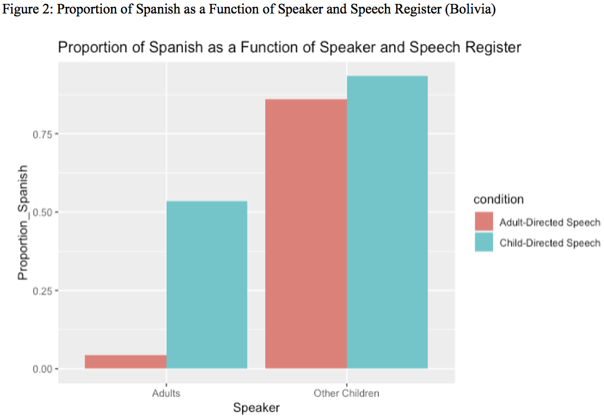

---

#### Toddlers raised in multi-dialectal families learn words better in accented speech than those raised in monodialectal families

[*Natalia Kartushina, Audun Rosslund, Julien Mayor*](./authors.md)

Natalia.Kartushina@psykologi.uio.no

Many infants grow up in multi-accent environments, which offer rich but inconsistent language input, as words are produced differently across accents, providing no robust mapping between an acoustic signal and a word. For instance, in Oslo, 30% of population speak Norwegian as their second language, and among the remaining 70% of speakers, ~30% use a different dialect than the one spoken in Oslo area. Previous research has shown that brief exposure to multiple accents facilitates understanding of unfamiliar accents in infants with no prior multi-accent experience; yet, long-term exposure to accents (being raised in a bi-accent family) hinders word comprehension. 

The current study examined whether multi-accent variability affects infants’ ability to learn words and whether toddlers’ prior experience with accents modulates learning. To address these questions, we designed a child-friendly audiovisual tablet-based e-storybook ‘Krokko og Grynte på fisketur” and embedded four novel pseudowords into the story, each referring to a novel object. Two audio conditions were created: in the multi-accent condition, the audio narration was recorded in three distinct Norwegian accents, whereas in the single-accent condition, it was in one Norwegian accent. The e-book was presented, twice per day, to thirty 2.5-year-old Norwegian toddlers, in their kindergarten, for one week. Half of them were assigned to multi-accent and the other half to single-accent condition. Toddlers’ age, gender and vocabulary size were matched between groups. Word learning was assessed in a four-alternative forced-choice identification. 

The results revealed no differences between conditions, suggesting that multi-accent variability did not hinder toddlers’ word learning. Yet, in the multi-accent condition, toddlers exposed to dialects at home showed significantly larger improvements than toddlers growing up in uniformly-accented families, suggesting that accent exposure benefits learning in multi-accent environments, and thus revealing, for the first time, advantages of bi-accent home exposure on language development in an ecological setting.

---

#### Not all simultaneous bilinguals are dominant in the community language and not all code-mix: Catalan as a heritage language in Hamburg

[*Laia Arnaus, Amelia Jiménez-Gaspar*](./authors.md)

amelia.jimenez@uib.es

Recent studies have focused on studying minority languages in different linguistic contact situations, as it is for Catalan within the Catalan speaking regions in Spain and beyond its borders. Some of these studies have concentrated on the early simultaneous acquisition of Catalan together with English (Juan-Garau & Pérez-Vidal 2001; Pérez-Vidal & Juan-Garau 2002) or Hungarian in Catalonia (Biró 2017); Others have focused in the study of Catalan as a heritage language (HL) in a monolingual German environment (Arnaus Gil 2013, Arnaus Gil & Müller 2015, Jiménez-Gaspar et al. 2020, Sivakumar et al. 2020). The aim of these studies differs significantly. Some are interested in analyzing different linguistic phenomena that can be vulnerable to cross-linguistic influence; Others focus on the (internal and external) factors that promote a high competence in Catalan. The empirical study of Arnaus Gil & Müller (2020) and Sivakumar et al. (2020) examine the linguistic competence of 16 simultaneous trilingual and multilingual (i.e., acquire more than three languages) children between 3;3 and 7;9 who are raised with Catalan, Spanish and German/French in a Catalan-speaking region in Spain (Palma de Mallorca) or in several cities in Germany (Hamburg, Berlin, Cologne). The results show a high competence in Catalan, independently from the number of languages acquired and the language of the community (Spanish or German). Furthermore, this study concludes that the presence or absence of Catalan at home does not influence the Catalan linguistic competence for those children being raised in Palma de Mallorca. 

Poeste et al. (2019) investigate the use of Code-Mixing (CM) in 122 bi-, tri- and multilingual children, 16 of them are the ones investigated in Arnaus Gil & Müller (2020) and Sivakumar et al. (2020). The authors observe that children do not often code-mix, and they do not find any relation between CM and language dominance. Another relevant aspect of this study is that trilinguals seem to use CM, especially when they speak Catalan (98,53%). This trend might be due to the asymmetric societal bilingualism in the Catalan speaking regions (Boix-Fuster & Sanz 2008). Other studies to CM in bilingual children, such as the work done by Patuto et al. (2014) or Juan-Garau & Pérez-Vidal (2001), indicate that the intersentential CM-rates (Müller et al. 2015) in the heritage or minority language is higher than in the community language. 

We conducted a pilot study with sixteen bi- and trilingual children (mean age 5;7), being raised at the city of Hamburg, who acquire simultaneously (at least) Catalan and German. The study consists of a 30-minutes recording in every child’s L1s in a spontaneous game situation. Moreover, we administered a questionnaire of linguistic input based on the work by Torregrossa & Bongartz (2018) to examine internal and external factors that might contribute to the linguistic competence of the HL. For linguistic competence in both the heritage and community language, measured in terms of MLU (Brown 1973), there is a steady increase, the older the children are (cf. Figure 1). In terms of language dominance, we observe an even distribution of balanced (N = 7) and German dominant (N = 6) children, and this distribution does not correlate with age (r = .428, p > .05). We also examined the variable language strategy (LS1=OPOL, LS2=OPOL with extra community language, LS3=bilingual parent – mixed languages, cf. Arnaus Gil et al. 2020), and no significant effects were observed (x2 (4, N = 16) = 7.68, p >.05). For the results on CM, bi- and trilinguals behave monolingually in 90.4% of the cases, and thus CM only represents 9.6% of the data. Interestingly, we noticed that not all children present CM (cf. Figure 2): Those four children, who do code-mix, do so significantly more than 10%, all of them belong to LS1, show different language dominance patterns, belong to different age groups and use intersentential CM the most.

---

#### Properties of child-directed speech in bilingual parents: A study of partial repetitions

[*Luca Onnis, Yezhou Li*](./authors.md)

luca.onnis@unige.it

How parents talk to young children matters to language and cognitive development. In the early years the quantity, quality, and diversity inherent in language from parents in the home environment predict differences in vocabulary knowledge, school readiness, and later academic achievement. However, most of what is known about child-directed speech (CDS) comes from studies of monolingual parents, and little is known about features of speech from bilingual parents. Here, we asked whether degree of bilingualism assessed within a single parent might be positively associated with CDS features that are known to facilitate children’s lexical and grammatical structures across languages - parental partial repetitions. During unscripted narrations (n=91) of a picture book to their toddlers in English, mothers who reported being more bilingually balanced (see Figure 1) produced a higher proportion of self-repetitions (both single words and 2-word combinations) within a brief time frame in their speech. At the same time, more bilingual mothers preserved the same degree of lexical diversity as more monolingual mothers. The results obtained also accounted for differences in socio-economic status. These findings are discussed in terms of adaptive strategies that bilingual parents may consciously or unconsciously adopt in bilingual language development.

Figure 1. An excerpt from the questionnaire demonstrating to parents how they should respond to the questions on their relative language proficiency: for each aspect of language usage, namely reading, writing, listening and speaking, they would rate their relative ability of the languages they know, summing to 100% across the known languages.

---

#### Parental Responses to Child Code-Switching in 3 and 4-year-old Spanish-speaking Dual Language Learners

[*Sarah Surrain, Ali Mcafee, Meredith Rowe, Gigi Luk*](./authors.md)

sarahsurrain@g.harvard.edu

Increasing numbers of children around the world are dual language learners (DLLs) who are learning a minoritized language at home and a socially dominant language in school. Following school entry, DLLs tend to shift towards majority language dominance and often experience declining skills in their minoritized home language (Castilla-Earls et al., 2019; Honig & Xu, 2012). However, the wide individual variability among DLLs’ home language proficiency raises the question of whether specific parental language practices can contribute to sustained growth in a minority home language. Seminal case studies of early bilingual development have identified specific parental discourse strategies in response to children’s code-mixing (Döpke, 1992; Lanza, 1997). These range from what Döpke referred to as high-constraint strategies that require a verbal response from the child in the target language to low-constraint strategies that may model the target language but do not require a verbal response. In these case studies, high-constraint strategies were associated with greater active use of the target language by the child, but it remains to be seen if such strategies are used by a larger and more socioeconomically diverse group of families that speak a minoritized home language in the United States. 

     The current study examines the prevalence of these discourse strategies and other parental responses to child code-switching among Spanish-speaking parent-child dyads. It also explores the associations among particular parental responses and children’s expressive vocabulary skills in the minoritized language before and after children are enrolled in preschool. The data come from home-based observations of 35 Spanish-speaking parents and their 3 or 4-year-old child in the northeastern United States. Each dyad was observed interacting around a wordless picture book, a set of dollhouse furniture, and a puzzle. Children were assessed in Spanish using the CELF-P2 and the TVIP during the initial home visits. Thirty-two dyads participated in an additional online visit nine months later, during which the CELF-P2 expressive vocabulary subtest was administered in Spanish. Each observation was transcribed and coded for frequency and type of code-switches to English. 

     We found that children used a greater proportion of English tokens and initiated more switches to English than their parents (see Figure 1). We then developed a qualitative coding scheme based on prior literature and new categories that emerged from our data to describe the types and frequencies of parental responses to child-initiated code-switches. In this presentation, we will describe the relations among parental responses to code-switching and child Spanish skills at each time point. Our findings will contribute to our understanding of how parents can support their child’s maintenance of a minoritized home language during early childhood. 

References

Castilla-Earls, A., Francis, D., Iglesias, A., & Davidson, K. (2019). The impact of the Spanish-to-English proficiency shift on the grammaticality of English learners. Journal of Speech, Language, and Hearing Research, 1–16. https://doi.org/10.1044/2018_JSLHR-L-18-0324

Döpke, S. (1992). One parent, one language: An interactional approach. John Benjamins Publishing Company.

Honig, A. S., & Xu, Y. (2012). Chinese immigrant families and bilingualism among young children. NHSA Dialog, 15(4), 303–318. psyh. https://doi.org/10.1080/15240754.2012.721025

Lanza, E. (1997). Language mixing in infant bilingualism: A sociolinguistic perspective. 

Oxford University Press.

---

### Prosody and phonology

#### The role of experience in shaping language processing: Insights from non-industrial communities in Bolivia and Papua New Guinea

[*Alejandrina Cristia, Gianmatteo Farabolini, Camila Scaff, Naomi Havron, Jonathan Stieglitz, Marisa Casillas*](./authors.md)

alecristia@gmail.com

Childhood language input has been described as key for language processing: Infants who are more often directly verbally addressed develop larger vocabularies and process language faster. However, the evidence for this claim focuses on the lexicon, which is presumably among the most input-hungry language levels (Cristia, 2020). Additionally, most evidence for this input-output link comes from studies of socioeconomic variation in North American samples where these correlations may be confounded by covariation with resource access. The same systematic review of published data (Cristia, 2020) shows that socio-economic differences in infant-directed input are dwarfed in comparison to cultural variation (https://xcult.shinyapps.io/vocsr/).

We examined phonological processing in two subsistence-level communities where, compared to North American samples, wealth accumulation is relatively minimal and less variable, and infants are verbally addressed much less frequently: the forager-horticulturalist Tsimane' of lowland Bolivia and the subsistence-farming Yélî of Rossel Island, Papua New Guinea. Daylong audio recordings indicate that infants in these communities hear at least three times less directed input than infants in North America: 1–4 minutes per hour among Tsimane' (Cristia et al., 2019; Scaff et al., in prep), and 2–3 minutes per hour among Yélî (Casillas et al., und. rev.), versus 11 minutes per hour among North American infants (Bergelson et al., 2019).

 

We looked at phonological processing using a non-word repetition (NWR) task. In this task, participants hear phonotactically legal novel words and have to repeat them exactly. Previous work reports NWR scores above 50% among children 4 years and older, with even higher scores for mono- and bi-syllabic items, and for older children: Italian-speaking 4-year-olds score 75% for mono/bisyllabic items and 6-year-olds score 91% for longer items (Piazzalunga et al., 2019); Arabic-speaking 5-year-olds score 95% for short and 55% for long items (Jaber, 2018). 

 

NWR tasks have been used across multiple industrial settings, but have rarely been applied elsewhere; a secondary goal of the current project was to adapt this measure to two non-industrial contexts: the Tsimane' participants (N = 17; aged 1–12 years, although most data came from children over 4 years) performed the NWR task in a group setting in 2018, whereas Yélî participants (N = 42; aged 3–13 years) performed the NWR task individually in 2019. We also explored cross-linguistically rare sounds found in the extensive Yélî Dnye phonological inventory, including multiple monosyllabic targets with such rare sounds (Figure 1).

 

A mixed effects logistic regression revealed fixed effects of Word Length (B=-0.87, SE=0.29) and Population (B=-2.80, SE=0.77), as well as an interaction between Word Length and Population (B=1.58, SE=0.31) on the probability of correct repetition for a given trial. Child Age was not a significant predictor, nor did age interact with Word Length. We therefore collapse across ages to better portray the other effects. Yélî children's NWR scores were high and stable for items 2–4 syllables in length, with lower scores for monosyllables, whereas Tsimane' children showed a strong NWR score decline with item length (Figure 2). The lower performance for Yélî monosyllables could be related to how we constructed those stimuli: the phones we used for those items were typologically rarer (Figure 1).

 

Integrating across studies is difficult as any divergence in results may relate to the way in which NWR was administered, differences in the phonological structure of the items, or other differences across the sites or languages. Nevertheless, current results are not clearly compatible with a hypothesis that infant-directed input determines phonological processing, with two populations where infants receive similar levels of infant-directed speech showing divergent NWR patterns.

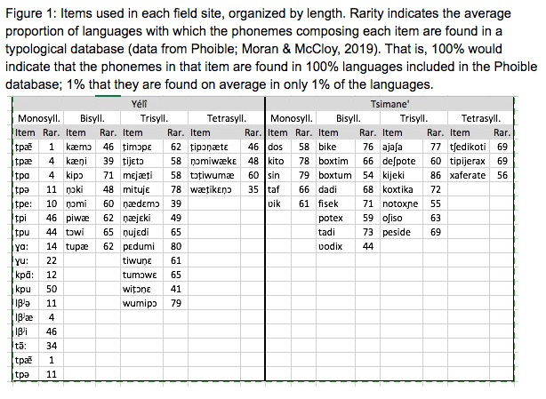

---

#### Mother-baby interactions: prosody variations according to maternal depression and infant age.

[*María Patricia Paolantonio, Laura M. V. Manoiloff, Ana E. Faas*](./authors.md)

mppaolantonio@gmail.com

We aimed to study the prosodic characteristics of maternal IDS and their babies babbling through voice’s prosodic characteristics such as intensity, fundamental frequency (F0), melodic contours (intonation) and amount of utterances and its duration. PRAAT software were used to measure the acoustic properties of the voice signal in a sample of Spanish speaking mother-infant dyads -from Córdoba, Argentina- in relation to the presence or absence of signs of postpartum depression (PPD) and infants age (younger than 6 months or older than 6 months). The hypothesis has been that both the verbal production and the prosodic characteristics of the mother-baby dyads vary depending on the presence of signs of postpartum depression and child age.

44 mother-child dyads between 2 and 10 months of age were analyzed. They were recruited when attended to healthy child control and / or vaccination at the University Hospital of Maternity and Neonatology, a public hospital dependent on the Faculty of Medical Sciences of the National University of Córdoba. The mothers were primiarous, of legal age, born and raised in the city of Córdoba. Those dyads with congenital pathologies or diseases that could affect the assessment of the variables under consideration were excluded. All mothers expressed consent for their participation and that of their children in the study.

The mothers were given a postpartum depression screening questionnaire and the dyads participated in semi-structured play session where acoustic data were obtained.  

Factorial ANOVAs were performed for each variable related to verbal production and prosody for each member of the dyad depending on the factors PPD (with/without indicators of symptomatology) and infant age (2-6 months old group/7-10 months old group).

The results showed statistical significance in relation to PPD for the amount of infant utterances, maternal voice intensity and the use of falling contour intonation in mothers. Significant differences were also found as a function of infant’s age for the amount and duration of maternal vocalizations, intensity measurements and melodic curves in both members of the dyads. 

These findings showed that IDS used in mothers with PPD loses the melodic qualities of this particular speech modality that, according to literature, fulfill numerous functions during language acquisition. Also, the results indicate that in Argentinian Spanish speaking mother-infant dyads the acoustic and verbal production from IDS speech and babbling are moderated is moderated bay child´s age like is shown in studies from other languages.

The results are discussed in relation to those guidelines of the interactionist theories of language acquisition that relate the quality of the early link in the first months of children's life with their environment and its incidence on prelinguistic development and subjective construction.

Furthermore, the results could lead us to a diagnosis method that facilitates the detection of maladjustments during mother-infant communicative interactions based on prosodic and verbal production objective patterns.

---

#### The Development of Consonants in Canonical Babble - Language Acquisition in Yélî Dnye and Tseltal

[*Abram A. K. Peute, Marisa Casillas*](./authors.md)

Bram.Peute@mpi.nl

Soon after children are born they start producing protophones, and after around 7 months they start to produce canonical babbles (Oller et al., 1998). Canonical babbling (henceforth CB) is defined as well-formed syllables often consisting of an reduplicated CV pattern, like “mama” or “da” (Lee et al., 2017), and is seen as a milestone in the motor development of the child. These rhythmic vocalizations relate to other motor development, and train the child in distinguishing and producing the phonemes of their home language(s) (McGillion et al, 2017). 

In the current study we investigate “vocal motor schemes” (henceforth VMS), a capacity for consistent phonetic patterning which manifests in CB. VMS provide the child with the means of producing “auditory approximations” to the target words produced by adults, without the child having to deduce the exact phonemes (Vihman, 1993), and VMS have been shown to predict children’s later lexical development (McCune & Vihman, 2001; McGillion et al., 2017).

We investigate VMS development in two communities with documented low rates of child-directed speech (CDS): Tseltal (Mayan; Casillas et al., 2019) and Yélî (Papuan; Casillas et al., in prep). Children in these communities have been shown to hit basic early vocal maturity milestones around the same age as has been found in communities with higher rates of CDS. The onset of canonical babbling – based on a vocal maturity measure - has been found to be highly robust cross-culturally and cross-linguistically, regardless of CDS (Oller et al., 1998). However, a measure that relates more closely to later lexical development, such as VMS, may be a more appropriate test of whether the lower rates of CDS impact the expected passage of linguistic milestones. We hypothesize that the average age of VMS acquisition by Yélî and Tseltal children will be comparable to the that of Western children; at least 2 VMS consonants between 9 and 14 months (McCune & Vihman, 2001), despite the fact that these children experience less CDS. Furthermore, we predict that the first consonants Yélî and Tseltal children consistently produce are labial or coronal consonants, or both (McCune & Vihman, 2001; de Boysson-Bardies & Vihman, 1991: Lee et al., 2010).

We made broad phonetic transcriptions of 18 Tseltal children’s spontaneous vocalizations over nine 5-minute randomly sampled clips from at-home daylong recordings. Adapting McCune and Vihman’s (2001) measure, if a child produced 10+ realizations of a consonant production within the total 45 randomly sampled minutes, then we considered the child to have acquired the VMS for this consonant. 

An analysis of the frequency of Tseltal consonant types can be seen in Figure 1, which shows that coronals and laryngeals, a phonetic super category containing glottal phonemes, are acquired the earliest; however, the occurrences of laryngeals diminish with age, likely because they are replaced with the other consonants. Interestingly, the dorsals are less often used by older children. The labials are used rather consistently over the course of development. The results largely coincide with our hypotheses, as 7 out of 9 Tseltal children between 9 and 14 months old acquired 2+ VMS, as shown in Table 1. A parallel analysis with Yélî recordings is in progress.

---

#### C[l]V is not a good enough C/ɾ/V, even if you say so: Asymmetric mispronunciation detection of liquids in Brazilian Portuguese

[*Andressa Toni*](./authors.md)

andressa.toni@usp.br

This study investigates the role of syllable structure on the production and perception of liquids by children learning Brazilian Portuguese (BP) as their first language. In BP, lateral /l/ and tap /ɾ/ are phonemes allowed in both simple (CV) and branching (CCV) onsets, as in /salada/ ‘salad’, /piɾata/ ‘pirate’, /plaka/ ‘signal’, /pɾato/ ‘plate’. However, there is a distribution bias in this language favoring laterals in simple onsets and taps in branching onsets, a tendency that could lead to a contrastive underspecification in CCV since no minimal pairs between /l/ and /ɾ/ occur in this syllabic position, and more than 85% of all CCV word types are /ɾ/-formed. Considering this asymmetry, our aim is to discuss whether liquids would have fully specified representations on children’s stored lexical forms throughout phonological development. We argue for developmental effects and syllable structure effects on the segmental (under)specification of the [lateral] feature that distinguishes /l/ and /ɾ/ in BP. To verify how this bias affects the child’s grammar, a mispronunciation detection task assessed if both CV and CCV would tolerate liquid substitutions, and if both substitution directions (/l/→[ɾ]; /ɾ/→[l]) would be equally detected by the child. 11 children (3-6 years old) were pre-tested in a word-repetition task and grouped according to their own productions (Graph1): Target-like Group (accurate liquid production in CCV/CV); Swap Group (CCV production with consistent liquid swaps in both directions; CV mostly adult-like); and Deletion Group (consistent non-adult liquids in CCV/CV). Results (Graph2) show that Target-like Group could detect mispronunciations in both CV/CCV contexts and liquid directions, as expected. Deletion Group accepted /ɾ/CV→[l]CV mispronunciations more than /l/CV→[ɾ]CV, but in CCV both mispronunciation directions were accepted. Swap Group children presented distinct production patterns, half of them tending to /ɾ/CCV→[l]CCV swaps (also affecting CV production) and half tending to /l/CCV→[ɾ]CCV (with adult-like CV production). Despite their opposite production tendencies, however, /ɾ/CCV→[l]CCV mispronunciations were detected more than /l/CCV→[ɾ]CCV, matching the input bias and pointing out that children’s mispronunciation detection is aligned with the input, not with their own outputs. In CV, liquid substitutions were also productively detected by this group, suggesting that different articulatory paths are not leading to (or are not driven by) different perceptual paths, both driving to the construction of similar phonological representations. Results from Swap Group and Deletion Group also suggest that the construction of these representations is influenced by syllable type and by the phonotactic development of the child: when production is unstable, mispronunciations on the unstable structure are accepted if they go towards the input bias. This pattern suggests a syllable effect on perception: CCV and CV present asymmetrical detection patterns, favoring different segment directions according to the input. The relation between unstable production and mispronunciation acceptance also suggests that the input’s dominant liquid for a syllable type (not the children’s own production tendencies) will compete with /l, ɾ/ for its detection while they are not licensed into the syllable. This competition supports the view that an underspecified liquid is first represented in lieu of the actual /l, ɾ/ segments, reflecting the most frequent segment in the input for CV and CCV syllables. On the other hand, the concrete liquid production in CV and CCV is individually variable, and the factors guiding this variability (such as segmental stability, coarticulatory difficulties, covert contrasts) are currently being investigated. We conclude that both syllable structure and syllable development play a role on the specification of the segmental properties of /l, ɾ/ on the phonotactic development of BP speaking children.

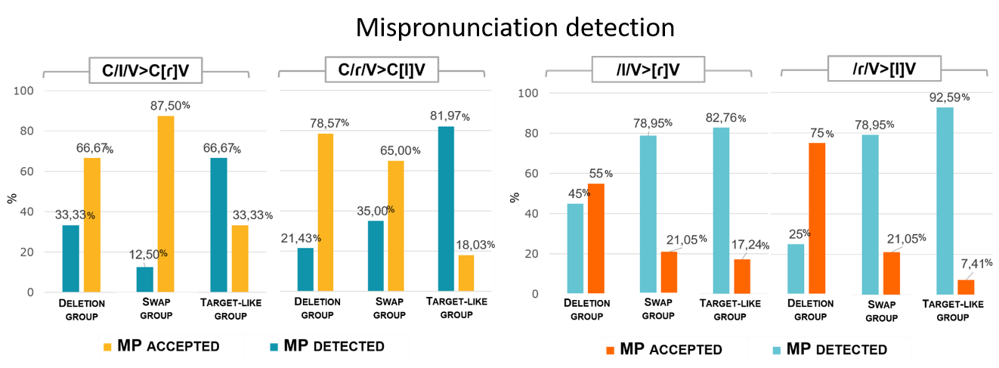

---

#### Quantifying the role of rhythm in infants’ language discrimination abilities: A meta-analysis

[*Loretta Gasparini, Alan Langus, Sho Tsuji, Natalie Boll-Avetisyan*](./authors.md)

loretta.gasparini@uni-potsdam.de

To begin learning language, infants must make sense of their acoustic input, establishing which sounds and kinds of variation are relevant. Newborns may already prefer their native language (Moon et al., 1993) over a variety that belongs to a different rhythm class: stress-, syllable- or mora-timed (Abercrombie, 1967; Nazzi et al., 1998). Between 4 to 7 months , babies seem to discriminate almost any language or accent from their native variety (Butler et al., 2011; Nazzi et al., 2000), but it is unclear at what age this ability emerges (e.g. Chong et al., 2018; Molnar et al., 2013) or to what extent infants continue relying on “rhythm class”, or prosody in general, for discrimination (Chong et al., 2018; White et al., 2016). The concept of rhythm classes has been contested in recent years (Turk & Shattuck-Hufnagel, 2013; White et al., 2012), so if rhythm is indeed an important cue for infant language discrimination, it is pertinent to establish to which durational cues infants are attentive, such as proportion or variability of vocalic and consonantal intervals (Grabe & Low, 2002; Ramus et al., 1999).

We present a meta-analysis of studies on babies' language discrimination skills. We first aim to quantify how discrimination skills and preference in the first year of life are modulated by the factors age, rhythm classes of the tested languages (same or different rhythm classes), manipulation of stimuli (e.g. low-pass filtered speech), and method (e.g. head-turn preference paradigm, high amplitude sucking). The second aim is to explore which durational metrics (White et al., 2014) best account for language discrimination in the included studies.

A systematic literature search identified studies that tested infants’ (birth to 12 months) discrimination or preference of two language varieties, by presenting babies with auditory or audio-visual continuous speech. Data analysis for the first research goal involved random effects meta-analytic models with the factors rhythm class contrast, age, stimulus manipulation, and method, nested in paradigm (analysing discrimination and preference studies separately). For the second research goal the factor of rhythm class will be replaced with durational metrics (like in White et al., 2014), and Principal Component Analysis will be conducted to explore which metrics best account for language discrimination or preference in the included studies.

37 studies were included. Analyses addressing the first research goal showed a significant effect of method, with central fixation paradigms showing larger effect sizes. The effects of age, rhythm class and speech manipulation and their interactions were not significant. An exploratory subgroup analysis was conducted, examining only studies that tested two distinct languages. In this subgroup of discrimination studies there were no effects of age or rhythm class or their interaction, like in the initial analysis. In the subgroup of preference studies there was a significant interaction of rhythm class and age, whereby a non-native language preference increased with age when the tested languages were in the same rhythm class, but a native language preference increased with age when the tested languages were in different rhythm classes. 

The results suggest that there is insufficient evidence that language discrimination is contingent on rhythm class, even in newborns. However, the results suggest that babies may prefer their native rhythm to varying extents, depending on their age. The former finding may be due to insufficient power or sensitivity of measures, or may reflect issues with rhythm class as a concept (Turk & Shattuck-Hufnagel, 2013; White et al., 2012). Analysis for the second research goal is ongoing and will shed light on whether any durational metrics are more successful than the categorical factor “rhythm class” in characterising the rhythmic properties of language that may inform infants’ language discrimination and preferences.

---

### Discourse and pragmatics

#### Pragmatic language assessment and development in children before the age of 4: Crosslinguistic insights using the Language Use Inventory

[*Daniela O'Neill, Diane Pesco, Anabela Cruz-Santos, Cristiana Guimarães*](./authors.md)

doneill@uwaterloo.ca

This presentation will bring together recent findings (published and in progress) stemming from studies of the original English Language Use Inventory (LUI) [1, 2], and of five translations, namely the LUI-Arabic [3], LUI-Polish [4], LUI-Portuguese [5], LUI-Italian [6] and LUI-French [7]. The LUI, a standardized parent-report measure, assesses pragmatic language functioning across a broad variety of everyday settings, including the purposes for which 18- to 47-month-old children use language (e.g., to ask for help, to share something of interest, to direct others in play), their conversational topics, and how they adapt communication to context. 

     The prior lack of tools to systematically elicit such information from parents about children's language use before the age of 4 years in everyday, meaningful social interactions has meant that less is known about how pragmatic aspects of language develop in children than about how aspects of grammar or vocabulary develop. However, the availability of the LUI since 2009, and subsequent translations of the measure, now provide an unprecedented opportunity to explore pragmatic development within and across languages. 

     The first goal of our presentation is to convey some of the challenges associated with translating and adapting a measure focused on pragmatics and the ways these were resolved, resulting in strong psychometric support for the translations. The results add to evidence of the original LUI's reliability, validity, and sensitivity [1, 8]; properties which have already led to its widespread adoption in clinical practice and in research with diverse populations (e.g., children with hearing impairment, Down syndrome, or autism). The second goal is to take a comparative approach, using findings from studies of the LUI’s translations to explore and discuss crosslinguistic similarities in pragmatic development as well as more language-specific patterns (e.g., the performance of boys versus girls at different ages). The results of these studies, taken together, underscore more similarities than differences in the growth of social pragmatic functions of language acquired in the early years across children living in different countries and learning different languages. They also are a strong validation of the importance and use of parent-report measures to gain an in-depth picture of a young 2- or 3-year-olds’ language development. 

     References: [1] O’Neill (2007). The Language Use Inventory: A parent-report measure of pragmatic language development for 18-47-month-old children. JSLHR, 50, 214; [2] O’Neill (2009). Language Use Inventory (LUI). Knowledge in Development, Inc. Waterloo, ON.:Canada; [3] AlKadhi, A. (2015). Assessing early sociocognitive and language skills in young Saudi children. (Unpublished Doctoral thesis, City University London); [4] Bialecka-Pikul, Filip, Stepien-Nycz, Kus, & O’Neill (2019). Rantunku! or just Tunku! Evidence for the reliability and concurrent validity of the Language Use Inventory - Polish. JSLHR, 62, 2317; [5] Guimarães, Cruz-Santos & Almeida (2013). Adaptation of the parent report Language Use Inventory for 18- to 47-months-old children to European Portuguese: A pilot study. Audiology – Communication Research, 18(4); [6] Longobardi, Lonigro, Laghi & O’Neill (2017). Pragmatic language development in 18- to 47-month-old Italian children: A study with the Language Use Inventory. First Language, 37(3), 252; [7] Pesco & O’Neill (2016). Assessing early language use by French-speaking Canadian children: Introducing the LUI-French. CJSLPA, 40, 180; [8] Pesco & O'Neill (2012). Predicting later language outcomes from the Language Use Inventory. JSLHR, 55, 421.

---

#### Individual variability in children’s assessment of ironic speaker motivations

[*Vera Hukker, Simone Sprenger, Petra Hendriks*](./authors.md)

v.hukker@rug.nl

The ironic interpretation of an utterance such as “Great weather!” requires complex reasoning skills. That is, listeners need to reason about what the speaker believes (speaker belief), what the speaker intends the listener to believe (speaker intention), and what emotion towards the situation the speaker wants to convey (speaker attitude). Although children begin to understand irony around the age of 5, full mastery requires further cognitive development, including Theory of Mind (ToM; Filippova & Astington, 2008), as well as social development, including experience with situations in which irony occurs (Pexman & Glenwright, 2007). For example, irony often occurs in response to violations of certain norms that we live up to (e.g., not treating someone’s belongings with care), known as a normative bias (Wilson, 2013). As children know and enforce social norms already from the age of 3 (Schmidt & Tomasello, 2012), we hypothesize that this normative bias contributes to children’s understanding of irony. To test this hypothesis, we compared irony understanding in situations with social norm violations to situations with situation-based expectation violations (e.g., bad weather when having a picnic in the park). Since the latter are not based on social interactions and therefore lack the advantage of children’s knowledge of norms, we predict better irony understanding in situations with social norm violations. As fully grasping an ironic utterance’s meaning requires children to understand why a speaker uses irony (speaker motivation), we investigated their interpretations of speaker motivations, using a ToM-based categorization scheme, ranging from ToM-0 type answers (no reference to beliefs or intentions) to ToM-2 type answers (a second-order reference to beliefs or intentions).	

 	42 monolingual Dutch children (6;11-9;4, M=8;1) and 20 Dutch adults (20;8-29;3, M=22;8) participated in an irony comprehension task (Table 1) with a 2x2 design with the factors ‘utterance’ (ironic, literal) and ‘violation’ (social norm, situation-based expectation). Participants listened to twelve recorded stories including a violation of either a norm or an expectation, each followed by an ironic or a literal utterance. Participants answered questions tapping into speaker belief (Q1: ToM-1), speaker motivation (Q2), speaker intention (Q3: ToM-2), speaker emotion (Q4), and participant belief (Q5: ToM-0) as control question. 	

 	Results on the binary questions Q1, Q3 and Q5 (Table 1) show lower accuracies for children compared to adults, but contrary to our prediction, no higher accuracy for social norm violations compared to situation-based expectation violations. Results on speaker emotion question Q4 (Figure 1) show that children (β=1.3188, p<.01) and adults (β=1.5933, p<.05) perceived emotions as more negative in situations violating social norms than in those violating expectations. Children also perceived emotions as more negative in literal utterances compared to ironic utterances (β=.5498, p<.05). Results on speaker motivation question Q2 (Figure 1) reveal a majority of ToM-2 answers for adults, a majority of ToM-0 answers for children, and individual variability in the quality of answers.

 	Children do not perform better on understanding irony based on social norm violations compared to situation-based expectation violations. However, social norm violations lead to more negative judgements of speaker emotions, indicating that social norms influence adults’ and children’s understanding of speaker attitudes. Children’s less negative emotion judgements in ironic utterances compared to literal utterances confirm an early sensitivity to the muting function of irony (Dews & Winner, 1995); its power to soften a criticism. Individual differences in speaker motivation interpretations raise the question which linguistic, cognitive, and social factors are of influence on children’s reasoning about speaker motivations.

---

#### You and I: Using epistemic cues to predict who will talk next in conversation

[*Imme Lammertink, Maartje de Vries, Caroline Rowland, Marisa Casillas*](./authors.md)

immelammertink@gmail.com

Human conversation is fast: interactants typically have just a few hundred milliseconds to determine if they need to give a response to the current turn and, if so, must start planning early enough to respond as soon as it ends (Casillas et al., 2016; Levinson & Torreira, 2015; Stivers et al., 2009, 2018). Adults manage these speedy transitions via precise predictions on the basis of lexical, syntactic, and prosodic knowledge (de Ruiter et al., 2006) but children, without such sophisticated knowledge, must rely on other strategies.

We hypothesize that children respond on time by using a handful of easily identifiable cues associated with response-seeking utterances (e.g., English wh-words and subject-verb inversion). Here we test whether children use a single, subtle epistemic cue to upcoming response: the subject pronoun person (e.g., “What did you do?” vs. “What did I do?”). Person and questionhood are naturally associated because I tend to know less about you than you yourself do, and so I am more likely to ask a question than make an assertion about you. The use of this epistemic cue is likely consistent, but at best could be used as a heuristic for identifying response-seeking utterances (e.g., “I” questions are possible): this first test presents a formidable challenge to our hypothesis.

We first examined the associative strength between subject pronoun person and interrogative status in Dutch. We controlled for syntactic context by extracting ~8500 child-directed utterances with subject-verb inversion, noting the subject pronoun, main verb, and response status (question/statement) for each. As expected, the majority of subject-verb constructions (79.5%) were questions. The second-person singular pronoun (‘je’/’jij’) appeared more often in questioning compared to non-questioning utterances (62% vs. 46%) while first person subjects occurred more often in non-questioning utterances (singular ‘ik’: 9% vs. 18%; plural ‘we’/’wij’: 8.4% vs. 13.1%). The second person singular pronoun may therefore be a reliable cue in identifying questions as conversational participants.

We then investigated conversational observers’ real-time use of subject pronouns to predict upcoming responses in an experimental setting. We asked 320 participants (80 each at 1;0, 2;0, 3;0 and >18;0) to watch a series of short dyadic conversations in which we controlled the use of first- and second-person subject pronouns (“ik” I vs. “jij” you). In this context, young children and adults spontaneously look at upcoming responders after questions (Casillas & Frank, 2017; Lammertink et al., 2015). We hypothesized that participants would make anticipatory looks more often when hearing a turn with a second- than first-person subject pronoun. We tested this pronoun effect in real Dutch (i.e., with semantic support) and Jabberwocky Dutch (i.e. with nonsense words; no semantic support), with both rising and falling intonation. Logistic mixed effects models of anticipatory gaze likelihood suggest no evidence for children’s use of subject pronoun, intonation, or their interaction, in real or Jabberwocky Dutch. However, anticipatory looks increased with age for real Dutch, suggesting children improve their predictions on the basis of other linguistic cues. Interestingly, the adults showed the predicted pronoun effect, but only in Jabberwocky Dutch, when there was no semantic support to predict what would happen next. There was no effect of intonation in the adults.

Despite the reliable distributional link between subject pronoun person and question status (Study 1), we find only weak evidence that this epistemic cue is used to predict upcoming responses in real time (Study 2); only adults used the cue, and only when we took away all semantic information. We discuss these results with respect to first- vs. third-person measures of prediction, prosodic prominence, and within the broader context of using superficial cues to facilitate interactional exchange.

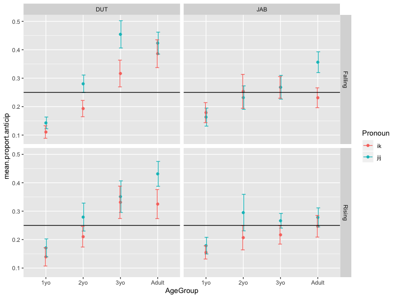

---

#### Sign advantage in development of spatial language: Signing children’s spatial expressions are more informative than speaking children’s speech and gestures combined

[*Dilay Z. Karadöller, Beyza Sümer, Ercenur Ünal, Asli Özyürek*](./authors.md)

dilay.karadoller@mpi.nl

Children often produce under-informative descriptions (Grigoroglou & Papafragou, 2019) such as in encoding space. Informative expressions for Left-Right are acquired later than other spatial relations (e.g., In). Speaking children instead use under-informative expressions (e.g., Side) to encode Left-Right. Signing children however are found to produce informative expressions for Left-Right in Turkish-Sign-Language [TİD] more than their Turkish-speaking peers around age 8 (Sümer, 2015). Perhaps, signing children, unlike speaking children, benefit from iconic linguistic structures that provide information about spatial relations in an analogue way via specific handshapes for objects’ shape and simultaneous hand placements to locate objects onto signing space. Yet, previous research has not ruled out the possibility that speaking children may also benefit from iconic gestures to informatively encode Left-Right. Here, we investigate whether acquisition of sign has an adv! antage ov er spoken language even when sign is compared to speech-plus-gesture for children and adults.

We elicited descriptions from 26 child (MAge = 8) and 25 adult (MAge = 35) monolingual-Turkish-speakers and 26 child (MAge = 8) and 25 adult (MAge = 29) TÄ°D-signers. Stimuli were 84 displays with 4 pictures showing the same Ground (i.e., big) and Figure (i.e., small) objects in various spatial configurations (Left, Right, Front, Behind, In, On). Participants described target pictures (Left-Right; N = 28) to a confederate. 

We coded descriptions in terms of informativeness in speech, speech-plus-gesture, and sign. For speech, informative-descriptions included Left-Right spatial nouns. Under-informative-descriptions included a general relational noun (i.e., Side), incorrect (e.g., Front), or no spatial encoding (e.g., labeling objects only). Also, we coded spontaneous spatial co-speech gestures (e.g., expressing relative locations of only one or both objects via hand placements) that conveyed information missing in under-informative speech (Figure 1) and resulted in informative-descriptions multimodally. For sign, informative-descriptions included iconic linguistic strategies to encode Left-Right relations (Figure 2) and under-informative-descriptions included incorrect (e.g., Front) or no spatial encoding (e.g., labeling objects only). 

Speaking children disambiguated their under-informative-descriptions (Speech-only: 32%) via iconic gestures (Speech-plus-gesture: 77%) more than speaking adults (Speech-only: 86%; Speech-plus-gesture: 94%; β = 2.94, SE = 0.70, p < 0.001). Sign to speech-plus-gesture comparisons showed that signing children were more informative than speaking children (β = 1.78, SE = 0.54, p < 0.001) but speaking adults were equally informative to signing adults (β = 0.74, SE = 0.46, p = 0.105). Lastly, both signing and speaking children were less informative than their adults (Sign: β = 2.59, SE = 0.49, p < 0.001; Speech-only: β = 6.32, SE = 1.34, p < 0.001; Speech-plus-gesture: β = 1.73, SE = 0.52, p < 0.001). 

In brief, visual modality has a stronger impact on signing children than speaking children even when both speech and gestures are considered. This can be attributed to the variations in iconic structures in sign vs iconic co-speech gestures. Having iconic linguistic structures in sign languages, unlike gestures that are not learned as linguistic structures but rather only as part of a composite system with speech (Perniss, Özyürek & Morgan, 2017), might have facilitated the development of informativeness in Left-Right expressions for signing children more than speaking children. Interestingly, the facilitating impact of sign over speech-plus-gesture was not present in adults, suggesting sign advantage appears mostly in the development. Lastly, both signing and speaking children were less informative than adults pointing to the challenge of spatial domain in conceptual development (Clark E., 1973).

---

### Morphosyntactic development

#### Acquisition of noun case inflections by Russian monolingual and Russian-English bilingual children

[*Ladinskaya N., Chrabaszcz A., Na Lopukhina*](./authors.md)

ladinskaya.ninaaa@gmail.com

Acquisition of case in Russian presents difficulties for both monolingual and bilingual children due to the syncretism, allomorphy of case forms, and a large number of cases (Gagarina and Voeikova 2009). We examined whether age-matched Russian monolingual children and Russian-English bilingual children follow the same timeline in the acquisition of Russian case inflections. For this purpose, we identified quantitative and qualitative differences in their case form productions for real and novel words (pseudowords). In the bilingual data of this language pair, it is interesting whether the rich inflectional Russian morphology system will be vulnerable to the influence of the poorer morphology of the English language. 

54 Russian monolingual children and 17 Russian-English bilingual children (age range 2 to 5 years old) have taken part in the study so far (data collection is in progress). In the first part of the experiment children named real objects corresponding to 24 real words (picture-naming task) then they completed the sentence (sentence-completion task) e.g., (trainNOM) “The children are riding the ... (trainPREP)”. For nonexistent objects, the experimenter named the object in isolation, e.g., (vomakaNOM), and asked the child to repeat it (repetition task) and then complete the sentence with the form of the pseudoword that s/he considered fit for the situation. Prompts were constructed to bias the children’s responses towards the use of a noun form in one of the five oblique Russian cases in singular and plural forms, across three declensions. The words denoted everyday objects and animals, AOA was by 2 years (based on Akinina et al. 2016).

Differences between monolinguals and bilinguals: 2-3-year-olds monolinguals substituted oblique case endings with the nominative case, and stopped to make such errors at 4-5-year-old. Bilingual children continued to make such substitutions even at 4-5 years of age. The effects in both monolingual and bilingual groups: the plural case forms presented more difficulty compared to singular forms (Fig. 1), in line with previous studies (e.g., Schwartz and Minkov 2014), 3rd declension (the rarest) presented the biggest challenge compared to other declensions, the instrumental case and genitive case were the most difficult. Also, we found that children tended to substitute zero inflections in plural forms with the more salient, transparent, and stressed –ov,-ev endings, supporting the idea of ‘inflectional imperialism’ (Slobin, 1966). 

The bilingual children tend to substitute oblique cases with nominative form even at 5 years and we can assume that bilinguals seek to simplify the morphological system under the influence of the English language. 

References 

Akinina Yu., Grabovskaya M., Vechkaeva A., Ignatyev G., Isaev D., Khanova, A. 2016. Biblioteka psiholingvisticheskih stimulov: novye dannye dlja russkogo i tatarskogo jazyka. In Yu. Aleksandrov & K. Anokhin (Eds.), The Seventh International Conference on Cognitive Science (pp. 93–95). Moscow: Institute of Psychology of Russian Academy of Sciences.

Gagarina N., Voeikova M. 2009. Acquisition of case and number in Russian. Development of nominal inflection in first language acquisition: A cross-linguistic perspective, 179-215.

Horst J. S., Hout M. C. 2016. The Novel Object and Unusual Name (NOUN) Database: A collection of novel images for use in experimental research. Behavior research methods, 48(4), 1393-1409.

Slobin D. I. 1966. Acquisition of Russian as a Native Language. In F. Smith & G. A. Miller (eds.), The Genesis of Language. A Psycholinguistic Approach. Proceedings of a Conference on Language Development in Children (Cambridge, MA, and London, MIT Press).

Schwartz M., Minkov M. 2014. Russian case system acquisition among russian–hebrew speaking children. Journal of Slavic Linguistics, 51-92.

---

#### Acquiring the Dutch plural in a bilingual setting: Cross-linguistic influence from English to Dutch

[*Darlene Keydeniers, Suzanne Aalberse, Sible Andringa, Folkert Kuiken*](./authors.md)

D.J.Keydeniers@uva.nl

BACKGROUND

In bilingual settings, language contact can sometimes lead to cross-linguistic influence. Earlier studies have found that this particularly occurs when there is partial overlap between languages: when one language offers an alternative between two patterns, a learner of that language tends to overgeneralize the pattern that also exists in the other (for an overview see Moro, 2016). This has been called the Alternation Hypothesis (Jansen et al., 1981; Heine, 2008). This study investigated whether the acquisition of the Dutch pluralization is affected by early exposure to English in the context of Dutch-English bilingual daycare centers. The Dutch plural can be formed by adding the -en or the -s affix:

a.	Eén stoel, twee stoelen (‘one chair, two chairs’)

b.	Eén tafel, twee tafels (‘one table, two tables’)

The English language only offers the -s affix in case of pluralization. Due to this partial overlap, it could be predicted that children in the process of acquiring the Dutch plural system may show a stronger preference for -s if they are also exposed to English.

METHOD

A group of 141 two- and three-year-old children growing up with Dutch and/or English at home and who attended monolingual (Dutch-only) or bilingual (Dutch-English) daycare participated in a Sentence Completion Task. In this task, the participants were presented with a dollhouse, its doll occupants and some of its furnishings.  The experimenter told the participants that they had brought more furnishings that had to be placed inside the house by the participants, and that she would hand them the objects one by one. 

To elicit plurals, the  experimenter would introduce and name two objects (e.g.: 'Look what I brought, a bed! But I didn’t just bring one bed, I brought another bed.’) Then, the experimenter would offer a sentence frame for the child to describe the objects (e.g. ‘So I didn’t just bring one bed, but two….?’). The participants were then prompted to complete the sentence.

In total, sixteen Dutch plurals were elicited. Eight months later, 59 out of the 141 children participated in a follow-up measurement in which they completed the same task. For each participant an English exposure measure (including English exposure at home and at daycare) was calculated on the basis of a parental questionnaire.

RESULTS

A generalized logistic mixed effect model showed that more English exposure was associated with an increased chance of children using the –s affix: an interaction effect was found between amount of English exposure and Type. This indicated that the more children were exposed to English, the more likely they were to form a plural with an –s when an –en affix was required (z=3.395, p<.001). No evidence was found for an increase or decrease of the effect of English exposure on the chances to form a plural with an –s over time, since no interaction effect between Exposure and Time was found (z=-0.662 , p=0.508). 

CONCLUSION

This study provides evidence for cross-linguistic influence from English to Dutch in the acquisition of Dutch pluralization: early exposure to English in two and three-year-old children leads to a higher chance of overgeneralization of the -s affix when an -en affix is required. No evidence was found for an increase or decrease of this cross-linguistic influence from English to Dutch over time.

REFERENCES

Jansen, B., Lalleman, J., & Muysken, P.C. (1981). The alternation hypothesis: acquisition of  Dutch word order by Turkish and Moroccan foreign workers. Language Learning, 31(2), 315-336.

Heine, B. (2008). Contact-induced word order chage without word order change. In P. Siemund & N. Kintana (Eds.), Language contact and contact languages, 33-60.  Amsterdam and Philadelphia: John Benjamins.

Moro, F. R. (2016). Dynamics of Ambon Malay: Comparing Ambon and the Netherlands. Utrecht: LOT.

---

#### An Assessment of Functional Categories in Hindi-English Bilingually Developing Young Children

[*Rita Mathur*](./authors.md)

mrita2008@gmail.com

An attempt is made to assess the existence of functional categories in young bilingually developing children. Theoretically, the study adheres to the notions of Strong Continuity Hypothesis (SCH) (Lust, 1999). SCH emphasizes that the complete functional structure is available in early stages of first language acquisition and is developed according to mental operating principles which are available through Universal Grammar (Chomsky 1981). Children have the ability to delineate the parameters of ambient language/s and acquire functional categories pertaining to inflection, gender, and tense contrast in early stages of language acquisition.  In bilingual environment children are able to set the parameters of more than one language and can acquire two languages successfully. 

The objective of this paper was to assess acquisition of functional categories in bilingually developing children; we have included social variables as well. Therefore, the study was inclusive of perspectives from psycholinguistics and sociolinguistics. To understand the acquisition process we need psycholinguistic issues, and to understand the context of learning sociolinguistic variables are inevitable. 

In order to procure data, comprehension, production and judgment tasks related to Agreement Phrase (AgrP), Tense phrase (TP) and Complementizer phrase (CP) were administered to 127 Hindi-English 3-6 years old bilingually developing children. The tasks were developed in two languages; in Hindi and in English. The data collection was carried out in northern part of India where Hindi is a major language; English coexists with Hindi in social, cultural and educational environments. 

Comprehension task was comprised of three sub-sets: 1) picture selection, 2) identification and 3) lexical concept. 

The production task was comprised of two subsets: 1) Production sentence, 2) Agreement. ‘Production sentence’ task was composed of narrative pictures. ‘Agreement’ task was composed of grammatically wrong sentences violating agreement rules. Children were asked to evaluate the sentences as ‘right’ or ‘wrong’. 

The Judgment task was composed of silly statements.  Children were asked to judge them for semantic correctness . 

Data were coded and entered in a Microsoft Excel spreadsheet. All statistical analyses were carried out using IBM SPSS 21.0 for Windows (SPSS Inc, Chicago, IL, USA). 

The result of the assessment provided the evidence that children have acquired parameters of two languages.  The study also concludes that early grammar of bilingually developing children was well structured. We have got evidence that the knowledge about Agreement Phrase (AgrP), Tense phrase (TP) and Complementizer phrase (CP) was available with children in early years.  Children have comprehended Person, Number and Gender (PNG) markers in both the languages with right values. Both the languages differ in word order parameter. English is head initial language where as Hindi is head final language. More over Hindi is a prodrop language where English is not. The results have provided the evidence that children’s utterances were error free as far as word order and prodrop parameter was concerned. It may be concluded that bilingually developing children acquire two grammatical systems. 

X2 test was used to assess bivariate association between categorical variables. If probability associated with the X2 test was <0.05; we asserted that correlation between variables was significant.

---

#### Revisiting Children's Pronoun Case Errors: A Comprehensive Corpus Analysis

[*Xiaomeng Ma, Virginia Valian, Martin Chodorow*](./authors.md)

xma3@gradcenter.cuny.edu

Between 2-4, English-speaking children reportedly make pronoun case errors such as

‘me go’. For more than 40 years, researchers have categorized such errors as systematic, characteristic, and frequent (e.g. Huxley, 1970; Pelham 2011).  Few studies, however, have reported error counts or error rates for all pronouns, so the frequencies and distributions of such errors are still unknown. Estimates confined to first person subjects show 92%-94% correct use of ’I’ (Rispoli, 1998; Kirjavainen et al, 2009).  Here we describe a comprehensive corpus analysis of pronoun case, across all persons and numbers, to assess the prevalence and distribution of case errors and input as a possible source of errors. 

We extracted first and third person singular and plural pronouns from longitudinal data of 46 monolingual English-speaking children from ages 2 to 4 in CHILDES.  Any misuses of nominative, accusative, or genitive case were counted as errors. Candidate errors were located using the NLTK python package and were hand-checked by two annotators. As shown in Table 1, of 244,874 total pronouns, we found 3421 errors. There were five types of errors: accusative case used as a subject or a possessive, genitive case used as a subject or an object, and nominative case used as an object. All pronouns but ‘me’ (93%) and ‘her’ (91%) were used correctly over 95% of the time. In addition, most positions (subject, object, or possessive) were filled with a correct pronoun over 95% of the time.  The two exceptions were ‘she’, which only filled 92% of subject positions that required a third person singular female pronoun, and ‘their’, which only filled 90% of determiner positions that required a third-person plural pronoun. 

Most children made few errors: 43 of the 46 children have an error rate less than 5%; 21 children have an error rate less than 1%.  Children made no errors on most pronouns.  Errors are concentrated in four types: using accusative case as a subject, including ‘me-for-I’, ‘them-for-they’, ‘her-for-she’ and ‘him-for-he’.  The low number we document is not due to small sample size.

To test if parental input, such as ‘Let her open it’, could be responsible for overuse of the accusative form (Tomasello, 2000), we extracted all child and parent utterances containing ‘me/her/him/them +V’ in the corpus.  We also extracted all the ‘NOM + V’ sequences in children’s and parents’ utterances in order to determine the proportion of ‘ACC + V’ sequences.  Children make ‘ACC + V’ errors (e.g. ‘them want it’), along with correct ‘ACC + V’ utterances (e.g., ‘help her find it’). There is no significant correlation between the proportion of ‘ACC + V’ errors in children’s utterances and the proportional use of ‘ACC + V’ sequences in parents’ input for ‘me’ (r = 0.10), ‘him’ (r = 0.07), ‘her’ (r = -0.21) or ‘them (r =0.01). Since not all the children made ‘ACC + V’ errors, we further calculated the correlations limited to children who made at least 2 ‘ACC + V’ errors for each pronoun. Even so, there is still no significant correlation between the proportion of ‘ACC + V’ errors and the proportion of ‘ACC + V’ in parents’ input: ‘me’ (r = 0.13), ‘him’ (r = 0.34), ‘her’ (r = 0.24), or ‘them’ (r = 0.02).  In addition, we compared the mean proportion of ‘ACC + V’ in parents’ input for children who made at least 2 errors with children who made 1 or 0 errors for each of the 4 pronouns. Parental examples ranged from .03 (him) to .10 (me and them), and did not differ for children who made more than 1 error and children who made 1 or 0 errors, as shown in Table 2. 

Children make few pronoun case errors.  There is considerable variability in error types and tokens, within a narrow range, from child to child.  We consider whether there is a substantial phenomenon to be explained:  children case most of their subjects and objects correctly, regardless of how many ‘ACC +V’ sequences parents produce.

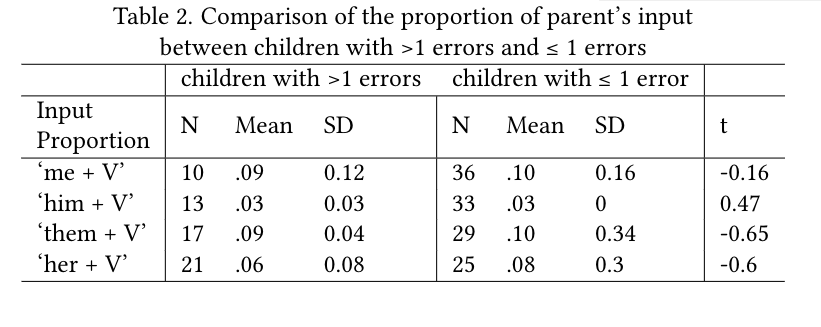

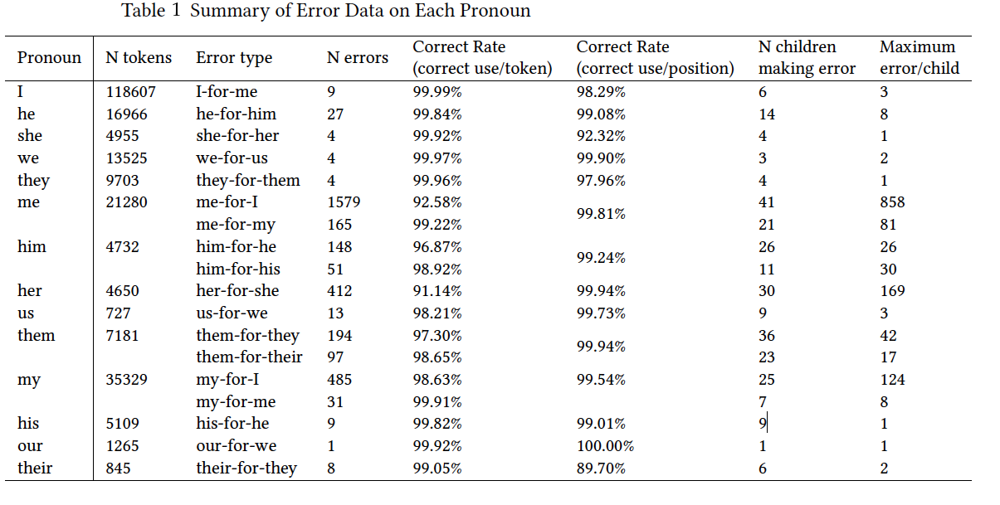

---

#### The acquisition of optionality in Akan wh-questions

[*Paul O. Omane, Barbara Höhle*](./authors.md)

omaneokyere@hotmail.com

Previous research on the acquisition of wh-questions over the years suggests that children are constrained in the derivation of wh-questions as a consequence of complex syntactic movement operations. Hence, for languages that offer variations to its speakers (e.g. French), children may favour the less complex structure that is available in their input. In previous spontaneous speech analyses (Crisma, 19992; Hamann 2000, 2006) and experimental studies (see Zuckerman & Hulk, 2001; Hamann, 2006), it has been shown that children acquiring French use the in-situ wh-questions whereas wh-questions that require inversions and overt movement are initially absent. This indicates that children initially have a preference for in-situ wh-questions over ex-situ questions. These findings provide evidence for the role of the Derivational Complexity Hypothesis (DCH)/Derivational Complexity Metric (DCM) in the acquisition of French. The DCH (Jakubowicz, 2004) claims that during language development, less complex derivations are input convergent, that is, correctly spelled out or pronounced before more complex ones. The assumptions of the DCM (Jakubowicz, 2005) are that, merging αi n times gives rise to a less complex derivation than merging αi (n+1) times. Also, internal merging of α gives rise to a less complex derivation than internal merge of α+β. We tested the predictions of the DCH and the DCM in another language, Akan – a language spoken in Ghana belonging to the Kwa, Niger-Congo group - that offers variation in the formation of wh-questions. We tested 44 Akan-speaking children (ages 4;0 – 4;11, N=21, M: 53.24 months, SD=3.30 and 5;0 – 5;11, N=23, M=64.65 months, SD=3.64) and 22 adults in a sentence repetition task. Participants were asked to imitate grammatical and ungrammatical who, what and where-questions. Stimuli were presented auditorily by the researcher. The grammatical question condition included both ex-situ and in-situ questions. An ex-situ grammatical sentence has an obligatory morpheme na which occurs after the fronted wh-word. For ex-situ who-questions, there is always an overt pronoun (resumptive pronoun (RP)) that replaces the fronted wh-word at the extracted site. However, there is no such overt RP at the extracted site in ex-situ where and what-questions.  In-situ grammatical sentences followed the SVO word order of the Akan language. The wh-word remains in its canonical position (at sentence final) without any movement. In the ungrammatical sentence condition, we used only the ex-situ structure but left out the obligatory clitic morpheme and the resumptive pronoun. This made it possible for us to test whether children would switch from the more complex ex-situ structure to the less complex in-situ structure or whether they would maintain the provided structure and fill in the obligatory missing morphemes in their corrections in the ungrammatical questions. Our findings showed that 4-and 5-year-olds as well as adults preferred to maintain the more complex ex-situ structure and inserted the missing obligatory morphemes rather than switching to the less complex in-situ question structure. Both child groups and adults make a difference between grammatical and ungrammatical sentences. They produced more exact repetitions in the grammatical sentences than in the ungrammatical sentences. We discuss our findings in the light of the DCH and DCM.

Keywords: Acquisition, wh-questions, Akan, in-situ structure, ex-situ structure, Derivational complexity.

---

#### The acquisition of possession in Inuktitut: insight from child and caregiver speech

[*Leah D. Doroski, Heather Littlefield, Shanley E. M. Allen*](./authors.md)

doroski.l@husky.neu.edu

Possession forms are among the earliest utterances produced by children (Brown, 1973). Children typically go through stages of acquisition of possession, as they often begin expressing possession far before they can produce target forms (Marinis, 2016). As different languages use different structures to convey possession, cross-linguistic acquisition of the possession structure offers insight into the role of language structure within acquisition. 

In English, German, Greek, Hebrew, and Japanese, children build possession utterances with units that are attested in target forms (Marinis, 2016). First possession utterances consist of uninflected nouns, with the inflectional system being acquired at a later stage. Data from the polysynthetic language Northern East Cree, however, shows a different pattern (Henke, 2019). In this study, one child (aged 2;1-3;8) evidenced an early stage using an analytic possessive form that was largely unattested in adult speech (which uses primarily synthetic forms), thus circumventing units of the target form altogether until a much later stage when the child could produce units of the target form. In the current study, we ask whether this pattern is specific to Cree or also found across other polysynthetic languages.

 

To this end, we investigated the acquisition of possession forms in Arctic Quebec Inuktitut, a polysynthetic language of Quebec (Dorais, 2010). Inuktitut marks possession through inflections on both the possessor and the possessee. The possessor is inflected with one of 39 ergative case markers indexing the number of the possessor, while the possessee is inflected with one of 252 inflections indexing both the person and number of the possessor as well as the number and case of the possessee. Four constructions are possible, mixing these options (see Figure 1). Recursive nested possession relationships are formed with an additional, often null, constituent (see Figure 2). 

We analyzed spontaneous speech data from three children (aged 2;0-2;9, 2;6-3;3, 3;7-4;4), along with a small subset of input from two caregivers, collected once per month for nine months (Allen, 1996). Possession relationships were found in ~10% of utterances, yielding 1469 possession forms from the three children and 293 forms from the adults. 

The three children showed no early stage lacking possessive inflection, and also no other stages of development in their possession forms. In fact, they showed patterns of possession relationships in their speech that were astonishingly similar to those of their caregivers in terms of overall possession use, the constructions of constituents, and types of possessor and possessee forms. All speakers overwhelmingly preferred the possessee-only construction and showed about equal use of the other three constructions (Figure 1). All three children even produced the more complex nested form (Figure 2). Investigations of younger data are ongoing to pinpoint possible earlier development of possession forms. 

Our results suggest that the “circumventive method” of acquiring possession does not hold for all polysynthetic languages and may be due to additional complexities of possession in Cree. Polysynthetic versus non-polysynthetic is perhaps not a crucial distinction in structural development of possession forms. 

References

Allen, S. E. M. (1996). Aspects of argument structure acquisition in Inuktitut. Amsterdam: Benjamins.

Brown, R. (1973). A first language: The early stages. Cambridge: Harvard University Press.

Dorais, L.-J. (2010). Language of the Inuit: Syntax, semantics, and society in the Arctic. Montreal: McGill-Queen's Press.

Henke, R. E. (2019). The development of possession in the L1 acquisition of Northern East Cree. Journal of Child Language, 46(5), 980-997.

Marinis, T. (2016). Acquiring possessives. In Jeffrey L. Lidz, William Snyder & Joe Pater (Eds.), The Oxford handbook of developmental linguistics. Oxford: Oxford University Press.

---

### Language in multiple modalities

#### Interactional style in child-parent multimodal interaction during the first three years of life

[*Tove Nilsson Gerholm, Gláucia Laís Salomaõ, Petter Kallioinen*](./authors.md)

tove@ling.su.se

The study investigates the relation between different modalities as these played out in the interaction between 14 child-parent dyads during the children’s first 3 years of life. The research questions were: i) Do different child-parent dyads make use of the various  communicative modalities in similar ways and, if not, in what way do they differ from one another? ii) Are there age related differences in the interactants´ multimodal behavior during the three years of recording? iii) Do potential differences/similarities found in i) and/or ii) relate to the child´s verbal competence at three years of age as measured through SCDI (the Swedish Communicative Development Inventory)?

From studies of language acquisition, we know communication context to be crucial. We know this context need to contain interacting humans (Kuhl et al., 2003; Goldstein & Schwade, 2008); that there has to be shared attention between these interactants (Tomasello, 1995); that the topics named and discussed tend to be present to touch and see (Smith & Yu, 2008), leading to these objects also becoming the child’s first words in speech production (Yu et al., 2005); and that the manner in which parents address the child in these contexts appear to follow a particular pattern (Fernald & Kuhl, 1987; Fernald, 1989). All these traits are suggested to facilitate the acquisition process. Yet, there are many aspects we still do not understand. In terms of context we lack a clear definition of what this context needs to consist of. It is established that children need someone who responds appropriately to the child’s communicative moves (Kuhl et al., 2003; Goldstein & Schwade, 2008; Roseberry et al., 2014). But is it enough with verbal responsive behaviors or is gaze, touch, gestural behavior or facial expressions equally important in this respect? Joint attention has been highlighted as a crucial part of the language acquisition process (Tomasello & Farrar, 1986; Mundy et al., 1990; Dawson et al., 2004). Still, we do not fully understand if this sharing of attention has to include gaze, or if touch, gestures or facial expressions function in the same or a similar way in guiding the child along. In the present study the aim was to disentangle the different modalities and relate them to the child’s vocabulary size at three years of age, while also comparing the dyads behavioral patterns throughout the three years.  

Method. The children were recorded together with one parent on 10 occasions starting when they were 3 months old and ending around the 3rd birthday. The recordings took place in the interaction lab at the Dept of linguistics, Stockholm University. The parents were instructed to play with and handle the child as they normally would, and the room was equipped with three stuffed animals and a few age adequate toys. Each session generated approximately 10 minutes of free interaction, transcribed using the ELAN software (Sloetjes & Wittenburg, 2008). 

Analyses. The extent of possible relationships between interactants’ vocalizations/ verbalizations, gestures, gaze behavior, touch behavior and different facial expressions were examined using correlation analysis. Common factors that may have accounted for highly correlated modalities were examined by means of factor analysis. Preliminary results suggest, for instance, that during the first year of life for one group of dyads “gaze away” and “touch” were correlated, perhaps indicating that the communicative bond between child and parent might rely on touch as well as gaze patterns. 

Discussion. The similarities and differences over time between children, parents and dyads are discussed in the context of the vocabulary level the children had reached at 3 years of age; and to what extent the variation in interactional style could be understood in terms of dynamic systems theory (Thelen & Smith, 2006).

---

#### Quantifying the nature of vocal and gestural activity in infants across the first year

[*Helen L. Long, Megan M. Burkhardt-Reed, Dale D. Bowman, Kimbrough D. Oller*](./authors.md)

hlong@memphis.edu

The literature on vocal development has largely focused on the effects of social interaction to support the emergence of language. Gesture is also widely studied in infant and child development with an emphasis on how gesture supports language learning. There is a growing literature base highlighting the role of intrinsic motivation for endogenous activity in early infancy. To our knowledge, there has been no previous quantification of the social and endogenous nature of infant “protophones,” i.e., prelinguistic speech-like vocalizations, and gestures across the first year of life. This presentation presents the results from two studies quantifying the nature of vocal and gestural activity in the first year.

For Study 1, six parent-infant dyads (3 M, 3 F) completed two naturalistic laboratory recordings at 3, 6, and 10 months of age. From these recordings, infant protophones were labeled for a range of communicative and non-social functions, later collapsed into social or endogenous categories for data analysis. We found infants used significantly more endogenous vocalizations at all three ages, approximately 75% overall, compared to socially-directed ones (p < .001) as shown in Figure 1. Social and endogenous vocal activity also remained relatively stable across the three ages studied. For Study 2, we sought to investigate the directivity and rates of vocal communication compared to gestural communication. Ten parent-infant pairs (5 M, 5 F) were observed at ages 3, 6, and 11 months of age with their primary caregivers during interactive play sessions. For directivity, the infant protophones and gestures were labeled for social and non-social functions using the infant’s gaze direction as an indicator of intent. Figure 2 illustrates that the protophones were directed by gaze toward a person 74% more often that gestures (p < .001). However, both protophones and gestures were directed by gaze toward a person far less than half the time. The rate of occurrence between gestures and protophones was vastly different. Gestures occurred at an average of 2 per minute or less across the three ages, whereas protophones occurred at an average of approximately 6 per minute. 

Overall, infants used about three times as many endogenous protophones as social ones, a pattern that remained stable across the three ages. The results potentially suggest a larger role for intrinsic motivation to vocalize independent of face-to-face engagement than previously expected. The endogenous nature of infant communication applied whether the communication was vocal or gestural. Since gesture is inherently visual, it requires the recipient to be looking--yet the gesturing babies relatively rarely looked to see if the potential recipient was looking at them. Furthermore, the results from Study 2 showed that protophones occurred at almost three times the rate of gesture across the first year. Our results dramatically contradict the assumption that gesture is predominant in early infant communication, and thus suggest that gesture is not the primary foundation of language. On the contrary, the results are consistent with the suggestion that vocalization is, and always has, formed a more important foundation for language than gesture. We propose that high rates of endogenous vocalizations may have a deeply significant role in child language development, specifically for sensorimotor exploration and as the raw material with which parents engage.

---

#### Can you feel my rhythm? Interpersonal coordination between a child with deafblindness and their mentor

[*Lisette de Jonge-Hoekstra, Marleen Janssen, Ralf F. A. Cox, Trees van Nunen*](./authors.md)

lisette.hoekstra@rug.nl

How can you develop language if you are born without proper sight and hearing? Children with congenital deafblindness face profound difficulties in acquiring language, largely due to a lack of access to language in their environment. Indeed, only a few people with congenital deafblindness acquire language beyond the level of naming a limited amount of things, using tactile signs. Language is extremely powerful in extending the boundaries of communication, and not acquiring language proficiency is detrimental for someone’s developmental opportunities throughout life.

To enable more children with congenital deafblindness to become more proficient in language, we need to better understand their individual paths to language. 

Language does not appear and develop all of a sudden, regardless of the presence or absence of any sensory impairments. Instead, language emerges from and builds upon processes underlying interpersonal interaction, such as imitation, attunement, synchronization, and coordination. A detailed understanding of interpersonal interaction between children with deafblindness and significant others promises to yield vital understanding of opportunities to learn language. In this case-study, we investigated interpersonal interaction between a child with congenital deafblindness and their mentor in detail.

For this study, we analyzed interpersonal interaction using a video that was previously recorded for an effect study (Huiskens, 2015). We manually coded the harmonicity of the interaction, using an earlier developed coding system (Janssen et al., 2003). In addition, we tracked the hand movements of the child and the mentor in the video. We confined the coding and motion tracking to episodes in the video in which the head and at least one of the hands of both the child and mentor was visible. The child sat at the lap of the mentor and both did not change their posture significantly (e.g. going from sitting to standing). This resulted in the further analyses of two episodes (~ 130 – 150 sec.): One episode with a predominantly harmonious interaction, and one episode with a predominantly disharmonious interaction.

For both episodes, we investigated the attunement of velocity and acceleration of child’s and mentor’s hand movements. First, we visualized and described the velocity and acceleration of hand movements over time, across the episodes. Second, we applied Cross-Recurrence Quantification Analysis (CRQA) on the timeseries of the velocity and acceleration of child’s and mentor’s hand movements. CRQA informs about the stability, strength and dynamics of coordination between two coupled dynamical systems, in this case the child and their mentor. We found that the movement profiles in the disharmonious interaction were more capricious than in the harmonious interaction. Furthermore, we found a more evenly balanced leader-follower pattern and more attunement in the harmonious interaction, compared to the disharmonious interaction. Our results thus show that the way in which the child with congenital deafblindness and their mentor move their hands together from moment to moment is closely related to the global nature of their interpersonal interaction. 

Our study is the first to apply a combination of detailed motion tracking and coordination dynamics analysis with more qualitative methods to investigate the interpersonal interactions between children with deafblindness and significant others. Using these methods, we found that harmonicity of the interaction is evident from the coupling and attunement between the child and their environment over time. Similarly, opportunities for language development arise from coordination between the child and their environment – and in fact are intertwined with harmonicity itself. We therefore believe that more studies on coordination between children and their environment will lead to a better understanding of the many paths leading to language for children with deafblindness.

---

#### Through the lens of a communicative genre: Differences in use of iconic co-speech gestures by 4-years-old children

[*Katharina J. Rohlfing, Ulrich Mertens, Sofia Koutalidis, Olga Abramov, Stefan Kopp, Friederike Kern*](./authors.md)

katharina.rohlfing@upb.de

Most papers addressing gestures as nonverbal means of communication start with the observation that people in general and children in specific move their hand when they talk (e.g., Novack & Goldin-Meadow, 2015). In this work, we ask whether such generally observed gestural behavior changes in dependence on what communicative task is performed. The question is motivated by the assumption that communicative tasks differ with respect to the underlying cognitive and interactive demands. For children, this question is important, because in research, a relation between children’s communicative competences and their nonverbal behavior is discussed. In this discussion, however, communicative competences are considered on a general level, with little attention to children’s communicative competences in specific tasks. Whereas developmental research suggests that a child might, for example, eloquently retell a story but struggle with an explanation, studies on this difference in nonverbal modality are scarce. After introducing the term of communicative genre, we will use it as a lens to analyze children’s iconic co-speech gestures. 

In our study, 46 German-speaking children at the age of 4 participated in three different tasks (Explanation, Retelling, and Illustration) that were performed with parents to elicit a natural behavior. In our analysis, we differentiated between interactive and congitive functions of iconic co-speech gestures. In their interactive function, gestures are practices or techniques that occur visibly in speakers. The terms practices / techniques refer to manual schemata that are established and performed by a group of people. We followed the taxonomy developed by Cartmill et al (2017), according to which three handshapes give rise to gesture-to-world mappings in a different way: gestures of the type hand-as-hand, hand-as-object, and hand-as-neutral.

Based on great variability reported for children’s verbal competencies in different genres, we hypothesized that in its interactive function, the gestural behavior of the children (in terms of the amount of iconic gestures) will also differ with respect to the genres.

In their cognitive function, gestures aid a cognitive construction, in which an experience or a phenomenon is recalled. We investigated this function in the Retelling condition by exposting the children to a story presented with video or a book that was then recalled by the children.

To control for children’s verbosity, we calculated the proportions of iconic gestures with respect to the intonation pharases. We decided for intonation phrases, because we found that in children, it is difficult to determine what could count as a complete sentence/utterance. 

We conducted a repeated measures ANOVA on the proportions of iconic gestures (as a dependent variable) and the communicative genre as independent variable. We applied  Bonferroni corrected posthoc for pairwise comparisons within subjects for the posthoc tests.

We found support for our hypothesis, according to which the amount and types of children’s iconic gesture use differ depending on the interactive demands of the genre. Overall, we found a trend suggesting that gestures occur less during Retelling that in other genres. When looking at the correlation of the different types, we found more similarity between Retelling and Illustration (with the pattern of hand-as-hand correlating with hand-as-object) than in Explanation, which latter genre gave rise to more gestures of the type hand-as-neutral and a correlation between this type and hand-as-hand. The genres seem thus to raise specific interactive demands reflected by the differences in gestural occurrence.

With respect to the cognitive demands, we found that children gesture more when they recall a story from a video in comparison to a picture book that was read to them—a finding that lines up with previous literature (Hostetter & Alibali, 2008).

---

---

Go to [Main page](../MPaL_handbook.md)
