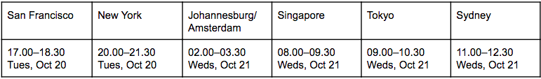
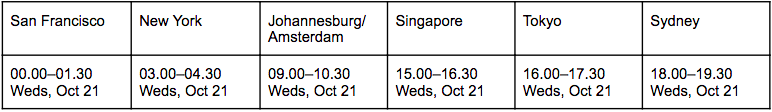
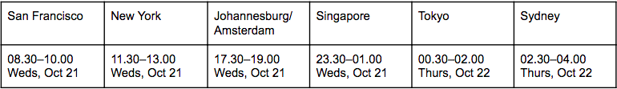
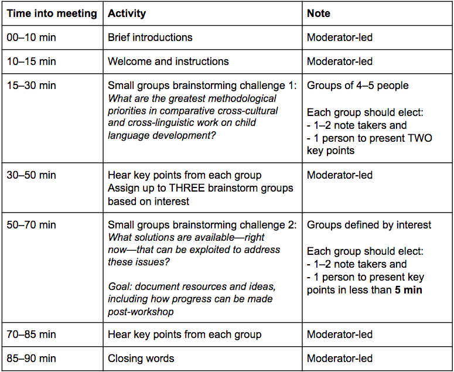

# Pre-MPaL2020 LangVIEW workshop
Click here to return to the [main MPaL workshop page](../../MPaL_handbook.md).

---

## Investigating the "standard model" across diverse contexts
**Dates:** October 20–21, 2020

**Organizing committee:** Marisa Casillas, Janet Bang, Alejandrina Cristia,
Michael C. Frank, & Caroline Rowland

A standard model of language learning has emerged in our field: child-directed speech drives learning such that higher quantities of (quality) input are assumed to lead to larger vocabularies and faster processing, with additional benefits to phonology and morphosyntax. Much of the research on this topic has come from a narrow, WEIRD (Western, Educated, Industrialized, Rich, Democratic) slice of the human population. Multiple independent studies have recently addressed this limitation by investigating the suitability of the 'standard' model in a variety of non-English-speaking, non-Western, and/or sociopolitically diverse contexts. The results so far are inspiring, but highlight one major caveat of increasing the diversity of studied populations: the difficulty of measuring input, uptake, and processing in distinct languages and cultures. We must grapple with this complex issue, and soon: differences in methodology obscure true patterns of cross-cultural variation, and current standardized measures are likely inappropriate for use across all contexts. In this workshop, participants will encounter a range of standard and non-standard measures of input, uptake, processing, and production that have been used with children across a variety of cultural and linguistic contexts.

The four invited presentations will focus on studies relating to the standard model across multiple contexts, and will discuss the costs and benefits of applying these measures in their population of study. Presenters will also discuss innovations they have made to counteract ill-fitting methods and steps they have taken to encourage methodological consistency with other research.

## How to participate
* Select one of the meetings below.
* [Register](https://forms.gle/8yAznEQ5RVFPG6r26) for your selected meeting
    * You will receive the Zoom link via email before the meeting.
* Review the activities on the Standard Meeting Agenda below.
* Watch the invited talks and discussions before joining the meeting. Please watch:
    * The 5-minute introductory video on the context of the workshop
    * The four 10-minute invited presentations
    * The 5-minute discussion videos on emerging themes
    * Take any notes you have on references and/or ideas useful for the meeting activities.
    * Once the meeting begins, be ready for active whole- and small-group discussion—we’re looking forward to hearing your thoughts!

## Meetings

Each meeting is 1.5 hours long. You are only expected to attend one meeting—whichever is most convenient for your schedule. These three meetings are scheduled such that participants from around the world can easily participate in at least one of them.

### Meeting 1 

**Moderator:** Michael C. Frank

### Meeting 2

**Moderator:** Caroline Rowland

### Meeting 3

**Moderator:** Janet Bang

## Standard Meeting Agenda

**Materials, resources, and ideas resulting from the workshop will be widely shared for continued discussion following MPaL 2020.**

## Invited presentations

The point of these 10-minute talks is not only to report on research, but more centrally to raise questions useful for discussion within the live meetings. Presenters should think of this opportunity as one of using their research experiences to underscore or make more concrete the issues most pertinent to equitably and strongly testing models of language development across cultural and linguistic contexts.

### Design thinking for data collection in multilingual environments

Suzy Styles (Psychology, School of Social Sciences and Centre for Research Learning and Development (CRADLE), Nanyang Technological University, Singapore; Singapore Institute for Clinical Sciences, Agency for Science, Technology & Research (A*STAR), Singapore)

SUZY.STYLES@ntu.edu.sg
 
**Abstract:** Measures designed for monolingual environments are hard to reverse engineer for multilingual contexts. While translating a standardized tool (e.g., a vocabulary checklist) provides parallel measurements across languages of interest, if the languages are in contact they may have shared vocabulary that is better characterized without reference to a particular language. If measurement tools guide participants to respond separately for their languages, researchers may elicit responses that do not align with community translanguaging practices. Similar problems arise in transcription and/or language-tagging of child-directed speech, and automated measures of language exposure. Designing new tools using emerging technologies may help overcome these challenges.
 
### A working model for the study of endangered and minority languages

Evan Kidd (Max Planck Institute for Psycholinguistics, Netherlands, The Australian National University, Australia, ARC Centre of Excellence for the Dynamics of Language), Shanley Allen (University of Kaiserslautern, Germany), Lucy Davidson (ARC Centre of Excellence for the Dynamics of Language, The University of Melbourne, Australia), Rebecca Defina (ARC Centre of Excellence for the Dynamics of Language, The University of Melbourne, Australia), Birgit Hellwig (University of Köln), & Barbara Kelly (ARC Centre of Excellence for the Dynamics of Language, The University of Melbourne, Australia)
 
Evan.Kidd@mpi.nl
 
**Abstract:** A key characteristic of human languages is their diversity (Evans & Levinson, 2009), and so any serious theory of language phenomena must be built upon a representative sample of the world’s languages. However, languages are dying at an alarming rate (Evans, 2010), underscoring the importance of widening the evidential base. Despite a proud history of crosslinguistic work in language acquisition (e.g., MacWhinney & Bates, 1989; Slobin, 1985, 1992, 1997), we only have data covering a mere 1 - 2% of the world’s languages (Lieven & Stoll, 2010). In this talk we will outline a working model for increasing the number of languages for which we have data, based on our collective experience and work across several languages in different contexts across the world.
 
**References:**

Evans, N., & Levinson, S. (2009). The myth of language universals: Language diversity and its importance for cognitive science. Behavioral & Brain Sciences, 32, 429–448.

Evans, N. (2010). Dying words: Endangered languages and what they have to tell us. Wiley-Blackwell, Chichester, UK

Lieven, E., & Stoll, S. (2010). Language. In M. Bornstein (Ed.), The handbook of cross-cultural developmental science (pp. 143–160). Mahwah, NJ: Lawrence Erlbaum.

MacWhinney, B., & Bates, E. (1989). The crosslinguistic study of sentence processing. Cambridge, UK: Cambridge University Press.

Slobin, D. I. (1985–1997). The crosslinguistic study of language acquisition (Vols. 1–5). Hillsdale, NJ: Lawrence Erlbaum.
 
### Daylong recordings in diverse societies and cultures

Alejandrina Cristia (Laboratoire de Sciences Cognitives et de Psycholinguistique, Département d’études cognitives, ENS, EHESS, CNRS, PSL University);
 
alecristia@gmail.com
 
**Abstract:** Daylong recordings from wearables could provide a unique view on the user’s spontaneous speech use. The long time scale facilitates habituation, leading to more ecological measures, and the collection of massive data for studying intra- and inter-individual differences. Daylong recordings promise to help answer questions like: What kinds of spoken interactions impact early language acquisition? Is this child developing normally? Is this intervention increasing social language use? I draw from interdisciplinary collaborations across anthropology, psychology, linguistics, and speech technology to discuss the unique technical opportunities and challenges that such recordings offer in the study of varied cultures and languages.
 
### Integrating qualitative and quantitative methods in research on early language development in diverse populations and cultures

Anne Fernald (Stanford University), Yatma Diop (Michigan State University), Ann Weber (University of Nevada, Reno), Virginia A. Marchman (Stanford University), Janet Y. Bang (San Jose State University)
 
afernald@stanford.edu, diopyatm@msu.edu, annweber@unr.edu, marchman@stanford.edu, janet.bang@sjsu.edu
 
**Abstract:** Research on early language learning in WEIRD populations is indisputably narrow, but it also runs deep. Newer studies using automated technologies build on a strong foundation of insightful observations by researchers who learned about children’s language in interactions with adults by actually watching and listening to children’s language in interactions with adults, over time. Based on our explorations of language input in relation to vocabulary and processing skills in English and Spanish in the U.S., and on field research adapting lab measures to assess language and processing in 200 Wolof-learning children in Senegal, we discuss the challenges of integrating qualitative with quantitative measures in extending developmental research to more diverse populations and cultures.
 
### Book-end commentaries

#### Context of the workshop: Testing the “standard model”
Michael C. Frank (Stanford University); mcfrank@stanford.edu

#### Emerging themes: How can we address the challenges before us?
Caroline Rowland (Max Planck Institute for Psycholinguistics); Caroline.Rowland@mpi.nl

---

Click here to return to the [main MPaL workshop page](../../MPaL_handbook.md).
