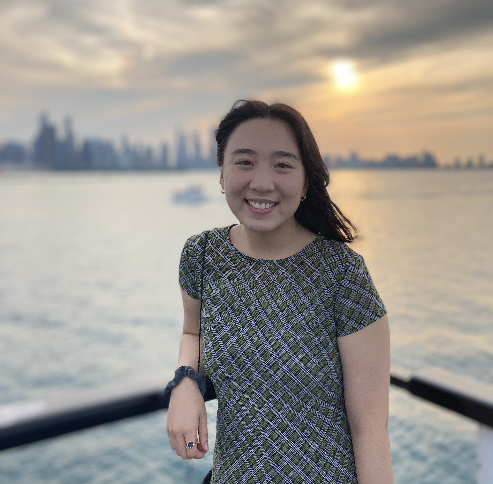

## Emily Chan (she/her/hers)

### About me

I am a third year undergraduate student double majoring in psychology and economics at the University of Chicago. I am interested in language acquisition. In particular, I am interested in how early language development influences social categorization.

### Contact 
Email: ewchan@uchicago.edu