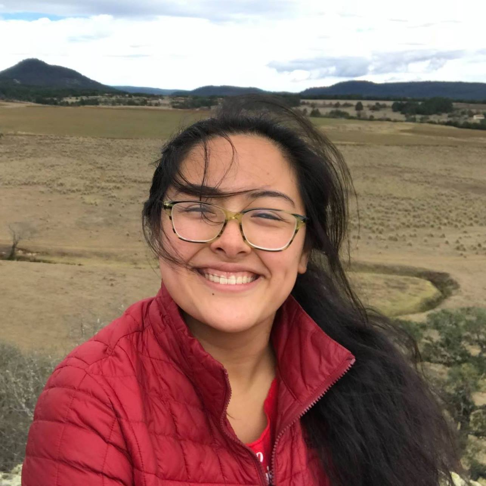

## Erica Hsieh (she/her/hers)

### About me

I am a fourth year undergraduate student double majoring in neuroscience and psychology at the University of Chicago. I am interested in the perception of prosody and more broadly in cross-cultural work on language and music cognition. 

### Contact 
Email: ehsieh1@uchicago.edu

### More about me:
(current) favorite xkcd comic: [xkcd.com/2196/](https://xkcd.com/2196/)

(\ /)   
( . .)  
C(")(")

<!--
    More about me:
    Favorite strange planet comic:
            https://twitter.com/nathanwpyle/status/1104761308057092097
    
    
-->