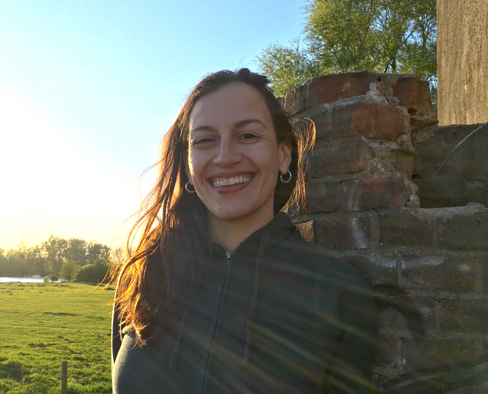

# Principal investigator

## Dr. Marisa Casillas

### About

Broadly speaking, I am interested in exploring how cognitive and social processes shape the ways in which we learn, perceive, and produce language. My primary research examines the relationship between communicative skills and linguistic processing in children and adults. I use a combination of experimental- and observation-based methods to comparatively investigate these processes in both urban, Western contexts and rural, Indigenous contexts.

Much of my work focuses in particular on how communicative and linguistic skills co-develop during in the first few years of life with the hope of better understanding how our capacity to produce, understand, and transmit language across generations is shaped by interactive needs.

### Curriculum Vitae
You can find a recent CV [here](https://docs.google.com/document/d/1hWEHXhlJ_VYXOmvjuOQlSOqgiCmt_eeVc6TvExBpC80/edit?usp=sharing). Lab-related publications can be found on our [Publications](../publications.md) page.

### My work
My research into children's everyday language environments in Western urban contexts and in two Indigenous rural contexts demonstrates that, across these communities, utterances directly and exclusively addressed to young children are relatively rare. Following on this discovery, we are now investigating differences in features of child-centered interactions in these communities while also exploring other ways in which children may capitalize on linguistic information in their environment.

This work has resulted in a secondary line of research on the methods and tools critical for collecting and analyzing long-format at-home recordings of children's language environments; for more on that, see [the ACLEW project](https://sites.google.com/view/aclewdid/home).

My research into children's development of turn-taking skills shows that even very young children predictively track the structure of human converstion, using linguistic cues to do so from age two onward. Following on this work, we are now investigating precisely how and when children begin attending to the need for response in conversation, focusing on the linguistic and non-linguistic cues that allow them to make online predictions.

I also work on a number of smaller projects relating to linguistic and cultural phenomena of special relevance to the two Indigenous communities I work with, a Tseltal Mayan community in Chiapas, Mexico and the rural Rossel Island community in Milne Bay Province, Papua New Guinea.

### Courses at UChicago

[Blooming Buzzing Confusion](../Casillas-BBC-Winter2021-Syllabus.md) (Winter 2021).

[The Emergence of Communicative Competence](../archived_courses/Spring2020/Casillas-DevCommComp-Spring2020-Syllabus.md) (Spring 2020).

### Professional organizations (co-)led

[Daylong Audio Recordings of Children's Linguistic Environments (DARCLE) Consortium](https://darcle.org/)

[Language Variation in Input Environments around the World (LangVIEW)](https://groups.google.com/forum/#!forum/langview)

[Ethical Study of Language Development (ESLD)](https://groups.google.com/forum/#!forum/esld)

### Contact

Office: TBA

Phone: TBA

Email: mcasillas@uchicago.edu

Other: [GitHub](https://github.com/marisacasillas/), [Google Scholar](https://scholar.google.com/citations?user=12yVanIAAAAJ&hl=en), and [Twitter](https://twitter.com/middycasillas?lang=en)

Dr. Casillas in the Bemmelse Waard, Nijmegen, The Netherlands

----
The chatter lab is founded on the principle that diversity in everyday language use is key to the study of human language cognition. We welcome opportunities to work with scholars from all walks of life, and particularly encourage those coming from marginalized groups to reach out if interested in working with the lab.

Our lab at the University of Chicago is located on the traditional homelands of the Ojibwe, Odawa, and Potawatomi nations.
